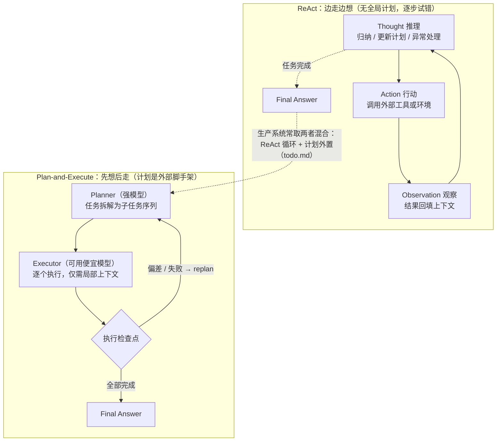
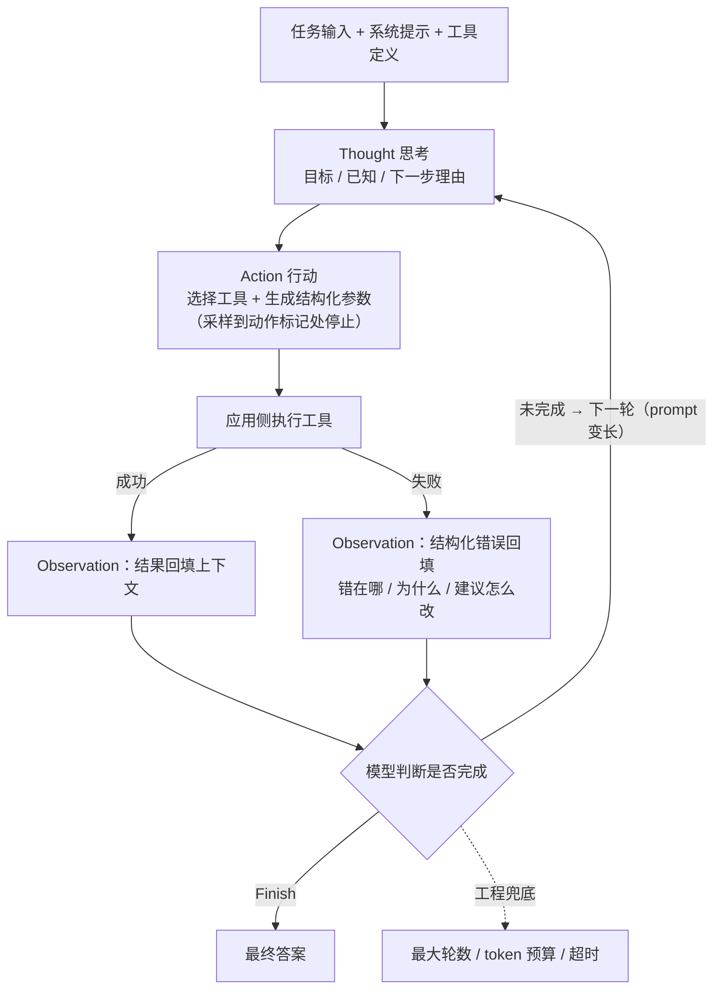
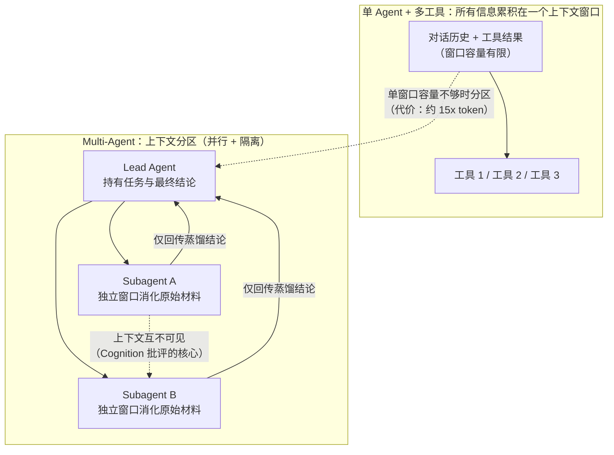
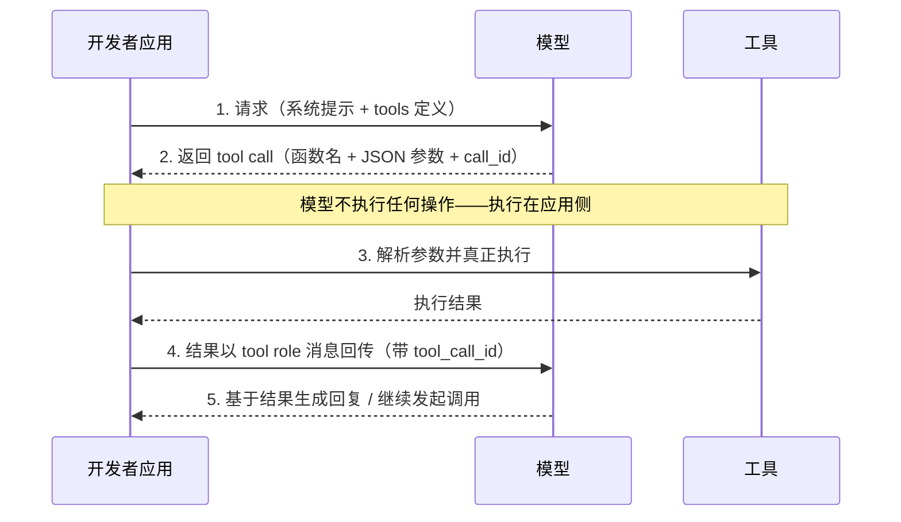
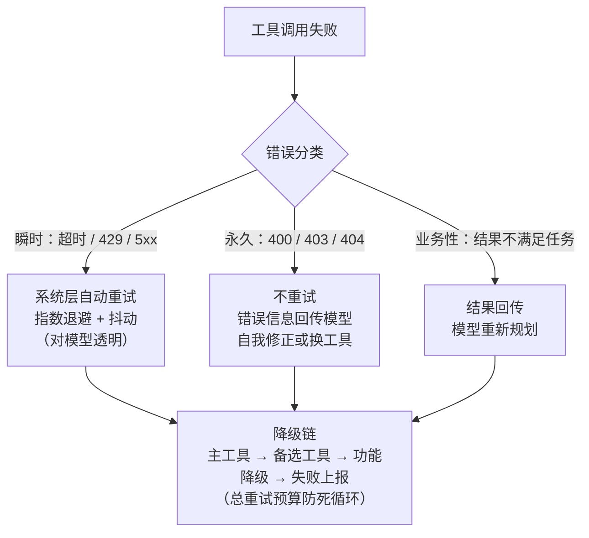
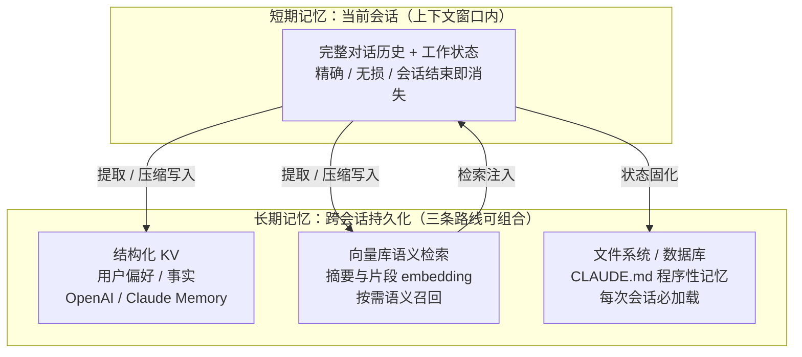
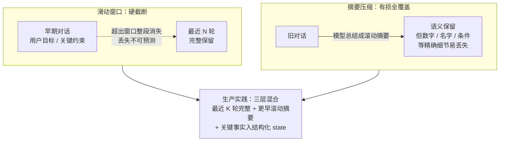
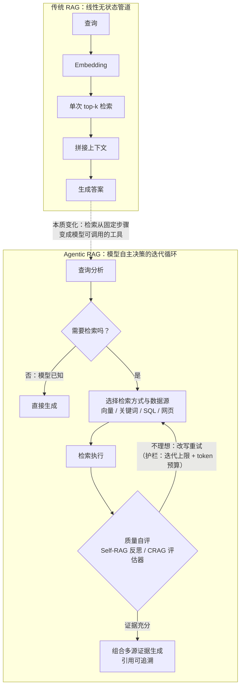

# AI Agent 面试 31 问：从原理到生产的深度回答指南

> **日期**：2026-09-02 | **状态**：完成
> **调研方式**：本指南基于对一手来源的系统调研撰写——包括 arXiv 论文原文（ReAct、Plan-and-Solve、Self-RAG、CRAG、Adaptive-RAG、τ-bench、MemGPT、FrugalGPT、RouteLLM）、OpenAI/Anthropic 官方文档与工程博客、LangGraph/LangSmith/LangFuse 官方文档，以及 2026 年中文技术社区（微信公众号）Agent 面试生态的检索。文中所有关键数字均标注来源；无法核实的说法明确标注"经验之谈"或"存在争议"。数据快照截至 2026-09。

---

## 〇、先读：面试表达的元策略

技术面试中"好的回答"有可复用的结构。结合 2026 年中文社区 Agent 面试的现状（面试官"根本不听你吹模型有多聪明，只关心系统有多稳定"——公众号面经文章的普遍观察），专业性的来源不是名词堆砌，而是以下四点：

1. **先定义再展开**。被问概念题（如"ReAct 是什么"），先给一句话本质定义，再展开机制，最后说适用边界。避免上来就讲细节。
2. **带数字与出处**。"ReAct 在 ALFWorld 上比模仿学习高 34 个百分点（绝对值，Yao et al. ICLR 2023）"远胜"ReAct 效果很好"。数字是调研过的信号。
3. **主动说代价与反方观点**。每个架构选择都有代价（multi-agent 的 15 倍 token、Agentic RAG 的延迟方差）。主动说出代价是资深工程师与背书者的分水岭。
4. **区分事实与观点**。"τ-bench 论文显示 gpt-4o retail 场景 pass^8 < 25%"是事实；"我认为参数错误是最大失败源"要改成"τ-bench 论文对失败轨迹的统计显示约 55% 源于参数/信息错误"。面试官对"求是"的敏感度远超想象。

一个通用回答模板：**本质定义 → 机制/实现 → 量化证据 → 代价与边界 → 我的工程选择及理由**。

---

## 一、Agent 架构（Q1–Q7）

### Q1：ReAct 和 Plan-and-Execute 的核心区别是什么？各适合什么场景？

**核心回答**：本质区别在决策的时间结构——ReAct 是"边走边想"（interleave 推理与行动，无全局计划，每步依据 observation 即席决策），Plan-and-Execute 是"先想后走"（先产出全局计划，把任务拆成子任务序列，再逐个执行）。

**机制细节**：
- ReAct（Yao et al., ICLR 2023, [arxiv 2210.03629](https://arxiv.org/abs/2210.03629)）：LLM 交替生成推理轨迹（reasoning trace，用于归纳、追踪、更新计划、处理异常）与面向外部环境的动作。纯提示范式，仅需 1–2 个上下文示例，无需微调。
- Plan-and-Solve（Wang et al., ACL 2023, [arxiv 2305.04091](https://arxiv.org/abs/2305.04091)）：针对 Zero-shot-CoT 的漏步、计算错误等问题，先制定计划再按计划执行；LangChain 2023 年将其工程化为 planner–executor–replan 三段式。
- 计划作为外部脚手架有两个工程红利：执行器只需局部上下文（token 省），且可以"强模型做 planner、便宜模型做 executor"分层降本。

**量化证据**（均出自论文摘要）：ReAct 在 ALFWorld / WebShop 上分别以 34% 和 10% 的**绝对成功率**超过模仿学习与强化学习方法；Plan-and-Solve 在 10 个数据集上持续超越 Zero-shot-CoT，数学推理上与 8-shot CoT 可比。

*图 1：ReAct 与 Plan-and-Execute 的决策时间结构对比——前者的循环依赖 observation 逐步修正，后者的计划作为外部脚手架支持"强模型规划 + 便宜模型执行"的分层降本*

**实事求是**：
- ReAct 并非总优于 CoT——论文正文显示知识密集 QA（HotpotQA）上 CoT 单独使用的 EM（约 29%）略高于 ReAct 单独使用（约 27%），两者结合最佳（约 35%）。"接地检索"与"内部推理"是互补关系，说"ReAct 全面更好"是错的。
- 2025 年后的生产系统（Claude Code、Manus）实际是**混合形态**：ReAct 循环 + 用 todo.md 文件承载计划。Manus 官方博客称之为"操控注意力的刻意机制"（[Manus: Context Engineering for AI Agents](https://manus.im/blog/Context-Engineering-for-AI-Agents-Lessons-from-Building-Manus)）。教科书式 Plan-and-Execute 已很少被直接使用。

**场景判断**（面试落点）：步数不确定、需与环境试错交互的开放任务 → ReAct 式循环；可预先分解、步骤多、成本敏感的长任务 → 计划先行 + 动态 replan。

**高频追问**："replan 怎么设计？"——触发条件（每步 vs 出错时 vs 计划偏差检测）、计划 diff 而非全量重生成、防振荡（限制 replan 频率）。

### Q2：CoT 推理在 Agent 决策中起什么作用？

**核心回答**：三个作用——决策质量（分解任务、评估工具结果、决定下一步）、可解释性（推理轨迹是人类可审计的决策依据）、纠错能力（推理 trace 让 Agent 能在 observation 与预期不符时定位并修正，克服纯 CoT 的幻觉与错误传播——ReAct 论文的核心论点之一）。

**演进脉络**（体现层次感的关键）：
- 经典 CoT（Wei et al., NeurIPS 2022, [arxiv 2201.11903](https://arxiv.org/abs/2201.11903)）：生成中间推理步骤显著提升算术/常识/符号推理，且该能力在足够大的模型中**涌现**——小模型上 CoT 甚至降低性能。
- 推理模型时代（2024-09 起）：OpenAI o1 用大规模强化学习把 CoT 从"提示技巧"变成"训练目标"，开辟 test-time compute scaling——性能随思考时间平稳提升（[OpenAI: Learning to Reason with LLMs](https://openai.com/index/learning-to-reason-with-llms/)）。o1 在 AIME 2024 上 pass@1 从 GPT-4o 的 12% 提升到 74%，64 次采样共识（cons@64）达 83%，1000 样本重排达 93%——"更多思考计算直接换性能"的最强例证。
- 对 Agent 的现实意义：显式手写 CoT 模板的价值下降了（模型自带推理），但 Agent 框架层的结构化思考仍有价值——如 Anthropic 多智能体系统中子代理用 interleaved thinking 评估工具结果、发现信息缺口（[Anthropic: How we built our multi-agent research system](https://www.anthropic.com/engineering/built-multi-agent-research-system)）。

**实事求是（重要加分项）**：CoT 的忠实性（faithfulness）存在严肃争议——展示的推理链未必反映模型真实的计算过程；OpenAI 自己承认不能直接在 CoT 上训练政策遵从，否则模型会"学会隐藏真实想法"。另外存在"过度思考"（overthinking）问题，推理模型在简单任务上浪费 token。面试中主动提这一点，说明你读过一手材料而非二手公众号。

### Q3：Agent 的"思考-行动-观察"循环具体怎么流转？

**核心回答**：循环由四个环节构成——

1. **Thought**：模型基于当前完整上下文（系统提示 + 历史 + 已积累的 observation）显式推理：目标是什么、已知什么、下一步为什么这么做。
2. **Action**：模型从动作空间中选择动作并生成结构化调用（现代实现即 tool call：函数名 + JSON 参数）。
3. **Observation**：应用侧执行工具，把结果（或结构化错误信息）回填到上下文。
4. **循环判定**：模型输出 Finish/最终答案则终止；否则回到 1。终止条件还需工程兜底：最大轮数、token 预算、超时。

*图 2：思考-行动-观察循环——模型无状态，每轮都是携带全部历史的完整推理；observation（含结构化错误）回填驱动下一轮决策*

**工程实现的关键认知**（区分懂原理与用过的人）：
- **stop 机制**：生成到动作标记处即停止采样，等待工具执行结果回填后再继续生成——这是 ReAct 提示范式在推理引擎层的物理实现。
- **模型无状态**：每一轮都是携带全部历史的完整推理，"状态"完全在上下文中，因此循环每轮的 prompt 越来越长，成本与延迟逐轮上升（与 Q20 呼应）。
- **Observation 是工程可控变量**：工具返回什么格式、截断到多少 token、错误怎么措辞，都由工程决定。错误信息要"写给模型看"——说明什么错了、为什么、建议怎么改，这直接决定自我修正的效率（与 Q11 呼应）。

### Q4：State 管理在多轮对话中如何设计？

**核心回答**：先纠正一个认知——LLM 本身无状态，"状态"只存在于两处：上下文（对话历史）和外部存储。State 管理设计的本质是决定**哪些信息放上下文、哪些放外部、如何同步**。

三层设计（由浅入深）：
1. **上下文内状态**：完整消息历史。简单，但窗口受限且长历史稀释注意力。
2. **结构化状态**：把关键信息从对话流提升为显式状态对象（用户槽位、实体属性、任务进度、已确认约束），每轮组装上下文时注入。LangGraph 是该思路的代表：状态定义为 typed schema（TypedDict），图中每个节点显式读写 state，state 通过 reducer 更新（如消息列表用追加而非覆盖，避免竞态覆盖）。
3. **持久化与恢复**：checkpointer 机制——每步执行后将状态快照序列化到存储（内存 / SQLite / Postgres），以 thread_id 关联会话。这是中断恢复、time-travel 回放、人工介入后继续执行的共同基础。

**加分点**：human-in-the-loop 的 interrupt（Q6）就建立在 checkpoint 之上——暂停即"停在某个快照"，审批通过即"从快照恢复执行"，这不是魔法而是持久化状态机的自然能力。

### Q5：Multi-Agent 协作和单 Agent 带多工具的本质区别在哪？

**核心回答**：表面区别是"多个模型实例协作"对"一个模型循环调用工具"；**本质区别是上下文工程**——multi-agent 是对上下文的分区（context partitioning）。子代理各自在独立窗口中工作，把海量原始信息蒸馏为结论后仅回传摘要，从而突破单窗口容量、隔离噪声、实现并行。

*图 3：Multi-Agent 的本质是上下文分区——Anthropic 实证：约 15 倍 token 消耗换取研究评测上 +90.2% 的表现；Cognition 则指出子代理间上下文共享是根本难题*

**正反两方都要说（本题最重要的加分点）**：

- **正方**（Anthropic 实证）：其多智能体研究系统以 Claude Opus 4 为 lead、Sonnet 为子代理，在内部研究评测中比单 agent Opus 4 高 90.2%，代价是 **token 消耗约 15 倍**（[Anthropic 工程博客](https://www.anthropic.com/engineering/built-multi-agent-research-system)，该数字经多个中文转述源交叉确认）。子代理并行探索 + 结论汇聚的模式适合开放式研究类任务。
- **反方**（Cognition《Don't Build Multi-Agents》）：子代理之间**共享上下文是根本难题**——agents 本质上无法共享不断演化的上下文，一条消息失序或丢失就会导致后续行为分歧；且决策分散化带来一致性问题。多 agent 系统引入的是完整的分布式系统难题（通信、一致性、容错），而非简单的"多干活"。

**工程判断（面试落点）**：默认单 agent + 多工具起手；只在同时满足"任务可并行分解、子任务间上下文依赖弱、单窗口容量确实不够"时引入 multi-agent，并接受 15x 量级的 token 成本。这样回答展现的是代价意识，不是赶时髦。

### Q6：Human-in-the-Loop 机制为什么要设计？怎么落地？

**核心回答**：四个理由——a) 高风险不可逆动作的最后防线（删除、支付、外发邮件）；b) 模型置信度校准不完美，"自信的错误"无法靠模型自身彻底消除；c) 合规与审计要求人工审批留痕；d) 数据飞轮——人工纠正的案例是最高质量的 eval set / 微调数据来源。

落地四件套：
1. **动作分级**：只读操作自动执行；低风险写操作白名单自动通过；高风险操作强制审批。粒度设计的关键是"最小干预点"——每步都问人会摧毁产品体验。
2. **技术机制**：以 LangGraph 的 `interrupt()` 为代表——在节点执行前暂停、状态快照持久化（Q4 的 checkpoint）、人工审批后 `Command(resume=...)` 从快照恢复；Claude Code 的做法是工具级权限模式（每类工具可配置 ask/allow）。
3. **触发策略**：不限于静态分级，还可以动态——模型置信度低、成本超阈值、连续失败次数超限时升级人工。
4. **交互与 SLA**：批量审批 UI、审批超时的默认策略（拒绝而非放行）。

**实事求是**：HITL 的真实难点不在机制而在**吞吐**——人工审批是串行瓶颈，生产系统要设计审批并行度与超时兜底，否则"人在环上"变成"人卡住环"。

### Q7：Agent 处理长任务时，如何避免上下文窗口溢出？

**核心回答**：四层策略，按优先级：

1. **预防（控制入口）**：工具输出限额——Claude Code 将工具响应默认限制在 25,000 tokens，就是为了防止单次工具结果吞噬上下文；分页、按需读取（文件不全量注入，先 grep 定位再读片段）。
2. **压缩（管理存量）**：auto-compact——Claude Code 在上下文接近窗口（约 95%）时自动触发：先清理旧 tool output，再把对话总结为摘要，CLAUDE.md 等程序性记忆从磁盘重新加载。压缩是有损的，关键决策可能丢失（官方文档与社区实践一致确认）。
3. **卸载（外部化）**：文件系统作为外部记忆——中间结果写文件、需要时读回；Manus 用 todo.md 承载任务计划，作为"操控注意力的刻意机制"，保证计划在压缩中幸存。
4. **分治（隔离）**：子代理消化大量原始材料（如全篇论文/网页），只回传蒸馏结论——本质是用 15x 的 token 成本购买上下文容量（Anthropic 多智能体系统，见 Q5）。

**加分表达**：主动提出"上下文预算"概念——不同信息设不同保留优先级（系统提示与任务状态 > 近期对话 > 滚动摘要 > 原始工具输出），压缩时按优先级牺牲。这是把被动救火变成主动预算管理。

---

## 二、工具调用（Q8–Q13）

### Q8：Function Calling 的原理是什么？和直接让模型输出 JSON 有什么区别？

**核心回答**：Function Calling = **训练（模型学会理解 schema、判断何时调用）+ 推理期约束（strict 模式复用结构化输出技术）** 的特殊输出模式。完整循环五步（OpenAI 官方文档）：请求携带 tools 定义 → 模型返回结构化 tool call（函数名 + JSON 参数 + call_id）→ **开发者代码解析并真正执行** → 结果以 tool role 消息（带 tool_call_id）回传 → 模型基于结果生成回复或继续调用。模型可以一次返回零个、一个或多个并行调用。

*图 4：Function Calling 五步循环——工具结果回传后模型才"知道"执行情况，可继续发起调用形成多轮循环*

**与"直接让模型输出 JSON"的区别（三个层次）**：

1. **可靠性**：这是本质区别。OpenAI Structured Outputs 采用**约束解码（constrained decoding）**：把 JSON Schema 编译为上下文无关文法（CFG），每生成一个 token 后由推理引擎根据文法确定下一批合法 token 并 mask 采样（非法 token 概率置零）；因为合法集合随前缀动态变化，必须实现**动态**约束解码（[OpenAI 官方博客, 2024-08](https://openai.com/index/introducing-structured-outputs-in-the-api/)）。官方数字：gpt-4o-2024-08-06 在复杂 schema 评测中 100% 遵循；纯提示工程的 gpt-4-0613 不足 40%；训练改进但未加约束时为 93%。
2. **工程闭环**：原生 tool call 语义（id 关联、tool role 回传、并行调用）省去自行解析、容错、拼接 prompt 的工作。
3. **协议地位**：模型被训练成把工具调用识别为特殊输出模式，而非普通文本。

**实事求是（重要）**：
- 100% 指的是**格式合法性**，不是内容正确性——官方明示"Structured Outputs doesn't prevent all kinds of model mistakes"；refusal 与 max_tokens 截断会破坏遵循。
- 约束解码是否损害模型能力，OpenAI 官方只说"延迟开销极小"，未正面论证，学术上存在约束改变输出分布的讨论——引用时说明这一点。
- 常见讹传纠正：网传"gpt-4o function calling 准确率 97%"在 OpenAI 官方原文中**不存在**，官方数字只有 100% / <40% / 93%。面试中主动纠正这个数字是极强的信号。

**高频追问**："为什么选 CFG 而不是正则/FSM？"——CFG 表达能力更强，能表达递归类型与深层嵌套结构，FSM 做不到。

### Q9：工具描述怎么写才能让模型精准选择？Schema 定义有哪些关键字段？

**核心回答**：Schema 三要素——`name`（动宾结构、自然语义化，如 `search_flights` 而非 `tool_1`）、`description`（决定模型**何时**调用该工具——这是 Anthropic 官方原话）、`input_schema`（JSON Schema：type / properties / required / enum 约束值域）。

写好描述的心智模型（Anthropic《[Writing effective tools for agents](https://www.anthropic.com/engineering/writing-tools-for-agents)》, 2025-09）：**"像给团队新员工介绍工具一样写描述"**——把隐含上下文显式化：专用查询格式、术语定义、资源之间的关系。要写清楚 what（做什么）、when（何时用，以及**何时不该用**——消歧往往比正面描述更有效）、how（参数语义与格式约定）。

**关键认知**：工具描述本质是 prompt 的一部分——直接消耗 token 和注意力预算。工具越多、描述越长，选择准确率越受影响。工程上：控制工具集规模、功能重叠的工具合并或用描述互相排斥（"用 A 当且仅当…否则用 B"）；超大规模工具场景（数十上百个）用分组加载或检索式发现（MCP 生态 2025 年的 Tool Search 思路：把"找工具"本身也做成一次工具调用，先搜相关工具再加载 schema）。

### Q10：多工具冲突时，Agent 如何决策调用哪个？

**核心回答**：分两层。

**模型层（隐式决策）**：transformer 注意力在全部工具描述上做语义匹配，本质是下一个 token 预测中工具名的概率竞争。功能重叠的工具会导致选择不稳定——这不是 bug，是工具设计留下了模糊空间。

**工程层（显式消歧）**：
- 描述互斥：每个工具的 description 写清与其他工具的边界；
- 两阶段路由：按任务类型预分组工具集，先选组再选工具，降低单次决策的候选规模；
- 工具合并/拆分：按"自然任务子域"切分工具边界，而不是按系统模块；
- 动态工具发现：大规模场景下按需检索工具定义（Q9）。

**面试落点**：把"模型选不准工具"正确归因为**工具设计问题**而非模型问题（与 Q22 呼应）——面试官问这题往往就在等你这个归因视角。

### Q11：工具调用失败后的重试和降级策略怎么设计？

**核心回答**：先做错误分类，再对症下药——

| 错误类型 | 例子 | 策略 |
|---|---|---|
| 瞬时错误 | 网络超时、429 限流、5xx | 系统层自动重试，指数退避 + 抖动；对模型透明 |
| 永久错误 | 400 参数不合法、403 权限、404 不存在 | 不重试；错误信息回传模型**自我修正**（改参数/换工具） |
| 业务性失败 | 工具执行成功但结果不满足任务需要 | 回传结果，模型重新规划 |

*图 5：错误分类决定处置路径——重试前先确认幂等性；系统层重试（模型不知情）与 Agent 层重试（模型重新推理）职责分离*

**关键设计点**：
- **幂等性是重试安全的前提**：写操作重试需要幂等键或先查后写，否则重试造成重复副作用。
- **错误消息写给模型看**：结构化回传"什么错了、为什么、建议怎么改"，模型的自我修正回路效率完全取决于此——这是 Agent 重试与传统 RPC 重试的本质差异（传统重试盲目重复，Agent 重试带推理）。
- **两层重试职责分离**：系统层重试（SDK 自动、模型不知情）处理瞬时故障；Agent 层重试（模型知情、重新推理）处理语义故障。混在一层会导致重复推理浪费 token 或盲目重试放大故障。
- **降级链**：主工具 → 备选等价工具（搜索 API 挂了换备用源）→ 功能降级（明确告知"暂时无法查询实时数据"）→ 失败上报。必须设总重试预算防死循环。

### Q12：工具调用的超时机制如何设置？

**核心回答**：分层超时，每层的依据不同——

1. **单工具调用超时**：按该工具延迟分布的 P95/P99 设定（不是拍脑袋常数），不同工具不同值——只读快接口可以紧（秒级），批处理类要松（分钟级）。
2. **单轮/单步超时**：LLM 推理（注意流式场景区分首 token 超时与总生成超时）+ 工具执行的总和。
3. **任务级总超时**：用户可接受的端到端上限，且在多轮循环中做**剩余预算感知**——预算递减时提示模型提前收尾，避免"任务做到 90% 被硬杀"。

超时后的三种处置：kill 并把超时信息回传模型（由它决定重试还是绕过）；直接系统层重试；升级人工。选择取决于工具幂等性与任务语义。

**面试落点**：这题没有标准数值答案，正确答案是**从监控数据出发**（P50/P95/P99 分布）动态设定——展现的是"数据驱动配置"的工程素养。若被追问量级：主流 API 的 TTFT 实测（2026-03，中等长度 prompt）：Gemini 2.5 Flash 约 450ms、Claude Sonnet 4 约 900ms、GPT-4.1 约 1100ms（Artificial Analysis 交叉验证的一手实测数据），工具自身耗时从百毫秒到数十秒不等，须实测。

### Q13：如何确保 Agent 调用的工具符合权限和安全规范？

**核心回答**：安全设计的总原则——**权限校验必须放在确定性代码层执行，不能靠 prompt 约束**（prompt 是建议，不是约束）。三层防线：

1. **工具层（最小权限）**：工具设计时收窄能力面——只读工具优先、限定可访问的目录/表/域名范围、参数值域白名单校验。对应 OWASP LLM Top 10 中的 Excessive Agency（过度代理）：只给任务真正需要的权限。
2. **执行层（审批与分级）**：高风险动作 human-in-the-loop（Q6）；工具级 allowlist；写操作默认拒绝、显式开启。
3. **输入输出层（注入防御）**：**间接 prompt injection** 是 Agent 特有威胁——工具返回的外部内容（网页、邮件、检索文档）中可能嵌有恶意指令，劫持 Agent 调用越权工具。防御：不可信内容标记与隔离、基于来源的权限差异（从不可信内容中解析出的指令不享受同权限）、敏感工具二次确认。

**加分点**：提及 MCP 生态 2025 年以来的安全讨论（server 信任、权限声明与校验）；提及"检索增强场景下注入面随数据源扩大而扩大"——说明你理解安全是系统性问题而非单点功能。

---

## 三、记忆管理（Q14–Q17）

### Q14：短期记忆和长期记忆在 Agent 中分别怎么实现？

**核心回答**：

- **短期记忆** = 当前会话的上下文：完整对话历史 + 工作状态。实现就是消息列表管理——精确、无损、窗口内直接可用，但容量受窗口限制、会话结束即消失。
- **长期记忆** = 跨会话持久化，三条技术路线（可组合）：
  1. **结构化 KV**：用户偏好、事实、约束显式写入（OpenAI Memory、Claude Memory 的本质——显式记忆条目按需注入，适合"不变信息"）；
  2. **向量库语义检索**：对话摘要/片段 embedding 入库，用时按语义召回（适合海量、稀疏访问的历史）；
  3. **文件系统/数据库**：Claude Code 的 CLAUDE.md（程序性记忆，每次会话必加载）与 auto-memory——最朴素也最可控。

*图 6：记忆三层架构——MemGPT 类比：LLM 是 CPU、上下文窗口是 RAM、外部存储是磁盘，模型自主执行"换页"*

**理论坐标**：MemGPT/Letta（[arxiv 2310.08560](https://arxiv.org/abs/2310.08560)）提出 OS 式内存管理思想——LLM 是 CPU、上下文窗口是 RAM、外部存储是磁盘，模型自己执行"换页"（自主决定什么调入上下文、什么写回外部）。这个类比是面试表达的记忆点。

**加分表达**：记忆问题的完整闭环是"存什么（写入策略）→ 怎么存（结构选择）→ 何时取（触发）→ 取多少（预算）"，多数团队只做了前两步。

### Q15：Memory 窗口满了怎么办？滑动窗口和摘要压缩各有什么优劣？

**核心回答**：关键洞察是**两种方法丢失的信息类型不同**——

| | 滑动窗口 | 摘要压缩 |
|---|---|---|
| 机制 | 只保留最近 N 轮，旧的直接丢弃 | 旧对话总结成语义摘要保留 |
| 信息损失 | 硬截断：早期关键信息（用户目标、约束）**整段消失**，丢失不可预测 | 有损但全覆盖：语义保留，**精确细节**（数字、名字、条件）易在摘要中丢失或失真 |
| 成本/延迟 | 零额外开销 | 摘要调用的 token 成本与延迟；摘要质量依赖模型 |
| 实现复杂度 | 极低 | 触发时机、摘要 prompt、保留策略都需设计 |

*图 7：两种策略丢失的信息类型不同——窗口丢语义连续性，摘要丢精确细节；Claude Code 的 auto-compact（约 95% 窗口占用触发）即三层混合思想的实现*

**生产实践（面试落点）**：不二选一，用三层混合——最近 K 轮完整保留 + 更早部分滚动摘要 + 关键事实提取进结构化 state（Q4）。Claude Code 的 auto-compact 是实证参考：约 95% 窗口占用时触发，先清理旧 tool output（工具结果是最可牺牲的——可重新获取），再总结对话，CLAUDE.md 从磁盘重载（程序性记忆永不压缩丢失）。

**深层答案**：根本解不是窗口也不是摘要，而是**结构化状态**——把"绝不能丢"的信息（用户确认过的约束、任务进度）从概率性的对话流转移到确定性的状态对象里，由代码保证其存在。

### Q16：向量存储用于长期记忆时，召回策略怎么设计？

**核心回答**：基础配置 + 四个进阶手段：

- **基础**：top-k 召回 + 相似度阈值过滤。k 的权衡：太小漏召回，太大引入噪声与 token 成本（经验起点 5–20，按效果调）。
- **进阶一：元数据过滤**——检索前先按时间/来源/用户域/会话过滤，缩小搜索空间且提升精度（几乎零成本，最被低估的手段）。
- **进阶二：时间衰减**——近期记忆权重更高，符合"最近的相关性更强"的直觉。
- **进阶三：多路召回 + rerank**——语义向量 + BM25 关键词并行召回，粗召回大 k，再用 cross-encoder 精排出 top-n。rerank 是工程上性价比最高的精度提升手段。
- **进阶四：查询构造**——不要拿用户原始话语直接检索，用当前任务上下文构造/改写 query。

**实事求是**：向量召回有精度天花板——embedding 对"语义相近但答案不相关"的内容区分能力有限，所以 rerank 与元数据过滤不是优化项而是必需项。

### Q17：多轮对话中的上下文继承如何保证不丢失关键信息？

**核心回答**：核心原则——**把记忆的可靠性从概率性的注意力机制转移到确定性的状态管理代码**。四个具体手段：

1. **显式结构化 state**（根本手段）：用户目标、已确认约束、关键实体、未决问题从对话流提升为状态对象（Q4），每轮组装上下文时确定性注入——不依赖模型"记得"。
2. **关键信息冗余注入**：在每轮上下文中以结构化块重复提供已确认的约束/偏好——用 token 成本换可靠性（长对话中注意力稀释是物理事实）。
3. **定期状态固化**：让模型主动总结"当前已知状态"并写入持久层（todo.md 模式的变体），压缩/新会话时以固化的状态恢复。
4. **压缩保护清单**：触发摘要压缩时，明确要求保留：用户原始目标、已确认的约束与偏好、未决问题、关键决策及其理由（Manus 的教训：任务规划必须外置于对话历史，否则一次压缩就可能丢）。

---

## 四、评估与优化（Q18–Q23）

### Q18：Agent 任务完成率怎么定义和计算？

**核心回答**：这是评估体系的第一题，答案分三段：

**1. 定义（结果导向）**：任务完成率 = 达成任务目标的交互占比。判定方式首选**终态比对**而非过程评判——τ-bench（[arxiv 2406.12045](https://arxiv.org/abs/2406.12045)）的方式是"比较对话结束时的数据库状态与标注目标状态"，不看对话过程只看世界状态是否达成；SWE-bench 的 resolved 标准是补丁使 fail-to-pass 测试全过且不破坏 pass-to-pass 测试。

**2. 一致性指标（本题的深水区）**：单次成功率严重高估部署可靠性。τ-bench 提出 **pass^k**：对每任务跑 n 次成功 c 次，计算"k 次独立试验**全部**成功"的概率；对比传统的 pass@k（"至少一次成功"）。论文论证：pass@k 适合代码生成等"有验证器兜底、可多次采样挑一个"的场景，但真实生产（如客服）面对海量交互**每次都必须成功**。实证数字：gpt-4o 在 τ-bench retail 场景 pass^1 = 61.2%，但 pass^8 < 25%——"8 次里全对"不到四分之一，这就是不一致性的代价。

**3. 评估手段的分工**：自动评估（终态比对 + LLM-as-judge）大规模跑，人工只审抽样队列。LLM-as-judge 的边界要实事求是：GPT-4 作评委与人类偏好一致性超 80%（MT-Bench, Zheng et al. 2023），但存在三类已知偏差——position bias（偏爱特定位置答案）、self-preference（偏爱自家模型）、verbosity bias（偏爱长答案）。成本参照：τ-bench 全量（gpt-4o agent + gpt-4 用户模拟器）约 $200/轮。

**加分数字**：SWE-bench Verified 榜首（截至 2026-08 调研）约 79%，而只有 100 行 Python 的 mini-SWE-agent 达 65%——说明架构简洁与效果并非线性关系。

### Q19：工具调用准确率如何评估？

**核心回答**：拆成三层分别度量，混在一起就没法归因——

1. **工具选择准确率**：是否选对了工具。确定性判定（code evaluator 精确匹配），不需要 judge。
2. **参数级正确性**：选对工具但参数填错。**这是实证中的最大失败源**——τ-bench 对 40 条 gpt-4o 失败轨迹的统计：约 55% 是"错误参数或错误信息"。结构校验用 schema 验证，语义校验才用 LLM-as-judge。
3. **幻觉调用率**：调用不存在的工具/编造 ID。τ-bench 实测：gpt-3.5-turbo 每任务幻觉不存在 ID 达 2.08 次（function calling 模式），gpt-4o 仅 0.46 次——模型能力差异在这项指标上最直观。

**落地方法**（LangSmith 方法论）：把系统拆为 LLM 调用/检索/工具调用/格式化各组件，各定义质量标准；数据集从"人工精选 10–20 个高质量示例"起步 → 用户负反馈的历史轨迹回流转化 → 合成数据扩充；runs 记录全部中间步骤（工具调用、参数）供轨迹级评估。原则：**能用确定性代码判定的绝不用 judge**。

### Q20：端到端响应延迟的瓶颈通常在哪？

**核心回答**：延迟分解为 TTFT（首 token 时间：排队 + prefill + 网络）+ TPOT × 输出 token 数（NVIDIA NIM 的标准定义）。Agent 的延迟特殊性在于三个叠加：

1. **多轮串行循环是最大头**：N 轮循环延迟近似线性叠加，每轮 = LLM 推理 + 工具执行，且 prompt 逐轮变长（工具结果回灌），prefill 成本逐轮上升（注意力计算随序列长度平方增长）。
2. **工具自身耗时**：从百毫秒（内部 API）到数十秒（批量任务）不等，往往超过单轮 LLM 推理。
3. **单轮内的模型差异**：实测（2026-03，约 200 token prompt）：TTFT——Gemini 2.5 Flash 约 450ms、Claude Haiku 4.5 约 597ms、Claude Sonnet 4 约 900ms、GPT-4.1 约 1100ms；输出速度——Flash 约 204.5 tok/s、GPT-4.1 约 125.3 tok/s、Sonnet 4 约 53 tok/s。模型间差距可达数倍。

**缓解手段**（按性价比）：流式输出（体感优化，不动物理延迟）、prompt caching（同时降 TTFT 与成本——OpenAI 官方文档明确其加速效果）、并行工具调用（一轮内多个独立工具并发）、缩短上下文（直接降 prefill）。

### Q21：Token 消耗怎么优化？

**核心回答**：先看结构再优化——τ-bench 数据显示输入 token 占总成本 **95.9%**、输出仅 4.1%。**Agent 的成本大头在输入侧**，这与直觉相反，决定了优化优先级：

1. **Prompt caching（第一杠杆）**：Anthropic 缓存命中的输入价格约为原价 0.1x（省约 90%），写入有 1.25x 溢价。工程要点是**缓存友好结构**——稳定内容（系统提示、工具定义）放前缀，动态内容放后缀，保证前缀命中。
2. **上下文裁剪**：工具输出截断与摘要（Claude Code 的 25K 上限是实证）、历史压缩（Q15）、按需加载而非全量注入。
3. **输出侧**：结构化输出约束减少冗长、控制 max_tokens。
4. **模型选择与批量**：简单子任务用小模型（Q31 路由）；离线任务用 batch API 折扣。

### Q22：如何区分是模型能力不足还是工具设计问题导致的失败？

**核心回答**：方法论是**错误分类 + 消融实验**，两者都要有：

1. **错误分类先行**：把失败按（意图理解 / 工具选择 / 参数填充 / 结果误读 / 格式）分类统计（Q23），不同类别指向不同根因。
2. **消融实验定位**：取同一批失败案例做对照——**换更强模型重跑**：改善明显 → 偏模型能力；**只改工具描述/schema 重跑**（加示例、消歧、简化参数）：改善明显 → 工具设计问题；**两者都不动**：大概率是任务定义或架构问题。
3. **判别信号**：失败集中在特定工具上（无论什么模型）→ 工具设计；失败分散且与模型档位正相关 → 模型能力；强模型在同一位置失败且 trace 显示"反复读描述仍选错" → 描述歧义。

**面试金句（有实证支撑）**：τ-bench 数据显示参数错误占失败的约 55%——大量被归咎于"模型不行"的失败，其实是工具接口设计不良（参数语义不清、描述歧义）。**把责任从模型推回工程，是这题的专业答案**。

### Q23：Bad Case 分析应该从哪些维度切入？

**核心回答**：六个错误维度 + 一个分析流程：

**分类维度**：意图理解错误（用户目标解析错）→ 规划错误（步骤遗漏/顺序错）→ 工具选择错误 → 参数填充错误（含幻觉参数值，Q19 的 55%）→ 工具结果误读（信息在眼前但理解错）→ 输出格式错误。RAG 场景追加检索错误（召回了错误上下文）；另外注意两类行为性问题：提前终止（该继续时收尾）与过度执行（该停止时死循环）。

**分析流程**：trace 复盘 → 定位**首个偏离点**（错误会级联，根因在第一个偏离处，后续错误多是连锁反应）→ 归类 → 统计分布 → 回流 eval set。

**加分点**：区分**系统性错误**（分布集中，指向设计缺陷，改 prompt/工具/架构）与**随机错误**（方差问题，指向采样温度、模型档位）——前者的解是工程修复，后者的解是降低方差（温度调低）或升级模型。没有分布统计的 bad case 分析只是 anecdote。

---

## 五、RAG + Agent 融合（Q24–Q27）

### Q24：Agent 调用 RAG 和单纯的 RAG 系统有什么本质不同？

**核心回答**：一句话本质——**检索从固定管道中的一步，变成模型可自主调用的工具/动作**。Agent 自己决定是否检索、检索什么、从哪检索、何时停止、如何组合多源证据，形成 ReAct 式迭代控制循环。

**结构性差异**（可整理成表）：

| 维度 | 传统 RAG | Agentic RAG |
|---|---|---|
| 控制结构 | 线性无状态管道（chunk→embed→retrieve→generate） | 带记忆的迭代控制循环 |
| 检索策略 | 固定单次 top-k，"检索一次即信任结果" | 自适应、多步、可自我评估后重试 |
| 数据源 | 通常单一 | 多工具：SQL、向量库、API、网页搜索 |
| 查询处理 | 所有查询一视同仁 | 逐条分析、拆子查询、路由 |

*图 8：传统 RAG 与 Agentic RAG 的结构差异——检索成为模型自主决策的动作（Adaptive-RAG：按查询复杂度路由三档策略，同等精度下耗时约省一半），代价是延迟与成本随迭代步数增长*

**三篇关键论文（体现理论深度）**：
- **Self-RAG**（[arxiv 2310.11511](https://arxiv.org/abs/2310.11511), ICLR 2024）：训练模型输出**反思令牌**，自适应决定是否检索 + 自我批判检索内容与自身输出。数字：7B 模型 PopQA 54.9 分（ChatGPT 仅 29.3）、Bio 长文生成 FactScore 81.2 超 ChatGPT（71.8）。消融实验极具说服力：去掉自我批判模块 ASQA 从 32.1 跌到 18.1；**强制每段都检索**使 PopQA 从 45.5 跌到 28.3——"按需检索"本身贡献巨大。
- **CRAG**（[arxiv 2401.15884](https://arxiv.org/abs/2401.15884)）：轻量**检索质量评估器**判断检索结果置信度——Correct 则精炼知识使用；Incorrect 则**触发网页搜索**弥补静态语料不足。即插即用：在 Self-RAG 骨干上 PopQA +7.0、PubHealth +36.6。警示：作者用普通 LLaMA2 复现 Self-RAG 时分数崩塌——Self-RAG 的反思令牌依赖专门微调，不可直接嫁接。
- **Adaptive-RAG**（[arxiv 2403.14403](https://arxiv.org/abs/2403.14403), NAACL 2024）：小模型（T5-Large）做**查询复杂度分类器**，路由到三档：不检索（LLM 直接答）/ 单步检索 / 迭代多步检索。数字：平均 F1 50.91 与纯多步方法（IRCoT）50.87 持平，但耗时 1.46 倍 vs 3.33 倍——**几乎同等精度省一半时间**；三档实测耗时分别 0.35s / 3.08s / 27.18s。

**实事求是（本题最重要的部分）**：Agentic RAG 的代价——延迟更高**且不稳定**（随推理步数波动）、成本随步骤增长、失败模式从"自信幻觉"变成"死循环与成本失控"（n8n 工程博客的总结）。护栏也不同：传统 RAG 护索引（权限、混合检索、chunk 治理），Agentic RAG 还须护行为（工具白名单、**迭代上限 + token 预算硬停止**、全链路追踪）。选型建议（务实加分项）：先用真实查询统计单次检索能满足的比例——多数团队过早上了 agentic，多数查询根本不需要多跳。

### Q25：Agent 在做检索时，如何决定是走向量检索还是关键词检索？

**核心回答**：按查询类型匹配检索方式的特性——

- **向量检索**擅长：语义模糊、同义改写的查询（用户问"怎么请假"，文档写"带薪休假政策"——词汇不匹配正是传统检索的经典失败模式）。
- **关键词检索（BM25）**擅长：精确 token 匹配——ID、错误码、专有名词、代码符号、版本号。embedding 对低频术语和精确字符串的表示能力弱，这类查询向量检索容易漏。

**工程答案的三层递进**：
1. **默认 hybrid**：BM25 + dense 双路召回 + RRF（倒数排名融合）——不二选一，是向量数据库（Weaviate/Qdrant/Elastic）的标准能力；
2. **Agent 场景的差异化**：把"选择检索方式"本身交给模型决策——查询分析（实体型/描述型/多跳型）后路由，Adaptive-RAG 的复杂度路由思想可直接引用；
3. **极端情况**：都试（多路召回）后 rerank，用算力换确定性。

**面试落点**：这题考的不是背两种检索的定义，而是**对查询分布的判断意识**——先分析你的用户查询里精确匹配与语义匹配各占多少，再决定投入。

### Q26：检索结果不理想时，Agent 应该如何调整策略？

**核心回答**：这题恰是 Agentic RAG 的存在意义（与 Q24 呼应）——固定管道只能硬答，Agent 能自主调整。按阶段组织手段：

- **检索前（查询侧）**：query 改写（指代消解、口语转检索语言）、子查询拆解（多跳问题拆成单跳序列）、HyDE（生成假设性答案再拿它检索——假设答案与真实文档的语义空间更近，[arxiv 2212.10496](https://arxiv.org/abs/2212.10496)）。
- **检索中（策略侧）**：放宽/收紧过滤条件、切换检索方式（向量↔关键词↔混合）、加大召回 k、**换数据源**——Agent 的独特能力：内部知识库不理想可以调用网页搜索工具兜底（CRAG 的 fallback 设计：检索质量低时自动触发网页搜索）。
- **检索后（重排侧）**：rerank 精排提升 top-n 质量。
- **兜底（诚实原则）**：迭代达到上限后，基于已有信息生成并**显式声明不确定性**（"根据现有资料 X 成立，但未能确认 Y"）——比编造强，这本身就是产品可信度设计。

**必须有工程护栏**：迭代上限（如最多 3 轮检索）+ token 预算硬停止，否则"自主调整"变成死循环（Q24 的失败模式警示）。

### Q27：如何确保 Agent 引用的知识来源可追溯、可验证？

**核心回答**：三段机制 + 一段评估：

1. **检索侧：chunk 级元数据**——source URI、文档标题、章节定位、时间戳随内容一起返回，这是可追溯性的数据基础；同时 chunk 切分策略要保证证据完整性（证据被切断则引用失真）。
2. **生成侧：inline citation**——要求模型对每个关键论断标注引用编号（引用与论断的绑定要在生成时完成，事后补标注不可靠）；Anthropic Citations API 提供原生结构化引用能力，模型输出直接携带可验证的文档引用。
3. **校验侧：答案-证据对齐**——后处理检查每条引用是否真实支持对应论断（引用了一个不含该结论的段落 = 虚假引用）；PII/敏感信息过滤。
4. **评估侧：faithfulness 指标**——RAGAS 框架的核心指标：faithfulness（答案是否由检索上下文支持）、answer relevancy、context precision/recall。faithfulness 低说明模型在"超出证据自由发挥"。

**面试落点**：可验证性的用户体验设计——引用要可点击回溯到原文档的具体位置，用户能一键验证。"信任来自可核查"，这是 RAG 产品与聊天产品的本质差异。

---

## 六、生产落地（Q28–Q31）

### Q28：Agent 从原型到上线，需要补齐哪些工程能力？

**核心回答**：六大能力，按建设顺序：

1. **评估体系**（Q18/Q19）：离线 eval set + 线上指标。没有评估的迭代是盲飞。
2. **可观测性**（Q29）：全链路 trace、成本/延迟监控。
3. **安全护栏**（Q13）：权限分级、注入防御、内容审核。
4. **发布工程**：灰度/金丝雀发布、快速回滚、**prompt 与配置的版本管理**（prompt 是代码的一部分，变更必须可归因可回滚）。
5. **成本与延迟管理**（Q20/Q21）：预算告警、限流、降级预案。
6. **数据飞轮**：bad case 回流 → eval set 扩充 → 迭代验证——这是长期竞争力的来源。

**面试金句**：原型到上线最大的差距不是功能，而是**可靠性的证明体系**——demo 靠最好情况运行，生产要靠最坏情况的统计描述（pass^k 而非 pass@1，呼应 Q18）。

### Q29：可观测性在 Agent 系统中怎么落地？

**核心回答**：三支柱 + 一个闭环：

- **Trace（核心）**：全链路 span 树——每次 LLM 调用的完整输入/输出、token 用量、延迟、每次工具调用的参数与结果、prompt 版本。标准正在统一：OpenTelemetry GenAI 语义约定（semconv）为 LLM/Agent span 定义了字段规范。
- **Metrics**：任务完成率、延迟分位数（P50/P95/P99，Q20）、每请求/每任务成本、工具错误率分布。
- **Logs / 回放**：会话级完整记录，支持事后逐帧回放（replay）bad case。
- **工具链**：LangSmith / LangFuse / Helicone 等提供托管 trace 分析、标注队列（人工抽检）、与 eval 集成。

**落地要点（体现实操经验）**：prompt 版本管理（每次变更可归因）；采样策略——失败全量记录 + 成功抽样（成本与信息量的平衡）；PII 脱敏先于落盘。

**面试落点**：可观测的目的不是"看"而是**归因**（Q22：区分模型问题与工具问题全靠 trace）与**回流**（eval set 的原料就是带标注的 trace）——没有可观测就没有迭代，这是它在六大工程能力中排第二的原因。

### Q30：A/B 测试如何验证 Agent 策略迭代的效果？

**核心回答**：Agent 的 A/B 测试有两个特殊难点，答案围绕它们展开：

**难点一：高方差**。同一输入多次运行结果不同（τ-bench 的 pass^1 61% 而 pass^8 <25% 就是方差证据）——单次运行的差异可能是噪声。对策：离线评估阶段每个用例跑多次取分布；在线实验计算所需样本量时把运行方差算进去。

**难点二：多目标**。完成率↑ 但成本↑、延迟↑ 怎么办？对策：明确 North Star 指标（如任务完成率）+ guardrail 指标（成本上限、延迟上限、安全指标不可恶化）——guardrail 违反则一票否决。

**流程**：离线评估先行（eval set 上迭代，便宜快速）→ 在线小流量金丝雀（1–5%）→ 逐步放量 → 全量。在线信号：用户显式反馈（点赞/重试/放弃）与隐式行为信号（任务是否完成、是否人工接管）；对内工具型 Agent 可用**交错实验（interleaving）**——同一用户交替体验两个版本，对敏感比较效率远高于分组实验。统计上注意：新奇效应（新版本初期天然占优）、多重比较（指标多了总有"显著"的假阳性）。

**前提条件**：A/B 建立在可观测之上（Q29）——没有 trace 就没有归因，只能知道"谁好"不知道"为什么"，策略迭代就无法沉淀认知。

### Q31：成本控制策略有哪些？缓存、模型降级、路由分发分别怎么用？

**核心回答**：三大杠杆 + Agent 特有的成本视角：

**1. 缓存**：
- **Prompt caching**（第一杠杆）：Anthropic 缓存命中输入约 0.1x 价格（省约 90%）、写入 1.25x 溢价。用法：稳定前缀（系统提示 + 工具定义）放前面、动态内容放后面；多轮对话天然适合（历史只增不改，逐轮命中）。
- **语义缓存**：相似问题命中历史答案——谨慎使用，准确性风险高，只适合低风险只读场景。

**2. 模型降级（cascade 级联）**：FrugalGPT（[arxiv 2305.05176](https://arxiv.org/abs/2305.05176)）的开创性思路——请求先给小模型，置信度足够就返回，不够再升级到大模型，级联最多可省约 98% 成本达到 GPT-4 级质量（**注意：这是论文在其基准上的声称数字，引用时说明场景**）。Agent 场景的现代变体：简单轮次（如格式转换）用小模型，复杂决策轮次用大模型。

**3. 路由分发**：RouteLLM（[arxiv 2406.18665](https://arxiv.org/abs/2406.18665)）——从偏好数据学习路由器，预测"这个查询小模型能不能答好"，能则路由到便宜模型。与 cascade 的区别：cascade 是串行试错（先小后大），路由是前置判断（一步到位）。

**4. 补充手段**：batch API 折扣（离线任务）、输出长度控制、上下文工程（Q21 的全部手段）。

**Agent 特有的成本视角（面试落点）**：别只盯单价——看 **token 结构**（输入占 95.9% 的启示：优化输入侧回报最大）、**缓存命中率**（多轮 Agent 的命中率是成本的决定性变量之一）、**每任务成本而非每请求成本**（一次任务 20 轮调用，单请求降价不如减少轮数）。以及 multi-agent 的 15x token 账（Q5）——架构选择本身就是最大的成本决策。

---

## 七、总结：这 31 问背后的四条主线

1. **上下文是 Agent 的第一资源**：架构（Q5 的上下文分区）、记忆（Q14–Q17）、成本（Q21 的 95.9%）、延迟（Q20 的 prefill 增长）——所有问题最终都汇到上下文工程。面试中反复回到这条主线，显得成体系。
2. **可靠性是概率性的，工程要把它变成统计可描述的**：pass^k（Q18）、错误分类（Q22/Q23）、A/B 与 guardrail（Q30）——生产 Agent 工程的核心理念。
3. **权限与安全必须放在确定性代码层**：prompt 是建议不是约束（Q13），这条原则贯穿工具设计到注入防御。
4. **每个架构选择都有价格标签**：multi-agent 的 15x token、Agentic RAG 的延迟方差、HITL 的吞吐瓶颈、摘要压缩的细节丢失——专业性的最终体现是把这些价格说在前面。

---

## 附：高频"陷阱题"速查（讹传与争议纠正）

| 常见说法 | 实情 | 出处 |
|---|---|---|
| "gpt-4o function calling 准确率 97%" | OpenAI 官方原文无此数字；官方数字为 100%（strict 约束解码）/ 93%（仅训练改进）/ <40%（纯提示） | OpenAI 2024-08 博客 |
| "ReAct 全面优于 CoT" | HotpotQA 上 CoT 单独（约 29%）略高于 ReAct 单独（约 27%），结合最佳 | ReAct 论文正文 |
| "Self-RAG 即插即用" | 反思令牌依赖专门微调；CRAG 作者用普通 LLaMA2 复现 Self-RAG 时 PopQA 崩塌至 29.0 | CRAG 论文 |
| "Structured Outputs 保证输出正确" | 只保证格式合法（100%），不保证内容正确 | OpenAI 官方文档 |
| "多 Agent 效率更高" | Token 消耗约 15 倍；收益是上下文容量与并行性，且上下文共享是根本难题（Cognition） | Anthropic / Cognition |
| "FrugalGPT 省 98%" | 是论文在其基准上的声称，非普适保证 | FrugalGPT 论文 |

## 参考文献

1. [ReAct: Synergizing Reasoning and Acting in Language Models (Yao et al., ICLR 2023)](https://arxiv.org/abs/2210.03629)
2. [Plan-and-Solve Prompting (Wang et al., ACL 2023)](https://arxiv.org/abs/2305.04091)
3. [Chain-of-Thought Prompting Elicits Reasoning (Wei et al., NeurIPS 2022)](https://arxiv.org/abs/2201.11903)
4. [OpenAI: Learning to Reason with LLMs (o1)](https://openai.com/index/learning-to-reason-with-llms/)
5. [Anthropic: Building Effective Agents](https://www.anthropic.com/engineering/building-effective-agents)
6. [Anthropic: How We Built Our Multi-Agent Research System](https://www.anthropic.com/engineering/built-multi-agent-research-system)
7. [Manus: Context Engineering for AI Agents](https://manus.im/blog/Context-Engineering-for-AI-Agents-Lessons-from-Building-Manus)
8. [MemGPT: Towards LLMs as Operating Systems](https://arxiv.org/abs/2310.08560)
9. [OpenAI: Introducing Structured Outputs in the API](https://openai.com/index/introducing-structured-outputs-in-the-api/)
10. [OpenAI: Function Calling Guide](https://platform.openai.com/docs/guides/function-calling)
11. [Anthropic: Writing Effective Tools for Agents](https://www.anthropic.com/engineering/writing-tools-for-agents)
12. [Anthropic Tool Use Documentation](https://platform.claude.com/docs/en/agents-and-tools/tool-use/overview)
13. [τ-bench: Measuring Agent Interaction with Humans (arxiv 2406.12045)](https://arxiv.org/abs/2406.12045)
14. [SWE-bench Leaderboard](https://www.swebench.com/)
15. [LangSmith Evaluation Documentation](https://docs.smith.langchain.com/evaluation)
16. [LangFuse Documentation](https://langfuse.com/docs)
17. [Self-RAG: Learning to Retrieve, Generate, and Critique (arxiv 2310.11511)](https://arxiv.org/abs/2310.11511)
18. [CRAG: Corrective Retrieval Augmented Generation (arxiv 2401.15884)](https://arxiv.org/abs/2401.15884)
19. [Adaptive-RAG (arxiv 2403.14403)](https://arxiv.org/abs/2403.14403)
20. [HyDE: Precise Zero-Shot Dense Retrieval (arxiv 2212.10496)](https://arxiv.org/abs/2212.10496)
21. [FrugalGPT: How to Cut LLM Costs (arxiv 2305.05176)](https://arxiv.org/abs/2305.05176)
22. [RouteLLM: Learning to Route LLMs with Preference Data (arxiv 2406.18665)](https://arxiv.org/abs/2406.18665)
23. [n8n: RAG vs. Agentic RAG](https://blog.n8n.io/rag-vs-agentic-rag/)
24. [Cognition: Don't Build Multi-Agents](https://cognition.ai/blog/dont-build-multi-agents)
25. [NVIDIA NIM Benchmarking Metrics (TTFT/TPOT 定义)](https://docs.nvidia.com/nim/benchmarking/llm/latest/metrics.html)
