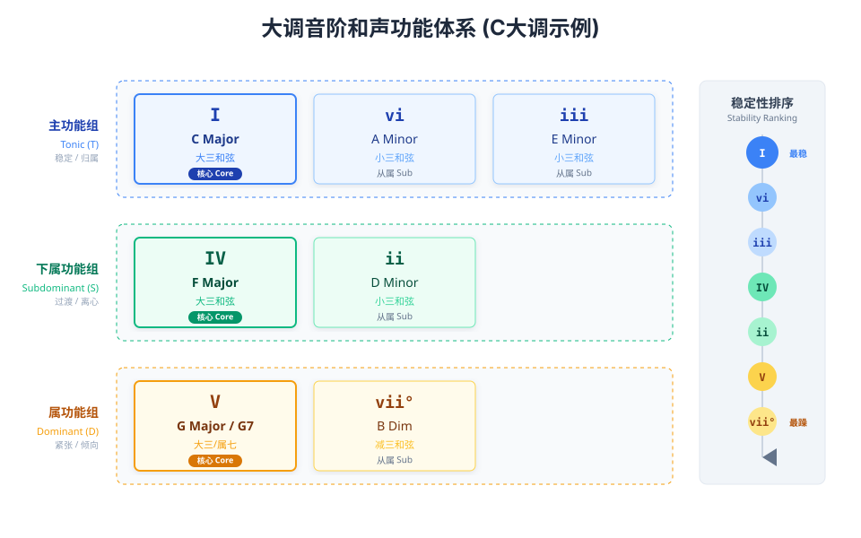
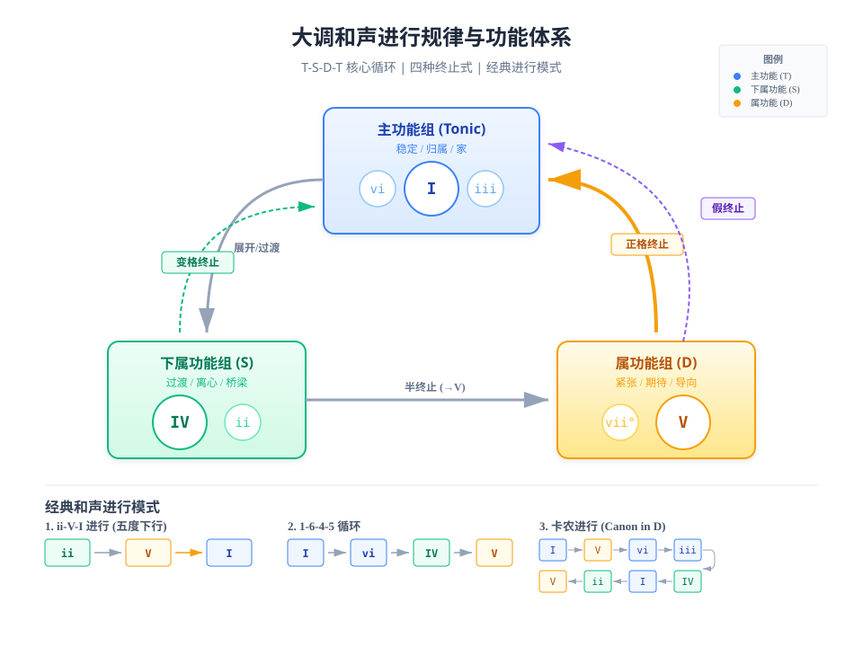

# 🎸 音级与功能和声

> 音级是音阶中每个音的位置编号，用于描述音与主音的关系。和声功能理论是西方调性音乐分析的基石，它将音阶中的每个音级所构成的和弦按照其在调性框架内的张力与解决倾向进行分类。调性音乐的本质运动可以概括为"稳定—不稳定—稳定"的循环往复，而和声功能理论正是解读这一运动规律的密钥。

## 1. 自然大调音级

| 音级 | 名称 | 功能 | 与主音关系 |
|:---:|:---:|------|:---:|
| **Ⅰ** | 主音 (Tonic) | 调性中心，最稳定 | 纯一度 |
| **Ⅱ** | 上主音 (Supertonic) | 过渡性，倾向Ⅰ或Ⅲ | 大二度 |
| **Ⅲ** | 中音 (Mediant) | 决定大/小调色彩 | 大三度 |
| **Ⅳ** | 下属音 (Subdominant) | 次稳定，推动进行 | 纯四度 |
| **Ⅴ** | 属音 (Dominant) | 强烈倾向主音 | 纯五度 |
| **Ⅵ** | 下中音 (Submediant) | 关系小调主音 | 大六度 |
| **Ⅶ** | 导音 (Leading Tone) | 强烈倾向主音（半音） | 大七度 |

## 2. 三大功能组体系

### 2.1 主功能组（Tonic, T）

主功能组以I级和弦为核心，代表着调性音乐中极度的稳定感与"家"的概念。它是音乐的出发点与最终归宿，听众在此获得完满的解决感与心理上的满足。主功能和弦包含调式的主音（1级音）和五音（5级音），这两个音构成了调性最稳定的骨架。在实际应用中，vi级和iii级和弦因与I级共享部分构成音，也被归入主功能组，可作为I级的替代选择。

### 2.2 下属功能组（Subdominant, S）

下属功能组以IV级和弦为核心，具有从中性向外扩张的"离心力"特征。它常作为主功能与属功能之间的桥梁，使和声进行更加平滑自然。下属功能的特征音是6级音，该音赋予此功能组独特的色彩——既不像主功能那样稳定，也不像属功能那样紧张。ii级和弦因包含6级音及其与IV级的三度关系，同样具备下属功能特性，在爵士和流行音乐中，ii-V-I进行已成为最核心的和声公式。

### 2.3 属功能组（Dominant, D）

属功能组以V级和弦为核心，包含大调音阶中最具倾向性的音——导音（7级音）。导音距离主音仅半音之遥，产生强烈的向上解决的内在驱动力。当V级和弦扩展为属七和弦（V7）时，其内部的三全音（由3级音与7级音构成）更是制造出极大的不稳定性，使听众产生强烈的解决期待。vii°和弦因同样包含导音和三全音，被归入属功能组，常作为V级的替代使用。

| 功能组 | 核心和弦 | 从属和弦 | 特征音 | 功能特点 |
|:---|:---|:---|:---|:---|
| 主功能(T) | I级 | vi级、iii级 | 1、3、5 | 稳定、归属、终点 |
| 下属功能(S) | IV级 | ii级 | 4、6 | 过渡、桥梁、离心 |
| 属功能(D) | V级 | vii°级 | 7（导音） | 紧张、期待、解决倾向 |

## 3. 七个音级详解

### 3.1 各音级和弦构成总览

以C大调为例，自然大调音阶的顺阶和弦遵循特定的三度堆叠规律，形成固定的性质序列：

| 音级 | 根音 | 三和弦 | 七和弦 | 和弦性质 | 功能归属 |
|:---|:---|:---|:---|:---|:---|
| I级 | C | C | Cmaj7 | 大三/大七 | 主功能核心 |
| II级 | D | Dm | Dm7 | 小三/小七 | 下属功能 |
| III级 | E | Em | Em7 | 小三/小七 | 双重功能 |
| IV级 | F | F | Fmaj7 | 大三/大七 | 下属功能核心 |
| V级 | G | G | G7 | 大三/属七 | 属功能核心 |
| VI级 | A | Am | Am7 | 小三/小七 | 双重功能 |
| VII级 | B | Bdim | Bm7♭5 | 减三/半减七 | 属功能 |

### 3.2 各音级功能详析

**I级（主和弦）** 是调性音乐的锚点与基石，代表绝对的稳定与完满。在C大调中构成C-E-G（三和弦）或C-E-G-B（大七和弦），其音响效果明亮、坚定，是乐曲开始与结束的首选和弦。在稳定性排序中居于最高位置，是所有和声进行最终指向的目标。

**II级（上主和弦）** 具有下属功能特性，在C大调中构成Dm（D-F-A）或Dm7（D-F-A-C）。作为小三和弦，其音响较为深沉、忧郁，常用于连接I级与V级，形成经典的ii-V-I进行。II级是流行音乐与爵士乐中使用频率极高的和弦。

**III级（中音和弦）** 具有功能上的模糊性与双重属性，在C大调中构成Em（E-G-B）或Em7（E-G-B-D）。它因包含3、5音而靠近主和弦，同时因包含7音（B，即导音）而具备属功能特征。这种中立性使其成为和声进行中灵活的"调色板"。

**IV级（下属和弦）** 是下属功能组的核心，在C大调中构成F（F-A-C）或Fmaj7（F-A-C-E）。作为大三和弦，其音响明亮、开阔，常被描述为"阳光、明朗"的感觉。IV级是制造"展开感"与"扩张感"的关键和弦，常用于变格终止（IV→I，又称"阿们终止"）。

**V级（属和弦）** 是属功能组的核心，在C大调中构成G（G-B-D）或G7（G-B-D-F）。属七和弦内部包含三全音（B-F），产生强烈的不稳定性与向I级解决的倾向。V→I的正格终止是调性音乐中最强有力的结束方式。

**VI级（下中音和弦）** 同样具有双重功能属性，在C大调中构成Am（A-C-E）或Am7（A-C-E-G）。它因包含主音C而具有稳定性，同时因包含下属特征音A而具备下属功能特征。VI级常作为I级的"代理"出现，在假终止（V→vi）中打破听众对完满终止的期待，使音乐产生意外的转折。

**VII级（导和弦）** 是最不稳定的音级，在C大调中构成Bdim（B-D-F）或Bm7♭5（B-D-F-A）。减三和弦的尖锐音响与内含的三全音使其具有强烈的解决倾向。VII级属于属功能组，常作为V级的替代或强化使用。

### 3.3 稳定性等级排序

根据和弦内音与主音的关系，大调各音级的稳定性由高到低排列如下：

**I级 > VI级 > III级 > IV级 > II级 > V级 > VII级**

这一排序反映了和弦与调性中心的亲疏关系：I级作为调性锚点最为稳定；VI级与III级因与I级共享多个构成音而相对稳定；IV级与II级处于中间地带；V级与VII级因包含导音和三全音而最不稳定，具有强烈的解决需求。

## 4. 音级之间的相互关系

### 4.1 功能组内的替代关系

同一功能组内的和弦因包含共同的骨干音，在特定语境下可以相互替换而不改变基本的和声功能。这种替代技巧为音乐创作提供了丰富的色彩变化可能：

**主功能替代**：VI级（vi）与III级（iii）可替代I级。用vi替代I常出现在假终止中，避免乐句过早获得完满解决；用iii替代I则能在保持稳定感的同时增添些许朦胧色彩。

**下属功能替代**：II级（ii）可替代IV级。ii-V-I进行已成为爵士与流行音乐中最核心的和声公式，其效果比IV-V-I更加流畅，根音运动更符合五度下行的强进行规律。

**属功能替代**：VII级（vii°）可替代V级。由于vii°包含与V7相同的三全音，其解决效果相近，但音响更加尖锐紧张。

### 4.2 副音级的双重功能属性

III级与VI级在功能归属上具有独特的模糊性，这种双重属性使它们成为和声语汇中最灵活的"万金油"：

III级（iii）兼具主功能与属功能。它与I级共享3、5两个音，因此具有一定的稳定性；同时它包含7级音（导音），这使它也能在特定语境中表现出属功能的解决倾向。

VI级（vi）兼具主功能与下属功能。它包含主音1，这赋予它一定的稳定性与"代理主和弦"的能力；同时它包含下属特征音6，使其能够承担下属功能的过渡作用。

## 5. 和声进行规律

### 5.1 T-S-D-T 基本原则

T-S-D-T是大小调和声最基本的逻辑序列，体现了张力的逐步积累与释放。典型的和声路径为：从稳定（Tonic）出发，经过过渡区域（Subdominant），到达紧张高峰（Dominant），最后回归稳定（Tonic）。这一循环可以简化为：**离开家 → 走向远方 → 产生归家的渴望 → 回到家**。

值得注意的是，这一序列中的各环节并非强制性的。S可以省略（直接T-D-T），D也可以省略（变格进行T-S-T），但D-S的逆向进行在传统和声中较为罕见，因为它违背了张力递增的自然逻辑。

### 5.2 常见和声进行模式

调性音乐中形成了若干经典的和声进行公式，这些模式经过数百年的检验，具有极高的音乐性与实用性：

**卡农进行**：I — V — vi — iii — IV — I — ii — V，通过下行五度与级进结合，形成极佳的流畅感。这一进行因巴赫贝尔《D大调卡农》而得名，至今仍被广泛应用于流行音乐创作。

**五度循环**：I — IV — vii° — iii — vi — ii — V — I，利用根音下行五度的强动力推动音乐前进。五度关系是和声进行中最具推动力的根音运动方式。

**1-6-4-5进行**：I — vi — IV — V，这是流行音乐中最经典的循环模式之一，无数金曲采用了这一简洁而有效的和声框架。

**ii-V-I进行**：ii — V — I，爵士乐与现代流行乐的核心公式，根音连续下行五度，推动力强劲。

### 5.3 四种终止式

终止式是乐句结束的和声公式，决定了音乐的收束感与完满程度：

| 终止式类型 | 和声进行 | 效果描述 | 典型应用场景 |
|:---|:---|:---|:---|
| 正格终止 | V→I | 最强的结束感 | 乐曲或乐段结尾 |
| 变格终止 | IV→I | 柔和的结束感 | 宗教音乐"阿们" |
| 半终止 | →V | 悬而未决的逗号感 | 乐句中间停顿 |
| 假终止 | V→vi | 意外转折，打破预期 | 延续乐句发展 |

正格终止（V→I）产生最彻底的"结束感"，是调性音乐中最标准的结束方式。变格终止（IV→I）因常用于宗教音乐中"阿们"的配和，又称"阿们终止"，听感较为柔和虔诚。半终止停在V级上，产生悬而未决的效果，类似于语句中的逗号，暗示音乐将继续发展。假终止（V→vi）是作曲家制造惊喜的利器，当听众期待V级解决到I级时，却意外地转向vi级，使音乐产生戏剧性的转折并得以延续。

## 6. 功能转换与副属和弦

### 6.1 同功能组替代的实践原则

在保持基本和声逻辑不变的前提下，同功能组内的和弦替代可以为音乐带来丰富的色彩变化。实践中应注意以下原则：

替代和弦应与原和弦共享至少两个构成音，以确保功能的连贯性。替代时应考虑旋律音的配合，避免产生不协和的碰撞。在乐句中间使用替代和弦比在终止位置更为安全，因为终止位置对功能的明确性要求更高。

### 6.2 副属和弦的应用

副属和弦（Secondary Dominant）是为了强化向某个非主和弦的倾向性而临时引入的属七和弦。这一技巧可以为和声进行增添戏剧性与色彩变化。

**应用规则**：找到目标和弦根音上方纯五度的音，以该音为根构造属七和弦，并将其插入目标和弦之前。

**典型示例**：在C大调中，若要进行到Am（vi级），可在其前插入E7（Am的属和弦），形成：**C — E7 — Am** 的进行。E7中的G#音（Am的导音）产生强烈的向A音解决的倾向，增强了进入vi级的戏剧效果。

| 目标和弦 | 副属和弦 | 示例进行(C大调) |
|:---|:---|:---|
| ii(Dm) | A7 | C—A7—Dm |
| iii(Em) | B7 | C—B7—Em |
| IV(F) | C7 | Am—C7—F |
| V(G) | D7 | C—D7—G |
| vi(Am) | E7 | C—E7—Am |

## 7. 总结

大调音阶的七个音级在和声功能体系中各司其职，共同构建起调性音乐的运动逻辑。主功能组（I、vi、iii）提供稳定与归属的锚点，下属功能组（IV、ii）承担过渡与桥梁的角色，属功能组（V、vii°）制造张力与解决期待。这三大功能组之间T-S-D-T的循环序列，构成了和声进行的基本框架。

在实际应用中，功能组内的替代关系、副音级的双重属性、以及副属和弦的灵活运用，为作曲家提供了丰富的和声语汇。理解各音级的功能特点及其相互关系，是驾驭调性音乐语言的关键。无论是分析经典作品还是进行原创写作，和声功能理论都是不可或缺的指导工具——它揭示了音乐运动的内在规律，让我们得以洞悉旋律与和声背后的逻辑之美。

## 参考文献

- 博客园, 2021-01-29. [和声学基础——大调的功能组、经典和声进行](https://cnblogs.com/halifuda/p/14344263.html)
- 自由派音乐理论. [终止式和进行节奏](https://music-theory.aizcutei.com/post/和弦篇/14-终止式和进行节奏)
- 音律屋, 2022-09-19. [常用和弦功能解析全在这了，附实用图表！](http://yinlvwu.com/2022/09/19/常用和弦功能解析全在这了，附实用图表！)
- Vocus, 2025-03-12. [樂理科普- 什麼是音級跟和弦?](https://vocus.cc/article/67d194d1fd89780001df2eea)
- 好和弦, 2022-08-29. [什麼是「終止式」？](https://nicechord.com/post/4-cadences)
- Oh! Music Theory. [现实作品中的和弦应用](https://ohmusictheory.com/music101/previous/5)
- Reddit, 2023-04-06. [大调音阶与七个和弦的关联](https://reddit.com/r/musictheory/comments/12d9999/i_just_read_that_any_major_scale_is_associated)
- 搜狐, 2016-06-24. [乐理和声进行的功能序列](https://m.sohu.com/n/456178459)
- 吉他世界, 2019-01-10. [和弦功能组以及和弦功能替代](https://guitarworld.com.cn/wxnews/497)
- 知乎专栏. [自然音阶中的七种调式](https://zhuanlan.zhihu.com/p/24890979)
- 好和弦, 2022-07-26. [什麼是「副屬和弦」？](https://nicechord.com/post/secondary-dominant-chord)

---

[← 返回吉他学习笔记](/music/guitar-learning.md)
