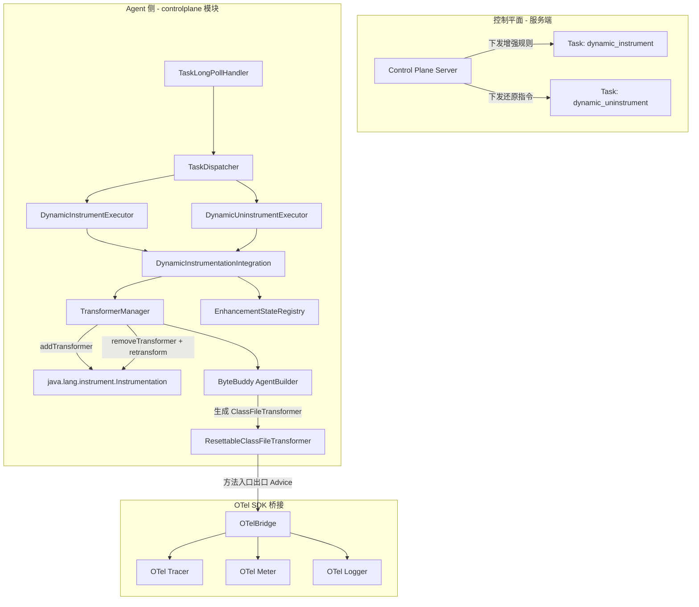
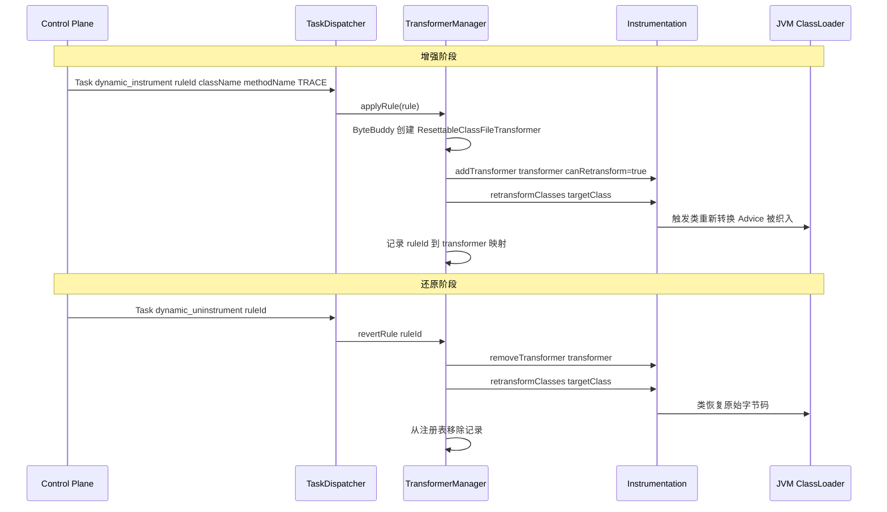
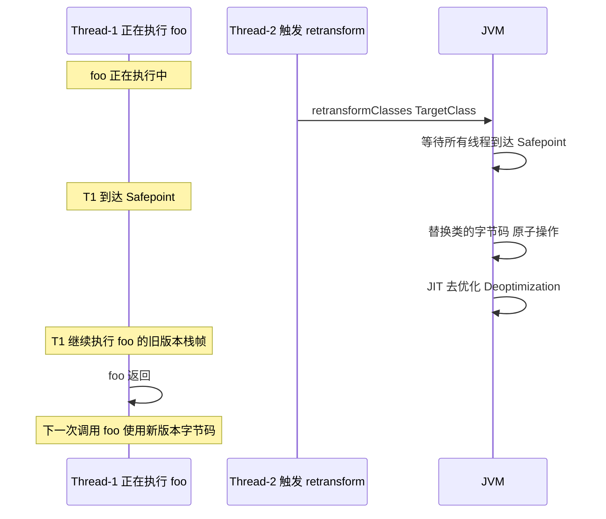

# 动态类增强与还原功能调研分析

> **调研目标**：分析当前 OpenTelemetry Java Agent 控制平面项目是否可以支持动态的类增强与还原，参考 Datadog Dynamic Instrumentation 能力，实现动态插入指标采集、链路采集、日志采集，以及增强后的可还原。

---

## 一、背景需求

参考 Datadog 的 Dynamic Instrumentation 能力，分析当前项目是否支持动态的类增强和还原，包括：

- **动态插入指标采集**（Metrics Instrumentation）
- **动态插入链路采集**（Trace Instrumentation）
- **动态插入日志采集**（Log Instrumentation）
- **可还原**（卸载增强后恢复原始类字节码）

---

## 二、当前基础设施评估

### 已具备的基础

| 基础设施 | 当前状态 | 评估 |
|----------|---------|------|
| **Instrumentation 获取** | InstrumentationProvider 支持多源获取（premain / javaagent-bootstrap / ByteBuddy / fallback），InstrumentationSnapshot 提供能力诊断 | 完备 |
| **retransformClasses 支持** | InstrumentationSnapshot.hasEnhancementCapability() 可判断是否支持 retransform | 完备 |
| **ByteBuddy 依赖** | 在 OTel Java Agent 环境中 ByteBuddy 已在 classpath | 可用 |
| **任务下发框架** | TaskDispatcher + TaskExecutor + TaskLongPollHandler，支持从控制平面下发任务并异步执行 | 完备 |
| **组件扩展体系** | ControlPlaneComponent + TaskExecutorProvider + 自动注册机制 | 完备 |
| **动态配置热更新** | DynamicConfigManager + HotUpdatableComponent + ConfigChangeListener | 完备 |
| **Arthas 增强经验** | 已有 Arthas 动态 attach/detach + SpyAPI 加载 + retransform 的完整实践 | 可借鉴 |

### 尚缺失的关键部分

| 缺失点 | 说明 | 重要性 |
|--------|------|--------|
| ClassFileTransformer 管理器 | 没有自己的 transformer 注册/注销/追踪机制 | 核心 |
| 增强规则模型 | 没有定义对哪个类的哪个方法、插入什么逻辑的数据模型 | 核心 |
| 还原 Rollback 机制 | 没有 transformer 移除 + retransformClasses 还原的统一流程 | 核心 |
| 增强状态追踪 | 没有记录哪些类已被增强、处于什么状态的注册表 | 重要 |
| 安全隔离 | 没有增强范围限制、黑名单/白名单、ClassLoader 隔离策略 | 重要 |
| OTel SDK 桥接层 | 需要将增强逻辑桥接到 OTel 的 Tracer/Meter/Logger API | 重要 |

---

## 三、技术方案设计

参考 Datadog Dynamic Instrumentation 的架构，提出以下分层设计：

### 3.0 整体架构图



### 3.1 核心组件设计

#### DynamicInstrumentationIntegration — 集成入口

```java
public class DynamicInstrumentationIntegration
    implements ControlPlaneComponent, TaskExecutorProvider {
    private final TransformerManager transformerManager;
    private final EnhancementStateRegistry stateRegistry;
    private final InstrumentationProvider instrumentationProvider;
}
```

#### TransformerManager — Transformer 生命周期管理器（最核心组件）

```java
public class TransformerManager {
    private final ConcurrentHashMap<String, ManagedTransformer> transformers;
    
    // 应用增强规则
    public EnhancementResult applyRule(InstrumentationRule rule);
    // 还原增强
    public EnhancementResult revertRule(String ruleId);
    // 还原所有增强
    public void revertAll();
}
```

**关键技术细节**：Java 的 retransformClasses 机制保证了在移除 transformer 后再次触发 retransform 时，类会恢复到当前所有剩余 transformer 处理后的状态。

#### InstrumentationRule — 增强规则模型

```java
public class InstrumentationRule {
    private String ruleId;
    private String className;              // 目标类名
    private String methodName;             // 目标方法名
    private String methodDescriptor;       // 方法描述符
    private InstrumentationType type;      // TRACE / METRIC / LOG
    private Map<String, String> config;
    private List<String> captureArgs;
    private boolean captureReturnValue;
}

public enum InstrumentationType {
    TRACE, METRIC, LOG, SNAPSHOT
}
```

#### EnhancementStateRegistry — 增强状态追踪

```java
public class EnhancementStateRegistry {
    private final ConcurrentHashMap<String, EnhancementState> states;
    
    public enum Status {
        PENDING, ACTIVE, REVERTING, REVERTED, FAILED
    }
}
```

#### ByteBuddy Advice 桥接 OTel SDK

```java
public class DynamicTraceAdvice {
    @Advice.OnMethodEnter
    public static Scope onEnter(@Advice.Origin Method method, @Advice.AllArguments Object[] args) {
        Span span = GlobalOpenTelemetry.getTracer("dynamic-instrumentation")
            .spanBuilder(method.getDeclaringClass().getSimpleName() + "." + method.getName())
            .startSpan();
        return span.makeCurrent();
    }
    
    @Advice.OnMethodExit(onThrowable = Throwable.class)
    public static void onExit(@Advice.Enter Scope scope, @Advice.Thrown Throwable thrown) {
        Span span = Span.current();
        if (thrown != null) {
            span.setStatus(StatusCode.ERROR);
            span.recordException(thrown);
        }
        span.end();
        scope.close();
    }
}
```

### 3.2 增强与还原的完整时序图



---

## 四、动态增强安全性分析

### 4.1 JVM retransformClasses 的安全保证

Java 的 Instrumentation.retransformClasses() 是 JVM 规范级别的 API，提供以下安全保证：

| 保证项 | 说明 |
|--------|------|
| **Safe Point 机制** | JVM 会等待所有线程到达安全点后才执行类重转换，不会在方法执行中途替换字节码 |
| **正在执行的方法不受影响** | 正在执行目标方法的栈帧继续使用旧版本字节码，直到方法返回 |
| **下一次调用使用新字节码** | 方法返回后，下一次调用使用新的字节码 |
| **原子性** | 类的转换是原子的，不存在半转换状态 |

### 4.2 栈帧级别的版本隔离时序图



### 4.3 需要注意的风险场景

#### 风险 1：JIT 去优化引起的性能抖动

retransformClasses() 会触发 JVM 标记该类的 compiled code 为 invalid，导致 Deoptimization。正在使用 JIT 编译代码的线程回退到解释执行，直到 JVM 重新 JIT 编译新字节码。

**缓解方案**：
- 避免对极高 QPS 的核心热点方法频繁 retransform
- 在低峰期执行增强操作
- 限制同时增强的类数量

#### 风险 2：Transformer 逻辑本身的线程安全

JVM 保证了类替换的原子性，但增强后的 Advice 代码必须自身是线程安全的。OTel 的 Tracer 和 Span API 是线程安全的，Context 基于 ThreadLocal，因此使用 OTel API 作为桥接是安全的。

#### 风险 3：增强与还原的竞态条件

同一规则的增强和还原操作可能存在竞态，需要在 TransformerManager 中使用规则级别的锁进行串行化保护。

#### 风险 4：与 OTel Agent 已有 Transformer 的交互

OTel Java Agent 本身使用 ByteBuddy 进行了静态字节码增强。多个 Transformer 对同一个类按注册顺序链式调用，叠加而非覆盖。还原时只移除我们的 transformer，OTel Agent 的增强仍然保留。

### 4.4 安全性总结矩阵

| 场景 | 是否安全 | 说明 |
|------|---------|------|
| 类正在被其他线程调用时触发增强 | ✅ 安全 | JVM Safepoint 机制保证原子替换，旧栈帧不受影响 |
| 增强后新的方法调用 | ✅ 安全 | 使用新字节码，Advice 正常执行 |
| 还原时类正在被调用 | ✅ 安全 | 正在执行的栈帧继续用旧字节码，新调用用还原后的字节码 |
| 与 OTel Agent 增强同一个类 | ✅ 安全 | Transformer 链式叠加，互不干扰 |
| 增强热点方法 | ⚠️ 安全但有性能影响 | JIT Deoptimization 导致短暂性能下降 |
| 频繁增强/还原同一个类 | ⚠️ 安全但有性能影响 | 反复 Deoptimization + Recompilation 消耗 CPU |
| 增强/还原操作的竞态条件 | ⚠️ 需要代码层面保护 | TransformerManager 中加入规则级别的互斥锁 |
| Bootstrap ClassLoader 的核心类 | ❌ 有限制 | JVM 不允许 retransform 某些核心类 |
| 修改方法签名/新增删除方法 | ❌ 不支持 | retransformClasses 只允许修改方法体，不能改变类结构 |

---

## 五、可行性评估

| 维度 | 评估 | 说明 |
|------|------|------|
| **JVM 层面** | ✅ 完全可行 | java.lang.instrument 的 retransform 机制原生支持增强和还原 |
| **ByteBuddy** | ✅ 完全可行 | AgentBuilder + Advice + ResettableClassFileTransformer 是标准做法 |
| **当前基础设施** | ✅ 高度契合 | InstrumentationProvider 已获取 Instrumentation，TaskDispatcher + TaskExecutorProvider 可无缝接入 |
| **与 OTel Agent 的共存** | ⚠️ 需要注意 | 使用独立的 transformer 实例 + 不同的匹配规则，理论上互不影响 |
| **性能影响** | ⚠️ 需要评估 | retransform 会触发 JIT 去优化，建议限制并发增强数量 |
| **ClassLoader 兼容性** | ⚠️ 需要处理 | 需要正确处理 Bootstrap/System/Application/自定义 ClassLoader |

---

## 六、相关文档

- [Bootstrap CL 注入 NoClassDefFoundError 排查与修复](/observability/implementation/otel-bootstrap-classloader-injection.md) — 实现过程中遇到的 ClassLoader 可见性问题排查记录
- [OTel Java Agent 控制平面](/observability/implementation/otel-java-agent-control-plane.md) — 控制平面整体架构
- [OTel 控制面长连接与任务系统](/observability/implementation/otel-controlplane-longpoll-task-system.md) — 任务下发框架
