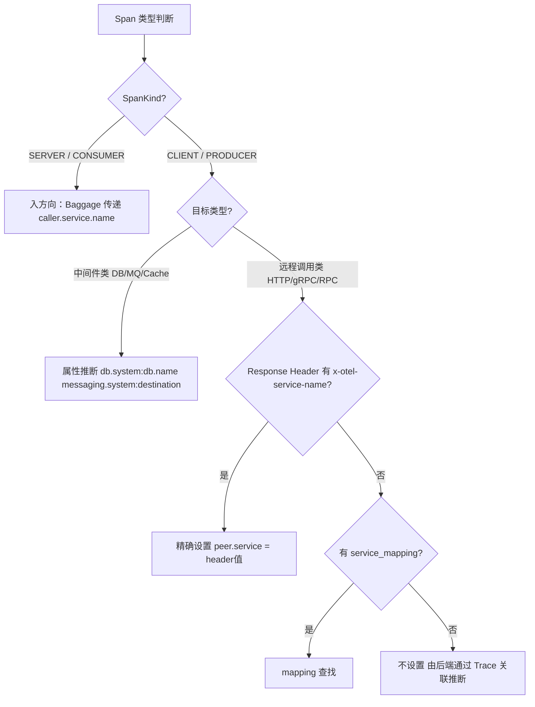
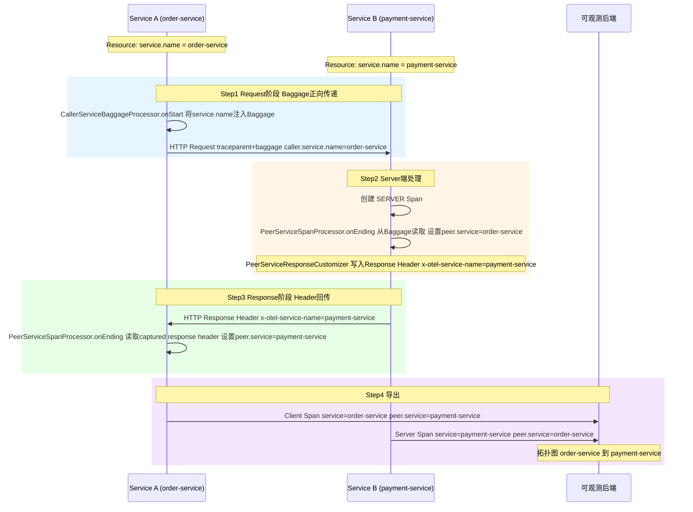
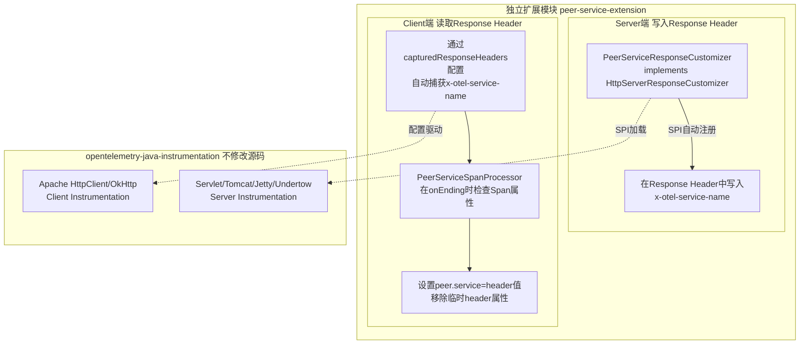
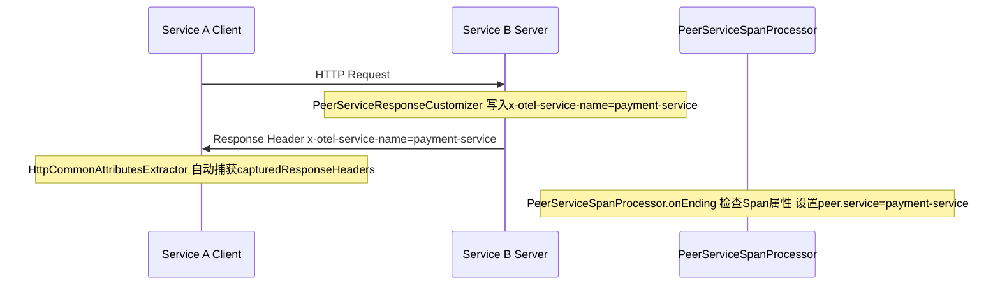
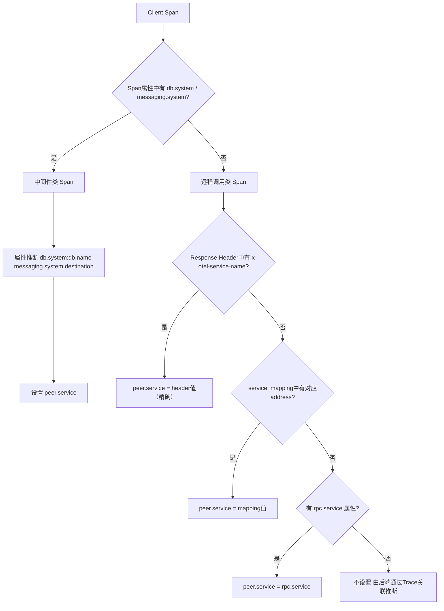
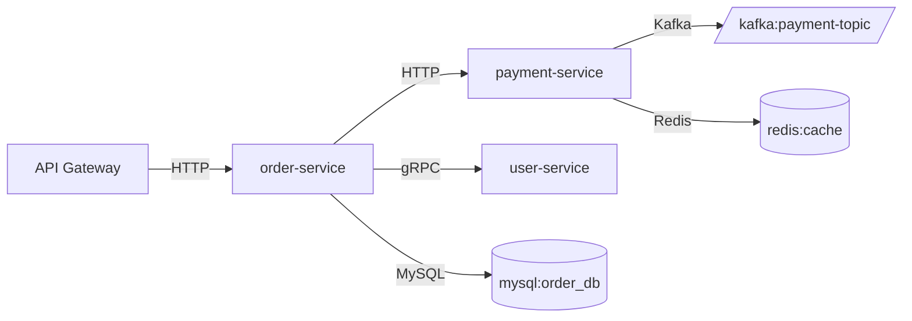

# peer.service 拓扑补齐方案设计

> 目标：为所有 Server Span 和 Client Span 自动填充 peer.service 属性，使可观测后端能正确绘制服务拓扑图。
>
> 涉及项目：
> - opentelemetry-java（SDK 层 SpanProcessor）
> - opentelemetry-java-instrumentation（Instrumentation 层 Response Header 回传）

---

## 一、问题背景

### 1.1 什么是 peer.service

peer.service 是 OpenTelemetry 语义规范中的一个 Span 属性，用于标识远端服务的名称。可观测后端（Jaeger、Zipkin、SkyWalking 等）依赖此属性绘制服务拓扑图。

### 1.2 核心痛点

当前 OpenTelemetry Java SDK 和 Instrumentation 不会自动设置 peer.service，导致：

- 拓扑图中服务间调用关系缺失
- 无法直观看到 A 调用了 B 的关系
- 需要依赖后端通过 Trace 关联推断，实时性差

### 1.3 不同 SpanKind 的挑战

| SpanKind | 含义 | peer.service 应该是 | 数据来源 | 难度 |
|----------|------|-------------------|---------|------|
| SERVER | 接收请求的一方 | 调用者的 service.name | 需要从上游传递 | 较难 |
| CLIENT | 发起请求的一方 | 被调者的 service.name | 需要知道远端服务名 | 极难 |
| PRODUCER | 消息发送方 | 同 CLIENT | 同上 | 很难 |
| CONSUMER | 消息消费方 | 同 SERVER | 同上 | 较难 |

---

## 二、方案演进与对比

### 2.1 候选方案一览

| 方案 | 原理 | 优点 | 缺点 | 结论 |
|------|------|------|------|------|
| A. service_mapping 配置 | 手动配置 address到service 映射 | 简单 | 需人工维护，不可扩展 | 不适合远程调用 |
| B. Baggage 正向传递 | 通过 Baggage 传递 caller.service.name | 标准化、零侵入 | 只能解决入方向，无法解决出方向 | 仅解决一半问题 |
| C. 后端拓扑推断 | 后端通过 TraceId 关联 Client和Server Span | 零侵入 | 依赖后端能力，实时性差 | 作为兜底 |
| D. 注册中心集成 | 通过 Nacos/Consul 查询 IP到service 映射 | 精确 | 强依赖注册中心，增加 SDK 复杂度 | 侵入性大 |
| E. 控制面自动发现+下发 mapping | 控制面收集所有 Agent 信息，构建全局映射表下发 | 自动化 | 需要控制面支持，有延迟 | 备选 |
| **F. Response Header 回传** | Server 端在 Response 中回传 service.name，Client 端读取 | **精确、实时、自收敛** | 需要双方都部署探针 | **最终选择** |

### 2.2 方案 B 的关键缺陷

Baggage 正向传递只能解决入方向（Server 知道谁调了我），无法解决出方向（Client 知道我调了谁）：

```
A (Client Span) --调用--> B (Server Span)
```

- B 知道 A 调用了它（通过 Baggage 拿到 caller = A）
- A 不知道它调用的是 B（A 的 Client Span 上没有 peer.service = B）

拓扑图只能画出入方向，画不出出方向，是残缺的。

### 2.3 为什么选择 Response Header 回传

1. **精确性**：直接从对方获取 service.name，不存在映射错误
2. **实时性**：每次调用都能拿到，没有延迟
3. **自治性**：不依赖外部系统（控制面、注册中心）
4. **渐进式**：对方没部署探针时优雅降级（不设置 peer.service），不会出错
5. **自收敛**：只要双方都部署了探针，就自动生效

---

## 三、最终方案设计

### 3.1 整体架构

方案采用分层策略，针对不同类型的 Span 使用不同的 peer.service 解析方式：



### 3.2 数据流全景图



---

## 四、两个项目的改造内容

### 4.1 opentelemetry-java（SDK 层）

在 SDK 层实现 PeerServiceSpanProcessor，负责：
- Server Span：从 Baggage 读取 caller.service.name 设置为 peer.service
- Client Span（中间件类）：从 Span 属性推断 peer.service
- Client Span（远程调用类）：从 captured response header 读取 peer.service

#### 核心组件

| 组件 | 职责 |
|------|------|
| PeerServiceSpanProcessor | 核心处理器，实现 ExtendedSpanProcessor，在 onEnding() 中填充 peer.service |
| CallerServiceBaggageSpanProcessor | 在 onStart() 时将本服务 service.name 注入 Baggage |
| PeerServiceResolverConfig | 配置类，持有 service_mapping、推断策略开关等 |

#### 关键技术决策

**为什么用 ExtendedSpanProcessor.onEnding() 而不是 onEnd()？**

- onEnding() 在 Span 结束前调用，此时 Span 仍然是 ReadWriteSpan，**可以修改属性**
- onEnd() 接收的是 ReadableSpan，已经不可变了
- 这是项目中已有的实验性 API，正好适合这个场景

#### 属性推断优先级（中间件类 Client Span）

| 优先级 | 属性来源 | 推断逻辑 | 示例 |
|--------|---------|---------|------|
| 1 | peer.service | 已有则直接使用 | - |
| 2 | db.system + db.name | 数据库类型+库名 | mysql:order_db |
| 3 | rpc.service | RPC 服务名 | UserService |
| 4 | messaging.system + messaging.destination.name | 消息系统+目标 | kafka:order-topic |
| 5 | server.address + server.port | 地址+端口（仅中间件） | redis:6379 |

### 4.2 opentelemetry-java-instrumentation（Instrumentation 层）

在 Instrumentation 层实现 Response Header 回传机制，这是解决远程调用 Client Span peer.service 的关键。

#### 关键发现：已有的扩展机制

经过深入分析 opentelemetry-java-instrumentation 项目，发现了三个关键的已有扩展点，大大降低了改造成本：

| 扩展点 | 位置 | 作用 | 侵入性 |
|--------|------|------|--------|
| HttpServerResponseCustomizer SPI | javaagent-extension-api | Server 端可以向 Response 中写入自定义 Header | 零侵入 |
| InstrumenterCustomizerProvider SPI | instrumentation-api-incubator | 可以向任意 Instrumenter 注入自定义 AttributesExtractor | 零侵入 |
| HttpCommonAttributesGetter.getHttpResponseHeader() | instrumentation-api | Client 端已有读取 Response Header 的能力 | 零侵入 |

#### 改造架构



#### Server 端：写入 Response Header（零侵入）

项目已有 HttpServerResponseCustomizer SPI 机制，且所有主流 Server Instrumentation 都已集成了这个调用点：

```java
// Servlet3Advice.java 中已有的代码
HttpServerResponseCustomizerHolder.getCustomizer()
    .customize(contextToUpdate, response, Servlet3HttpServerResponseMutator.INSTANCE);
```

我们只需实现 SPI 接口：

```java
@AutoService(HttpServerResponseCustomizer.class)
public class PeerServiceResponseCustomizer implements HttpServerResponseCustomizer {
    private static final String SERVICE_NAME_HEADER = "x-otel-service-name";
    private final String serviceName; // 从 Resource 中获取
    
    @Override
    public <RESPONSE> void customize(Context serverContext, RESPONSE response, 
                                      HttpServerResponseMutator<RESPONSE> responseMutator) {
        responseMutator.appendHeader(response, SERVICE_NAME_HEADER, serviceName);
    }
}
```

覆盖范围：Servlet 2.2/3.0/5.0、Tomcat、Jetty、Undertow、Netty、Spring WebFlux 等所有 HTTP Server Instrumentation 都已调用 HttpServerResponseCustomizerHolder，无需逐个修改。

#### Client 端：读取 Response Header（零侵入）

利用 capturedResponseHeaders 配置机制，让框架自动捕获 x-otel-service-name Header 到 Span 属性，然后在 PeerServiceSpanProcessor 中读取并转换为 peer.service：



---

## 五、改造成本评估

### 5.1 opentelemetry-java（SDK 层）

| 文件 | 操作 | 侵入性 | 工作量 |
|------|------|--------|--------|
| PeerServiceSpanProcessor.java | 新增 | 独立模块 | 中 |
| CallerServiceBaggageSpanProcessor.java | 新增 | 独立模块 | 低 |
| PeerServiceResolverConfig.java | 新增 | 独立模块 | 低 |
| TracerProviderConfiguration | 小改 | 注册 Processor | 极低 |

### 5.2 opentelemetry-java-instrumentation（Instrumentation 层）

| 文件 | 操作 | 侵入性 | 工作量 |
|------|------|--------|--------|
| PeerServiceResponseCustomizer.java | 新增 | 零侵入 SPI | 低 |
| META-INF/services/...HttpServerResponseCustomizer | 新增 | SPI 注册文件 | 极低 |
| capturedResponseHeaders 配置 | 配置变更 | 零侵入 | 极低 |

### 5.3 总体评估

| 维度 | 评估 |
|------|------|
| 对 opentelemetry-java 源码侵入 | 极低（独立模块，仅注册 Processor） |
| 对 opentelemetry-java-instrumentation 源码侵入 | **零侵入**（全部通过 SPI + 配置实现） |
| 后续同步开源版本影响 | 无影响（独立目录模块，不修改源码） |
| 总工作量 | 约 3-5 人天 |
| 风险 | 低（优雅降级，对方没探针时不设置 peer.service） |

---

## 六、Client Span 分类处理策略

### 6.1 两类 Client Span 的区别

| 类型 | 目标 | peer.service 来源 | 难度 |
|------|------|-------------------|------|
| **中间件类**（DB、MQ、Cache） | 虚拟节点 | 连接地址/系统名即可 | 简单 |
| **远程调用类**（HTTP、gRPC、RPC） | 真实服务 | 需要知道对方的 service.name | 极难 |

### 6.2 处理策略



### 6.3 核心原则

> **绝不用不精确的值（如 IP 地址）去填充 peer.service**，因为这反而会污染拓扑图。宁可不设置，交给后端通过 Trace 关联推断。

---

## 七、模块目录结构设计

为了不影响同步开源最新版本，所有改造代码放在独立目录模块中：

### 7.1 opentelemetry-java 侧

```
opentelemetry-java/
  sdk-extensions/
    controlplane/
      src/main/java/.../controlplane/
        peerservice/                    # 新增独立包
          PeerServiceSpanProcessor.java
          CallerServiceBaggageSpanProcessor.java
          PeerServiceResolverConfig.java
```

### 7.2 opentelemetry-java-instrumentation 侧

```
opentelemetry-java-instrumentation/
  custom-extensions/                    # 新增独立模块
    peer-service-extension/
      build.gradle
      src/main/
        java/.../extension/peerservice/
          PeerServiceResponseCustomizer.java
        resources/META-INF/services/
          ...HttpServerResponseCustomizer
```

---

## 八、拓扑图效果

### 8.1 完整拓扑示例



### 8.2 各节点的 peer.service 来源

| 调用关系 | peer.service 值 | 来源方式 |
|----------|----------------|----------|
| Gateway 到 order-service | order-service | Response Header 回传 |
| order-service 到 payment-service | payment-service | Response Header 回传 |
| order-service 到 user-service | user-service | Response Header 回传 |
| order-service 到 MySQL | mysql:order_db | 属性推断 |
| payment-service 到 Kafka | kafka:payment-topic | 属性推断 |
| payment-service 到 Redis | redis:cache | 属性推断 |

---

## 九、风险与降级策略

| 场景 | 行为 | 影响 |
|------|------|------|
| 对方没部署探针 | Response 中无 x-otel-service-name | 不设置 peer.service，由后端兜底 |
| W3CBaggagePropagator 未启用 | Server 端拿不到 caller.service.name | Server Span 无 peer.service，不影响 Client Span |
| Baggage header 大小超限 | 极少发生（service.name 通常很短） | 降级为不传递 |
| 非 HTTP 协议（如 Dubbo） | 无 Response Header 机制 | 使用 service_mapping 或后端推断 |

---

## 十、后续演进方向

1. **gRPC 支持**：gRPC 的 Metadata 机制类似 HTTP Header，可以用相同思路实现 Response 回传
2. **控制面自动发现**：作为 Response Header 回传的补充，通过控制面收集所有 Agent 的 service.name + listen addresses，构建全局映射表下发
3. **OTel 社区推动**：将 Response Header 回传方案提交为 OTel Enhancement Proposal，推动标准化

---

## 附录：相关文档

- [OpenTelemetry Semantic Conventions - peer.service](https://opentelemetry.io/docs/specs/semconv/general/attributes/#general-remote-service-attributes)
