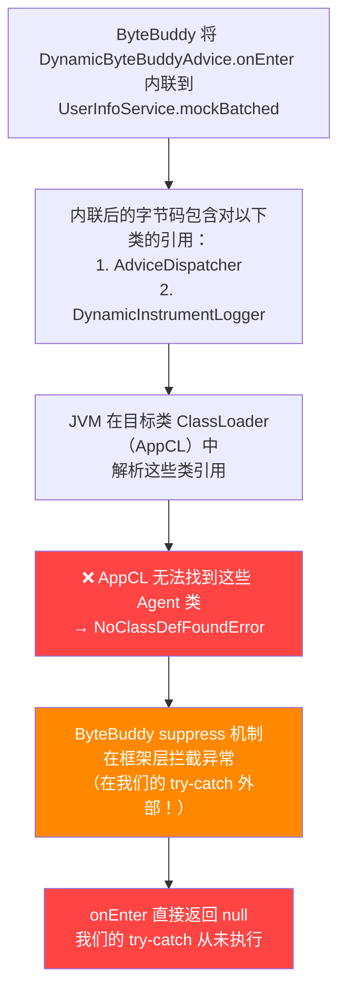
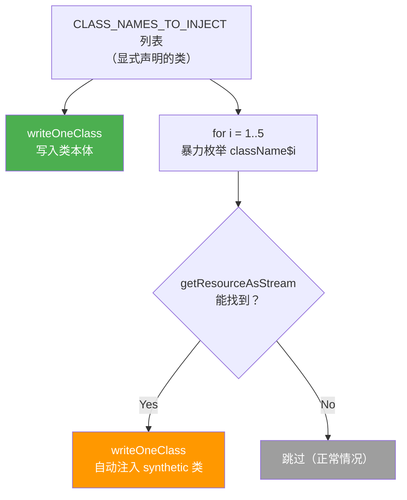
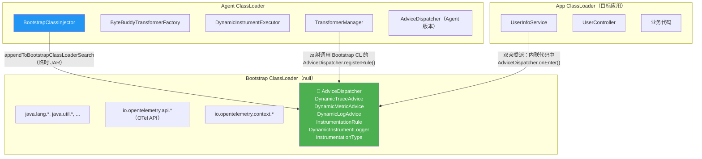
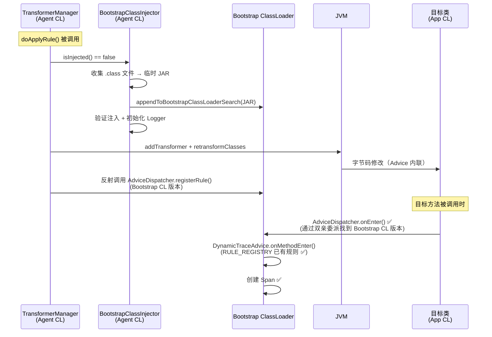

# Bootstrap CL 注入 NoClassDefFoundError 排查与修复经验记录

> **时间**：2026-03-07 ~ 2026-03-10  
> **模块**：opentelemetry-java / sdk-extensions / controlplane / instrument  
> **状态**：✅ 已修复并编译验证通过

---

## 一、问题背景

在实现动态增强功能（类 Datadog Dynamic Instrumentation）的过程中，我们使用 ByteBuddy Advice 将增强逻辑（创建 Span / Metric / Log）内联到目标业务方法中。核心链路如下：

```
控制平面服务端 → Agent 长轮询 → DynamicInstrumentExecutor → TransformerManager → ByteBuddy Advice 内联 → 目标方法被增强
```

**测试场景**：对 `UserInfoService.mockBatched()` 方法下发 TRACE 类型动态增强任务。

---

## 二、问题演进时间线

### 🔴 问题 1：动态 Span 不产生，日志文件为空

**现象**：
- 增强任务下发成功（Agent 日志显示 `Applied rule: rule-safe-svc-mockBatched`）
- Jaeger 中看不到动态 Span（`UserInfoService.mockBatched`）
- 只有 OTel Agent 自动产生的 Span（`GET /user/mockBatched`、Redis SETNX/DEL、MySQL SELECT）
- `/tmp/otel-agent/dynamic-instrument.log.0` 文件存在但**内容为空**

**分析过程**：

通过反编译目标类确认 ByteBuddy Advice 已成功内联到字节码中：

```java
// 反编译可见 Advice 代码已被内联
object2 = AdviceDispatcher.onEnter("rule-safe-svc-mockBatched", "trace");
// catch 中的日志也被内联
DynamicInstrumentLogger.logAdviceError("onEnter", "rule-safe-svc-mockBatched", throwable);
```

**根因**：**ClassLoader 可见性问题**。ByteBuddy Advice 将代码内联到目标方法后，代码在目标类的 App ClassLoader 中执行。但 `AdviceDispatcher`、`DynamicInstrumentLogger` 等类只存在于 **Agent ClassLoader** 中，App CL 无法访问 → `NoClassDefFoundError` 被 ByteBuddy 的 `suppress = Throwable.class` 静默吞掉。



**解决方案**：实施 **Bootstrap CL 注入**（方案 A2），将 Advice 内联代码引用的所有类打包成临时 JAR，通过 `Instrumentation.appendToBootstrapClassLoaderSearch(JarFile)` 注入到 Bootstrap ClassLoader。

---

### 🔴 问题 2：`NoClassDefFoundError: TaskExecutionContext`

**现象**：

```
[TASK-ERROR] Task execution failed: error=java.lang.NoClassDefFoundError: 
io/opentelemetry/sdk/extension/controlplane/task/executor/TaskExecutionContext
```

**根因**：`InstrumentationRule` 被注入到 Bootstrap CL 后，JVM 解析其 `fromContext()` 方法签名时发现 `TaskExecutionContext` 不在 Bootstrap CL 中。

**解决方案**：
1. 将 `InstrumentationRule.fromContext()` 方法**剥离**到 `DynamicInstrumentExecutor.parseRuleFromContext()` 中
2. 使 `InstrumentationRule` 成为纯数据模型类（不依赖 task 包的类）
3. 在 `DynamicInstrumentExecutor.execute()` 中增加 `catch (Throwable t)` 兜底捕获

---

### 🔴 问题 3：`NoClassDefFoundError: AdviceDispatcher$1`

**现象**：

```
Caused by: java.lang.NoClassDefFoundError: 
io/opentelemetry/sdk/extension/controlplane/instrument/AdviceDispatcher$1
    at AdviceDispatcher.registerRule(AdviceDispatcher.java:40)
```

运行时 `onEnter` 和 `onExit` 也同样报此错误。

**根因**：Java 编译器为 `switch(enum)` 语句自动生成了一个 **synthetic 匿名内部类 `AdviceDispatcher$1`**，其中包含 `$SwitchMap$...InstrumentationType` 字段。这个类没有被 `CLASS_NAMES_TO_INJECT` 列表包含，导致 Bootstrap CL 中缺失它。

类似地，`InstrumentationRule$1` 也是编译器生成的 synthetic 类（Builder 的 private 构造器的访问桥接类）。

---

## 三、方案对比与最终决策

### 三个候选方案

| 方案 | 思路 | 优点 | 缺点 |
|------|------|------|------|
| **A：硬编码补充 `$1` 类** | 在 `CLASS_NAMES_TO_INJECT` 中手动添加 `$1` | 简单快速 | `$1` 编号不稳定，编译器生成的编号可能变化 |
| **B：动态扫描所有 `$N` 类** | 暴力枚举 `$1`~`$N`，自动发现并注入 | 覆盖全面 | 治标不治本，依赖 ClassLoader 扫描能力 |
| **C：消除 switch(enum)** | 将 `switch` 改为 `if-else if`，从源头消除 `$1` 类生成 | **根治**，无外部依赖 | 需要 `@SuppressWarnings("UseEnumSwitch")` |

### 最终方案：方案 C 根治 + 方案 B 思想兜底



---

## 四、最终修复清单

### 4.1 `AdviceDispatcher.java` — 消除 switch(enum)

**修改**：4 个 `switch(InstrumentationType)` 全部改为 `if-else if`，消除编译器生成的 `$1` synthetic `$SwitchMap` 类。

```java
// Before（会生成 AdviceDispatcher$1）
switch (rule.getType()) {
    case TRACE: DynamicTraceAdvice.registerRule(rule); break;
    case METRIC: DynamicMetricAdvice.registerRule(rule); break;
    case LOG: DynamicLogAdvice.registerRule(rule); break;
}

// After（不会生成匿名类）
InstrumentationType type = rule.getType();
if (type == InstrumentationType.TRACE) {
    DynamicTraceAdvice.registerRule(rule);
} else if (type == InstrumentationType.METRIC) {
    DynamicMetricAdvice.registerRule(rule);
} else if (type == InstrumentationType.LOG) {
    DynamicLogAdvice.registerRule(rule);
}
```

类级别添加 `@SuppressWarnings("UseEnumSwitch")` 抑制 Error Prone 对 if-else 替代 switch(enum) 的警告，注释中说明原因。

### 4.2 `InstrumentationRule.java` — 消除 synthetic 访问桥接类

**修改**：Builder 构造器从 `private` 改为 package-private，减少编译器生成的 `$1` 访问桥接类。

```java
// Before
private Builder() {}

// After
Builder() {} // package-private，避免编译器生成 synthetic $1 访问桥接类
```

### 4.3 `InstrumentationRule.java` — 剥离 `fromContext()` 方法

**修改**：移除 `fromContext(TaskExecutionContext)` 方法，使 `InstrumentationRule` 成为纯数据模型类，不再依赖 `TaskExecutionContext`，可安全注入到 Bootstrap CL。

### 4.4 `DynamicInstrumentExecutor.java` — 承接规则解析 + Throwable 兜底

**修改**：
1. 新增 `parseRuleFromContext()` 私有方法，承接从 `InstrumentationRule` 移出的解析逻辑
2. 增加 `catch (Throwable t)` 兜底捕获，防止 `NoClassDefFoundError` 等 `Error` 逃逸到 `CompletableFuture`

### 4.5 `BootstrapClassInjector.java` — 兜底防护

**修改**：`writeClassesToJar()` 重构为每个类自动暴力枚举 `$1`~`$5` 的 synthetic 类，自动发现并注入；提取 `writeOneClass()` 方法消除重复代码。

```java
for (String className : CLASS_NAMES_TO_INJECT) {
    // 写入类本体
    writeOneClass(jos, agentClassLoader, className);
    // 兜底：自动扫描编译器可能生成的 synthetic 内部类
    for (int i = 1; i <= 5; i++) {
        String syntheticName = className + "$" + i;
        if (writeOneClass(jos, agentClassLoader, syntheticName)) {
            logger.log(Level.INFO, "Auto-discovered synthetic class: {0}", syntheticName);
        }
    }
}
```

---

## 五、验证结果

| 验证项 | 结果 |
|--------|------|
| 编译（clean build） | ✅ BUILD SUCCESSFUL |
| `AdviceDispatcher$1` 消除 | ✅ 不再生成 |
| `InstrumentationRule$1` 兜底 | ✅ `$N` 扫描会自动发现并注入 |
| Error Prone 检查 | ✅ `@SuppressWarnings("UseEnumSwitch")` 通过 |

---

## 六、核心架构图

### 6.1 三层 ClassLoader 架构



### 6.2 反射桥接机制



---

## 七、经验教训总结

### 7.1 关键认知

| # | 经验 | 说明 |
|---|------|------|
| 1 | **ByteBuddy Advice 内联代码运行在目标类的 ClassLoader 中** | 不是 Agent CL，所以 Agent CL 中的类对内联代码不可见 |
| 2 | **`suppress = Throwable.class` 会静默吞掉 NoClassDefFoundError** | 连我们自己写的 try-catch 都不会执行到 |
| 3 | **Bootstrap CL 注入后存在两份同名类** | Agent CL 和 Bootstrap CL 中各一份，静态字段不共享，必须通过反射桥接 |
| 4 | **Java 编译器为 `switch(enum)` 生成 synthetic `$1` 类** | 包含 `$SwitchMap$` 字段，是常见的 Bootstrap 注入遗漏根因 |
| 5 | **Java 8 编译目标下 `private` 内部类构造器也会生成 synthetic `$1` 类** | 即使改为 package-private，Java 8 target 仍可能生成空的 synthetic 类 |
| 6 | **`catch (RuntimeException)` 无法捕获 `Error`** | `NoClassDefFoundError` 是 `Error` 的子类，会穿透 RuntimeException 的 catch |
| 7 | **`InstrumentationRule` 等注入到 Bootstrap CL 的类不能引用非 Bootstrap CL 的类** | 即使是方法签名中的引用，JVM 也可能在类加载时尝试解析 |

### 7.2 Bootstrap CL 注入类的编码规范

对于需要注入到 Bootstrap ClassLoader 的类，应遵循以下规范：

1. **❌ 禁止使用 `switch(enum)`** — 编译器会生成 `$SwitchMap` 匿名类，用 `if-else if` 替代
2. **❌ 禁止引用非 Bootstrap CL 可见的类** — 包括方法签名、字段类型、局部变量类型
3. **⚠️ 避免 `private` 内部类构造器** — 在 Java 8 target 下会生成 synthetic 访问桥接类
4. **⚠️ 避免 lambda 表达式** — 编译器可能生成 `$Lambda$N` 类
5. **✅ 只依赖 JDK 类和已知在 Bootstrap CL 中的类**（如 OTel API）
6. **✅ 保持为纯数据模型或无状态工具类**，避免复杂依赖链

### 7.3 防御性编程

`BootstrapClassInjector` 的 `$1`~`$5` 暴力枚举兜底机制，确保即使未来有人在注入列表中的类里新增了 `switch(enum)` 或其他导致 synthetic 类的代码，兜底机制也能自动覆盖。

---

## 八、修改文件清单

| 文件 | 修改类型 | 说明 |
|------|---------|------|
| `AdviceDispatcher.java` | 修改 | 4 个 switch → if-else if；`@SuppressWarnings("UseEnumSwitch")` |
| `InstrumentationRule.java` | 修改 | 移除 `fromContext()` 方法；Builder 构造器改为 package-private |
| `DynamicInstrumentExecutor.java` | 修改 | 新增 `parseRuleFromContext()`；增加 `catch (Throwable)` 兜底 |
| `BootstrapClassInjector.java` | 修改 | `writeClassesToJar()` 增加 `$1`~`$5` 暴力枚举；提取 `writeOneClass()` |
| `TransformerManager.java` | 修改 | Bootstrap 注入触发 + 反射桥接（前序修改） |
| `BootstrapClassInjector.java` | 新建 | Bootstrap CL 类注入器（前序新建） |
| `DynamicInstrumentLogger.java` | 新建/修改 | 独立日志系统，支持文件输出（前序修改） |

---

## 九、相关文档

- [动态类增强与还原功能调研分析](/observability/design/otel-dynamic-instrumentation-design.md) — 功能调研与技术方案设计
- [OTel Java Agent 控制平面](/observability/implementation/otel-java-agent-control-plane.md) — 控制平面整体架构
- [Arthas SpyAPI 初始化机制分析](/observability/arthas/otel-arthas-spyapi-initialization.md) — 类似的 ClassLoader 可见性问题
