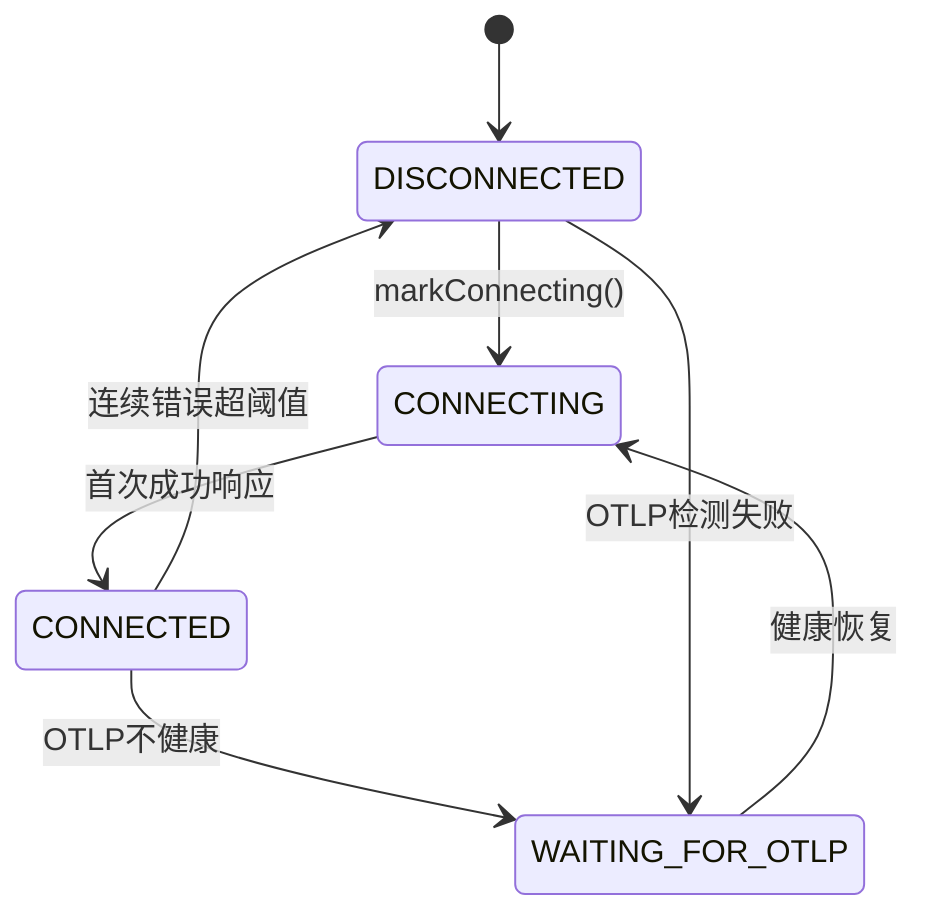
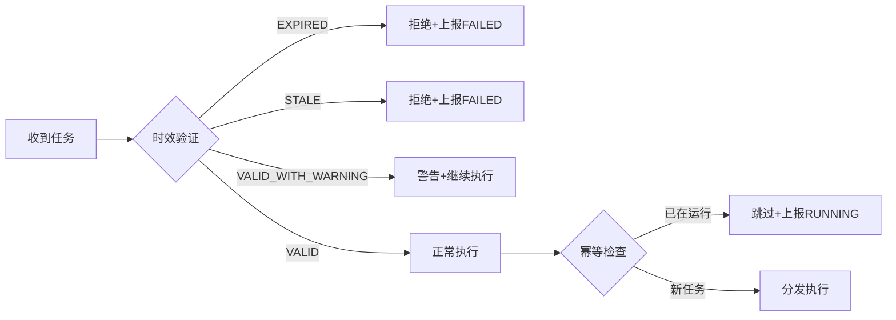
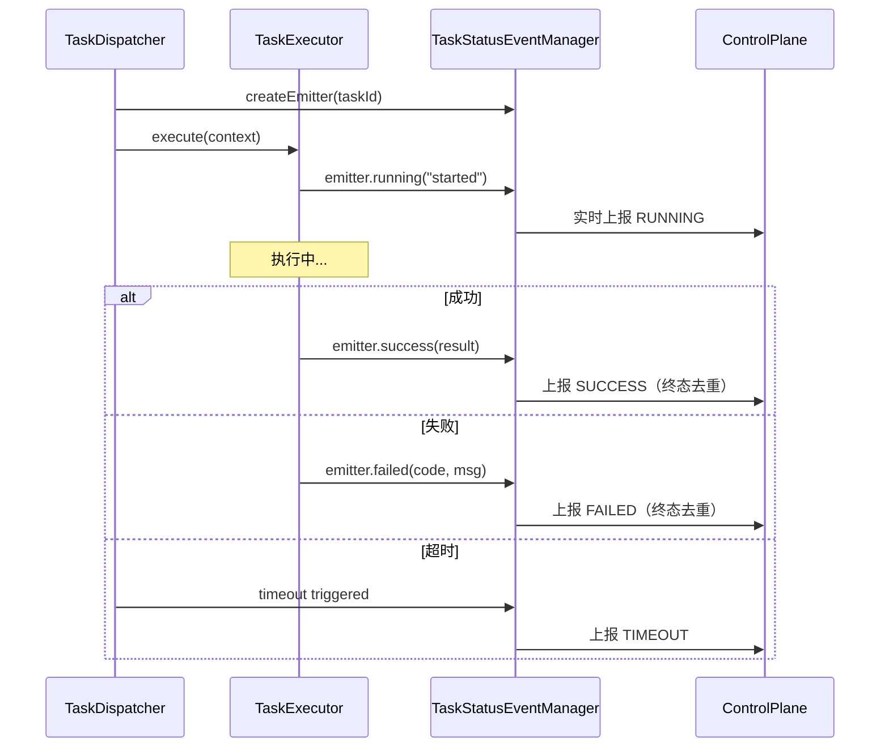

# 控制面长连接与任务系统设计

将远程诊断与配置下发从"黑盒轮询"升级为"事件驱动、状态可观测、失败可自愈"的生产级控制面能力。

## 一、核心价值

| 维度 | 传统方式 | 当前设计 |
|------|----------|----------|
| **连接管理** | 固定间隔轮询，无状态 | 长连接+状态机+健康联动 |
| **任务下发** | 被动拉取，无时效校验 | 主动推送+时效验证+幂等分发 |
| **状态上报** | 仅终态上报 | 事件驱动实时上报（RUNNING/SUCCESS/FAILED） |
| **失败处理** | 无重试或固定重试 | 指数退避+连续错误感知+自动降级 |
| **可观测性** | 日志散落 | 统一状态机+结构化日志+统计聚合 |

---

## 二、架构全景图

```
┌─────────────────────────────────────────────────────────────────────────────────┐
│                              Control Plane Server                                │
└───────────────────────────────────┬─────────────────────────────────────────────┘
                                    │ Long Poll /v1/control/poll
                                    ▼
┌─────────────────────────────────────────────────────────────────────────────────┐
│                              OTel Java Agent                                     │
│  ┌─────────────────────────────────────────────────────────────────────────┐    │
│  │                            连接层                                        │    │
│  │  ┌─────────────────┐  ┌──────────────────┐  ┌──────────────────────┐   │    │
│  │  │LongPollCoordinator│  │ConnectionStateMgr│  │HealthCheckCoordinator│   │    │
│  │  │  - 统一轮询入口  │  │  - 5状态机       │  │  - OTLP健康联动      │   │    │
│  │  │  - 响应分发      │  │  - 监听器通知    │  │  - 快速恢复策略      │   │    │
│  │  └─────────────────┘  └──────────────────┘  └──────────────────────┘   │    │
│  │                              │ ExponentialBackoff (指数退避)            │    │
│  └──────────────────────────────┼──────────────────────────────────────────┘    │
│                                 │                                               │
│  ┌──────────────────────────────▼──────────────────────────────────────────┐    │
│  │                           Handler层                                      │    │
│  │  ┌──────────────────────┐        ┌──────────────────────┐               │    │
│  │  │ ConfigLongPollHandler │        │ TaskLongPollHandler  │               │    │
│  │  │   - 配置变更处理     │        │   - 时效验证         │               │    │
│  │  │   - 热更新触发       │        │   - 任务分发         │               │    │
│  │  └──────────────────────┘        └───────────┬──────────┘               │    │
│  └──────────────────────────────────────────────┼──────────────────────────┘    │
│                                                 │                               │
│  ┌──────────────────────────────────────────────▼──────────────────────────┐    │
│  │                          任务执行层                                      │    │
│  │  ┌──────────────────┐  ┌────────────────────────────────────────────┐  │    │
│  │  │  TaskDispatcher  │  │              TaskExecutors                  │  │    │
│  │  │   - 幂等分发     │  │  ┌────────────┐ ┌────────────┐ ┌────────┐ │  │    │
│  │  │   - 超时控制     │──│  │AttachExec  │ │DetachExec  │ │ ...    │ │  │    │
│  │  │   - 终态去重     │  │  └────────────┘ └────────────┘ └────────┘ │  │    │
│  │  └────────┬─────────┘  └────────────────────────────────────────────┘  │    │
│  │           │                                                             │    │
│  │  ┌────────▼─────────────────────────────────────────────────────────┐  │    │
│  │  │              TaskStatusEventManager (事件驱动上报)                │  │    │
│  │  │   - RUNNING 节流 (1s/次)  - 终态去重  - 实时上报到控制面         │  │    │
│  │  └──────────────────────────────────────────────────────────────────┘  │    │
│  └─────────────────────────────────────────────────────────────────────────┘    │
└─────────────────────────────────────────────────────────────────────────────────┘
```

**数据流向**：
1. **下行**：Control Plane → LongPollCoordinator → Handler → TaskDispatcher → Executor
2. **上行**：Executor → TaskStatusEventManager → Control Plane（实时状态上报）
3. **联动**：HealthCheckCoordinator ↔ ConnectionStateManager ↔ LongPollCoordinator

---

## 三、重点设计与实现

### 3.1 长连接管理：状态机 + 健康联动

**难点**：网络不稳定时如何避免"假连接"和"无效重连"？

**解法**：



**关键实现**：
- `ConnectionStateManager`：5种状态的确定性转换，支持监听器通知
- `HealthCheckCoordinator`：OTLP 健康状态与连接状态联动，采用"快速恢复策略"——最近10秒内有成功即放行
- `ExponentialBackoff`：失败时指数退避（1s→2s→4s→...→30s），成功后立即重置

**亮点**：
```java
// 不是简单的"健康=连接"，而是"策略化门闩"
public interface ConnectionGatePolicy {
    GateDecision decide(OtlpHealthMonitor monitor);
}
// DEGRADED 状态下，只要最近有成功就"快速开闸"，兼顾稳定性与恢复速度
```

---

### 3.2 任务接收：时效验证 + 幂等分发

**难点**：如何避免"过期任务执行"和"重复任务干扰"？

**解法**：



**关键实现**：
```java
// TaskLongPollHandler.validateTask() - 四级时效验证
public enum TaskValidationResult {
    VALID,              // 正常执行
    EXPIRED,            // 已过期（expiresAt 已超）→ 拒绝
    STALE,              // 太旧（延迟>5分钟）→ 拒绝
    VALID_WITH_WARNING  // 延迟较高但未过期 → 警告后执行
}

// TaskDispatcher.dispatchWithResult() - 幂等分发
if (!runningTasks.add(taskId)) {
    return DispatchResult.alreadyRunning(); // 防重复执行
}
```

**亮点**：
- 过期/陈旧任务**立即上报失败**，让控制面快速收敛，避免无效重试
- 重复任务**上报 RUNNING 状态**，告知服务端任务正在执行中

---

### 3.3 任务执行：事件驱动 + 超时控制

**难点**：如何让服务端"实时感知"任务状态，而不是等终态？

**解法**：



**关键实现**：
```java
// TaskStatusEventManager - 事件驱动 + 节流 + 去重
private void emitRunning(String taskId, String agentId, String message) {
    // 终态后不再发 RUNNING
    if (terminalStatus.containsKey(taskId)) return;
    // 1秒内不重复发 RUNNING（防 spam）
    if (now - lastReport < 1000) return;
    emit(TaskStatusEvent.running(taskId, agentId, message));
}

// TaskDispatcher - 超时控制
CompletableFuture<TaskExecutionResult> withTimeout(future, timeoutMillis, taskId) {
    scheduler.schedule(() -> {
        if (!timeoutFuture.isDone()) {
            timeoutFuture.completeExceptionally(new TimeoutException(...));
        }
    }, timeoutMillis, TimeUnit.MILLISECONDS);
}
```

**亮点**：
- **事件驱动**：执行器只需调用 `emitter.running()/success()/failed()`，无需关心上报细节
- **RUNNING 节流**：1秒内最多上报一次，防止高频 spam
- **终态去重**：SUCCESS/FAILED/TIMEOUT/CANCELLED 只上报一次，防止状态翻转

---

### 3.4 扩展性设计：开闭原则

**难点**：如何在不修改核心代码的情况下支持新的任务类型？

**解法**：

```java
// 1. Handler 层：支持动态注册
public LongPollCoordinator registerHandler(LongPollHandler<?> handler) {
    handlers.add(handler);
    return this; // 链式调用
}

// 2. Executor 层：支持动态注册
public TaskDispatcher registerExecutor(TaskExecutor executor) {
    executors.put(executor.getTaskType(), executor);
    return this;
}

// 使用示例：
coordinator
    .registerHandler(new ConfigLongPollHandler(...))
    .registerHandler(new TaskLongPollHandler(...));

dispatcher
    .registerExecutor(new ArthasAttachExecutor(manager))
    .registerExecutor(new ArthasDetachExecutor(manager))
    .registerExecutor(new ProfilerExecutor(...)); // 未来扩展
```

**亮点**：
- **新增轮询类型**：只需实现 `LongPollHandler` 接口并注册
- **新增任务类型**：只需实现 `TaskExecutor` 接口并注册
- **无需修改**：`LongPollCoordinator` 和 `TaskDispatcher` 对扩展开放、对修改关闭

---

## 四、难点与解决方案对照表

| 难点 | 根因 | 解法 | 关键类/方法 |
|------|------|------|-------------|
| 网络抖动导致频繁重连 | 固定间隔重试 | 指数退避 + 连续错误计数 | `ExponentialBackoff.nextBackoff()` |
| OTLP 不健康时浪费连接 | 无健康联动 | 健康门闸策略 | `HealthCheckCoordinator.shouldConnect()` |
| 过期任务被执行 | 无时效验证 | 四级时效校验 | `TaskLongPollHandler.validateTask()` |
| 重复任务干扰 | 无幂等控制 | runningTasks 集合 | `TaskDispatcher.runningTasks.add()` |
| 服务端不知道任务状态 | 仅终态上报 | 事件驱动实时上报 | `TaskStatusEventManager` |
| 任务执行卡死 | 无超时控制 | 调度器超时 + 显式异常 | `TaskDispatcher.withTimeout()` |
| 终态被重复上报 | 无去重机制 | 终态原子标记 | `reportedTerminalStatus.compareAndSet()` |

---

## 五、监控指标

### 5.1 关键指标

| 指标 | 说明 |
|------|------|
| 连接成功率 | 长轮询成功响应比例 |
| 任务时效通过率 | 通过时效验证的任务比例 |
| 任务执行成功率 | SUCCESS / (SUCCESS + FAILED + TIMEOUT) |
| 平均任务延迟 | 从创建到接收的平均时间 |
| 重复任务拦截数 | 被幂等检查拦截的数量 |
| 状态上报实时性 | RUNNING 上报到终态的平均间隔 |

---

## 六、总结

### 6.1 核心收益

1. **可观测**：连接状态、任务状态、健康状态全程可追踪
2. **可收敛**：过期/重复任务被拒绝，系统最终到达确定性终态
3. **可自愈**：OTLP 恢复后自动重连，连续错误后自动退避
4. **可扩展**：新任务类型通过注册 Executor 即可支持，无需改动主链路

### 6.2 十行极简版

1. 采用**统一长轮询端点**同时获取配置和任务，减少连接数和延迟
2. 通过**5 状态连接状态机**管理连接生命周期，状态转换可观测
3. 引入**健康门闸策略**，OTLP 不健康时阻断连接，恢复后快速重连
4. 实现**指数退避重试**，失败时渐进延长间隔，成功后立即重置
5. 对任务做**四级时效验证**（VALID/EXPIRED/STALE/WARNING），拒绝无效任务
6. 通过**幂等分发**防止重复执行，重复任务上报 RUNNING 而非再次执行
7. 采用**事件驱动上报**，执行器发射事件即可，无需关心上报细节
8. 对 RUNNING 状态做**节流去重**（1秒/次），对终态做**原子去重**
9. 所有任务执行带**显式超时控制**，超时转为类型化 TimeoutException
10. 遵循**开闭原则**，新增任务类型只需注册 Executor，无需修改分发器

### 6.3 竞争力总结

> **我们不是简单地"轮询接口"，而是把控制面通信做成了可观测、可自愈、可收敛的生产级基础设施。**

- **连接层**：状态机 + 健康联动 + 指数退避 → 稳定可靠
- **接收层**：时效验证 + 幂等分发 → 不执行无效任务
- **执行层**：事件驱动 + 超时控制 + 终态去重 → 状态一致
- **扩展性**：Handler + Executor 注册机制 → 对修改关闭、对扩展开放
