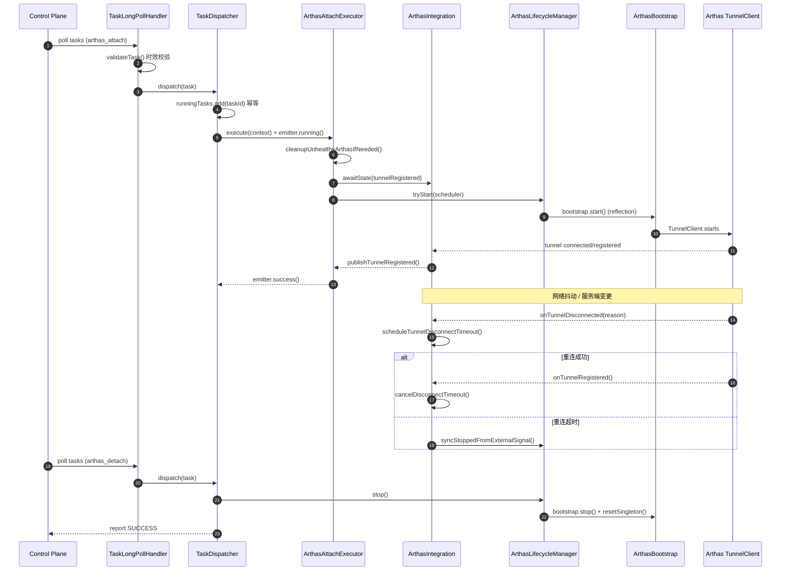
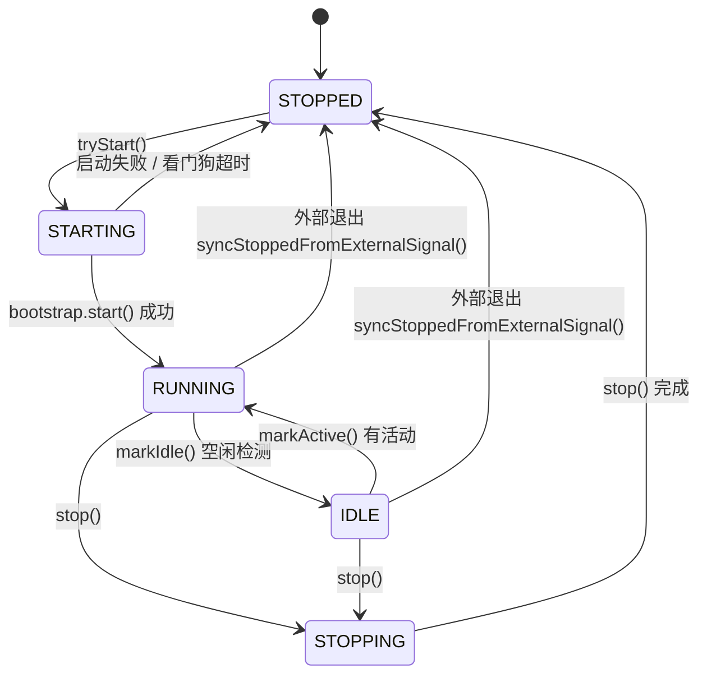

# Arthas 生命周期管理：任务驱动的 Attach/Detach 全链路闭环

把 Arthas 从"人工上机工具"升级为"控制面可编排的诊断能力"，实现可观测、可自愈、可收敛的生产级远程诊断闭环。

## 一、背景与目标

### 1.1 问题现状

传统 Arthas 使用方式存在以下痛点：

| 痛点 | 描述 |
|------|------|
| **人工依赖** | 需要登录机器手动执行 `as.sh`，无法远程批量操作 |
| **状态黑盒** | 不知道 Arthas 是否真正启动成功、Tunnel 是否可用 |
| **异常难恢复** | 遇到"启动卡住"、"Tunnel 断连"等问题，只能人工介入 |
| **资源泄漏** | Arthas 进程可能残留，无法确定性回收 |

### 1.2 核心目标

| 目标 | 说明 |
|------|------|
| **任务可下发** | 控制面下发 `arthas_attach / arthas_detach`，Agent 在本地可靠执行 |
| **状态可观测** | 任务执行过程与终态可持续上报，能定位失败阶段与根因 |
| **能力可收敛** | 在分布式不确定性下，系统最终能确定性地到达"就绪"或"已回收"的终态 |
| **具备自愈** | 对"本地看似运行但 Tunnel 不可用"等异常状态，可自动清理并允许重新 attach |

---

## 二、核心价值

> **一句话总结**：我们把 Arthas 的 attach/detach + tunnel 就绪从"黑盒、不可控、靠人工恢复"工程化成**任务驱动的可靠闭环**：具备幂等、防重复、过程可观测、失败可定位、异常可自愈、状态可收敛的生产级远程诊断能力。

### 2.1 能力矩阵

| 维度 | 传统方式 | 本方案 |
|------|----------|--------|
| **启动方式** | 人工 SSH + `as.sh` | 控制面任务下发 |
| **成功标准** | 进程启动 | Tunnel 注册就绪、终端可交互 |
| **失败定位** | 看日志猜测 | 结构化错误码 + 阶段上报 |
| **异常恢复** | 人工重启 | 自动检测 + 清理 + 重试 |
| **资源回收** | 不确定 | 确定性回收 + 状态纠偏 |

---

## 三、整体架构

### 3.1 架构图

```
┌─────────────────────────────────────────────────────────────────────────────────┐
│                              Control Plane                                       │
│  ┌─────────────────┐    ┌─────────────────┐    ┌─────────────────┐              │
│  │  Task Scheduler │───►│  Task Dispatcher │───►│  Status Tracker │              │
│  └─────────────────┘    └─────────────────┘    └─────────────────┘              │
└───────────────────────────────────┬─────────────────────────────────────────────┘
                                    │ Long Poll / WebSocket
                                    ▼
┌─────────────────────────────────────────────────────────────────────────────────┐
│                              OTel Java Agent                                     │
│  ┌─────────────────────────────────────────────────────────────────────────┐    │
│  │                         Task Execution Layer                             │    │
│  │  ┌─────────────────┐  ┌──────────────────┐  ┌──────────────────────┐    │    │
│  │  │TaskLongPollHandler│  │  TaskDispatcher  │  │  TaskStatusEmitter   │    │    │
│  │  │  - validateTask  │  │  - 幂等执行      │  │  - 实时上报          │    │    │
│  │  │  - 时效校验      │  │  - 超时控制      │  │  - 终态去重          │    │    │
│  │  └─────────────────┘  └──────────────────┘  └──────────────────────┘    │    │
│  └─────────────────────────────────────────────────────────────────────────┘    │
│                                    │                                             │
│  ┌─────────────────────────────────▼───────────────────────────────────────┐    │
│  │                         Arthas Integration Layer                         │    │
│  │  ┌──────────────────┐  ┌──────────────────┐  ┌──────────────────────┐   │    │
│  │  │ArthasAttachExecutor│  │ArthasDetachExecutor│  │  ArthasIntegration   │   │    │
│  │  │  - 就绪等待      │  │  - 确定性回收    │  │  - Tunnel 桥接       │   │    │
│  │  │  - 自愈清理      │  │  - 状态纠偏      │  │  - 断线治理          │   │    │
│  │  └──────────────────┘  └──────────────────┘  └──────────────────────┘   │    │
│  └─────────────────────────────────────────────────────────────────────────┘    │
│                                    │                                             │
│  ┌─────────────────────────────────▼───────────────────────────────────────┐    │
│  │                         Arthas Lifecycle Layer                           │    │
│  │  ┌──────────────────┐  ┌──────────────────┐  ┌──────────────────────┐   │    │
│  │  │ArthasLifecycleManager│  │  ArthasBootstrap │  │  ArthasStateEventBus │   │    │
│  │  │  - 状态机管理    │  │  - 反射启停      │  │  - 事件发布          │   │    │
│  │  │  - 启动看门狗    │  │  - 单例清理      │  │  - 状态订阅          │   │    │
│  │  └──────────────────┘  └──────────────────┘  └──────────────────────┘   │    │
│  └─────────────────────────────────────────────────────────────────────────┘    │
│                                    │                                             │
│                                    ▼                                             │
│  ┌─────────────────────────────────────────────────────────────────────────┐    │
│  │                    Arthas Runtime (Third-party)                          │    │
│  │  ┌──────────────────┐              ┌──────────────────────────────────┐ │    │
│  │  │  ArthasBootstrap │◄────────────►│  TunnelClient → Tunnel Server    │ │    │
│  │  │  (Singleton)     │              │  (WebSocket)                     │ │    │
│  │  └──────────────────┘              └──────────────────────────────────┘ │    │
│  └─────────────────────────────────────────────────────────────────────────┘    │
└─────────────────────────────────────────────────────────────────────────────────┘
```

### 3.2 核心组件职责

| 组件 | 职责 |
|------|------|
| **TaskLongPollHandler** | 任务获取与时效性校验，过滤过期/陈旧任务 |
| **TaskDispatcher** | 幂等分发、超时控制、终态去重 |
| **TaskStatusEmitter** | 实时状态上报（RUNNING/SUCCESS/FAILED/TIMEOUT） |
| **ArthasAttachExecutor** | Attach 执行：启动 + 等待 Tunnel 就绪 + 自愈清理 |
| **ArthasDetachExecutor** | Detach 执行：停止 + 等待停止 + 状态纠偏 |
| **ArthasIntegration** | Tunnel 状态桥接、断线治理、重连策略 |
| **ArthasLifecycleManager** | 生命周期状态机、启动看门狗、外部信号回灌 |
| **ArthasBootstrap** | 反射调用 Arthas 启停、单例清理 |

---

## 四、全链路闭环流程

### 4.1 时序图



### 4.2 阶段详解

#### 阶段 1：任务接收与校验

**目标**：避免"过期/陈旧任务"制造噪音与雪崩

```java
// TaskLongPollHandler.java
public TaskValidity validateTask(Task task) {
    long now = System.currentTimeMillis();
    long taskAge = now - task.getCreatedAt();
    
    if (taskAge > MAX_TASK_AGE_MS) {
        return TaskValidity.EXPIRED;  // 任务已过期
    }
    if (task.getVersion() < currentVersion) {
        return TaskValidity.STALE;    // 任务版本过旧
    }
    if (taskAge > WARN_THRESHOLD_MS) {
        return TaskValidity.VALID_WITH_WARNING;  // 有效但需警告
    }
    return TaskValidity.VALID;
}
```

**价值**：把"任务系统的不确定性"提前消解，避免"迟到的 attach/detach"干扰现场状态。

#### 阶段 2：任务分发与执行

**目标**：幂等、防重复、过程实时上报

```java
// TaskDispatcher.java
public void dispatch(Task task) {
    String taskId = task.getId();
    
    // 幂等：防止重复执行
    if (!runningTasks.add(taskId)) {
        logger.warn("Task already running: {}", taskId);
        return;
    }
    
    try {
        // 立即上报开始执行
        emitter.running("Task started");
        
        // 带超时执行
        CompletableFuture<TaskResult> future = executor.execute(task);
        TaskResult result = withTimeout(future, task.getTimeout());
        
        // 终态去重上报
        if (reportedTerminalStatus.add(taskId)) {
            emitter.report(result.getStatus(), result.getMessage());
        }
    } finally {
        runningTasks.remove(taskId);
    }
}
```

**价值**：把"任务执行"变成可控的状态机，而不是一次性脚本调用。

#### 阶段 3：Attach 执行

**目标**：从"启动 Arthas"升级为"启动 + 等待 Tunnel 注册就绪"的确定性动作

```java
// ArthasAttachExecutor.java
public TaskResult execute(TaskContext context) {
    // 1. 快速成功路径：已就绪直接返回
    if (readinessGate.evaluateNow().isTerminalReady()) {
        return TaskResult.success("Already ready");
    }
    
    // 2. 自愈清理：检测并清理不健康的 Arthas
    cleanupUnhealthyArthasIfNeeded(effectiveTimeout);
    
    // 3. 事件驱动等待
    CompletableFuture<Void> tunnelReady = integration.awaitState(
        state -> state.isTunnelRegistered(),
        effectiveTimeout
    );
    
    // 4. 并行等待失败模式（启动后又停止）
    CompletableFuture<Void> startFailed = integration.awaitState(
        state -> state.wasStartingThenStopped(),
        effectiveTimeout
    );
    
    // 5. 触发启动
    lifecycleManager.tryStart(scheduler);
    
    // 6. 等待任一条件满足
    try {
        CompletableFuture.anyOf(tunnelReady, startFailed)
            .get(effectiveTimeout, TimeUnit.MILLISECONDS);
        
        if (tunnelReady.isDone() && !tunnelReady.isCompletedExceptionally()) {
            return TaskResult.success("Tunnel registered");
        } else {
            return TaskResult.failed("Start failed: " + getLastError());
        }
    } catch (TimeoutException e) {
        return TaskResult.timeout("Tunnel registration timeout");
    }
}
```

**价值**：attach 从"发起启动"变成"等待能力就绪"的工程闭环，避免"看似启动成功但不可用"。

#### 阶段 4：生命周期管理

**目标**：防 hang、可观测、可回收

```java
// ArthasLifecycleManager.java
public class ArthasLifecycleManager {
    
    // 状态机：STOPPED → STARTING → RUNNING → IDLE → STOPPING → STOPPED
    private volatile State state = State.STOPPED;
    
    // 启动看门狗：防止卡在 STARTING
    private static final long STARTUP_WATCHDOG_MILLIS = 60_000;
    
    public void tryStart(ScheduledExecutorService scheduler) {
        if (state != State.STOPPED) {
            return;
        }
        
        state = State.STARTING;
        eventBus.publish(StateEvent.STARTING);
        
        // 启动看门狗
        scheduler.schedule(() -> {
            if (state == State.STARTING) {
                logger.warn("Startup watchdog triggered");
                syncStoppedFromExternalSignal("Startup timeout");
            }
        }, STARTUP_WATCHDOG_MILLIS, TimeUnit.MILLISECONDS);
        
        try {
            bootstrap.start();
            state = State.RUNNING;
            eventBus.publish(StateEvent.RUNNING);
        } catch (Exception e) {
            logCollector.record("Start failed: " + e.getMessage());
            syncStoppedFromExternalSignal("Start exception: " + e.getMessage());
        }
    }
    
    // 外部信号回灌：处理非本类 stop() 路径导致的退出
    public void syncStoppedFromExternalSignal(String reason) {
        if (state != State.STOPPED) {
            logger.info("Sync stopped from external signal: {}", reason);
            state = State.STOPPED;
            eventBus.publish(StateEvent.STOPPED, reason);
        }
    }
}
```

**价值**：把第三方组件的"不可控生命周期"变成内部可治理的状态机。

#### 阶段 5：Tunnel 断线治理

**目标**：把网络不确定性变成策略

```java
// ArthasIntegration.java
public class ArthasIntegration {
    
    private static final long DISCONNECT_TIMEOUT_MS = 5 * 60 * 1000;  // 5 分钟重连窗口
    private ScheduledFuture<?> disconnectTimeoutTask;
    
    public void onTunnelRegistered() {
        // 取消断线超时任务
        cancelDisconnectTimeout();
        
        // 标记就绪
        stateEventBus.publishTunnelRegistered();
        tunnelState.markRegistered();
    }
    
    public void onTunnelDisconnected(String reason) {
        // 检查本地是否已停止
        if (!bootstrap.isRunning()) {
            lifecycleManager.syncStoppedFromExternalSignal("Process exited: " + reason);
            return;
        }
        
        // 本地仍运行，给重连窗口
        scheduleTunnelDisconnectTimeout(reason);
    }
    
    private void scheduleTunnelDisconnectTimeout(String reason) {
        disconnectTimeoutTask = scheduler.schedule(() -> {
            logger.warn("Tunnel disconnect timeout, destroying Arthas");
            lifecycleManager.syncStoppedFromExternalSignal("Tunnel disconnect timeout: " + reason);
        }, DISCONNECT_TIMEOUT_MS, TimeUnit.MILLISECONDS);
    }
}
```

**价值**：既避免网络抖动造成误杀，也避免"僵尸 Tunnel"长期占用资源，保障系统最终可收敛。

#### 阶段 6：Detach 执行

**目标**：确定性回收（停止 + 等待停止 + 纠偏）

```java
// ArthasDetachExecutor.java
public TaskResult execute(TaskContext context) {
    // 1. 前置纠偏：Arthas 已被外部停止
    if (!bootstrap.isRunning() && lifecycleManager.getState() != State.STOPPED) {
        lifecycleManager.syncStoppedFromExternalSignal("Already stopped externally");
    }
    
    // 2. 已停止，直接返回成功
    if (lifecycleManager.getState() == State.STOPPED) {
        return TaskResult.success("Already stopped");
    }
    
    // 3. 触发停止
    lifecycleManager.stop();
    
    // 4. 等待停止完成（双条件判停）
    return waitForStopped(effectiveTimeout);
}

private TaskResult waitForStopped(long timeout) {
    long deadline = System.currentTimeMillis() + timeout;
    
    while (System.currentTimeMillis() < deadline) {
        State state = lifecycleManager.getState();
        
        // 条件 1：状态已收敛到 STOPPED
        if (state == State.STOPPED) {
            return TaskResult.success("Stopped");
        }
        
        // 条件 2：进程已停但状态未同步，触发纠偏
        if (!bootstrap.isRunning()) {
            lifecycleManager.syncStoppedFromExternalSignal("Process exited during wait");
            return TaskResult.success("Stopped (synced)");
        }
        
        // 条件 3：停止被取消（状态回到 RUNNING/IDLE）
        if ((state == State.RUNNING || state == State.IDLE) && bootstrap.isRunning()) {
            return TaskResult.failed("Stop cancelled");
        }
        
        Thread.sleep(100);
    }
    
    return TaskResult.timeout("Stop timeout");
}
```

**价值**：detach 面向不确定退出路径，仍能最终收敛到真实终态。

---

## 五、状态机设计

### 5.1 Arthas 生命周期状态机



### 5.2 状态转换触发条件

| 当前状态 | 目标状态 | 触发条件 |
|----------|----------|----------|
| STOPPED | STARTING | `tryStart()` 调用 |
| STARTING | RUNNING | `bootstrap.start()` 成功 |
| STARTING | STOPPED | 启动失败 / 看门狗超时 |
| RUNNING | IDLE | 空闲检测触发 `markIdle()` |
| IDLE | RUNNING | 活动检测触发 `markActive()` |
| RUNNING/IDLE | STOPPING | `stop()` 调用 |
| STOPPING | STOPPED | 停止完成 |
| RUNNING/IDLE | STOPPED | 外部退出 `syncStoppedFromExternalSignal()` |

---

## 六、核心难点与解决方案

### 6.1 难点 1：第三方系统状态漂移

**问题**：Arthas 是单例模式，可能被外部 stop 命令、进程异常等非本地 `stop()` 路径停止。

**解决方案**：

```java
// ArthasBootstrap.java
public boolean isRunning() {
    // 通过反射检查真实运行态
    return isBind();  // 检查端口是否绑定
}

public void stop() {
    // 调用 destroy() 后清理静态单例
    stopArthasViaReflection();
    resetArthasSingletonField();  // 清理单例，允许重新启动
}
```

### 6.2 难点 2：网络不确定性导致 Tunnel 状态不可控

**问题**：网络抖动可能导致 Tunnel 频繁断连，但 Arthas 本地仍在运行。

**解决方案**：采用"重连窗口 + 超时销毁"策略

- 断线后给 5 分钟重连窗口
- 重连成功则取消销毁任务
- 超时则触发销毁，状态收敛到 STOPPED

### 6.3 难点 3：任务系统的重复下发、超时、乱序上报

**问题**：控制面可能重复下发任务，网络延迟可能导致状态上报乱序。

**解决方案**：

| 问题 | 解决方案 |
|------|----------|
| 重复下发 | `runningTasks.add(taskId)` 幂等执行 |
| 超时控制 | `withTimeout()` 将超时转为 `TimeoutException` |
| 乱序上报 | `reportedTerminalStatus` 终态去重，只上报一次 |

---

## 七、监控指标

### 7.1 关键指标

| 指标名 | 类型 | 说明 |
|--------|------|------|
| `arthas_attach_total` | Counter | Attach 任务总数 |
| `arthas_attach_success_total` | Counter | Attach 成功数 |
| `arthas_attach_failed_total` | Counter | Attach 失败数（按原因分类） |
| `arthas_attach_duration_seconds` | Histogram | Attach 耗时分布 |
| `arthas_detach_total` | Counter | Detach 任务总数 |
| `arthas_tunnel_disconnect_total` | Counter | Tunnel 断连次数 |
| `arthas_tunnel_reconnect_total` | Counter | Tunnel 重连成功次数 |
| `arthas_cleanup_total` | Counter | 自愈清理次数 |
| `arthas_state` | Gauge | 当前状态（STOPPED=0, STARTING=1, RUNNING=2, IDLE=3, STOPPING=4） |

### 7.2 告警规则

```yaml
groups:
  - name: arthas-lifecycle
    rules:
      # Attach 成功率低于 95%
      - alert: ArthasAttachSuccessRateLow
        expr: |
          rate(arthas_attach_success_total[5m]) 
          / rate(arthas_attach_total[5m]) < 0.95
        for: 5m
        labels:
          severity: warning
        annotations:
          summary: "Arthas attach success rate low"
          
      # Tunnel 频繁断连
      - alert: ArthasTunnelDisconnectFrequent
        expr: rate(arthas_tunnel_disconnect_total[5m]) > 0.1
        for: 5m
        labels:
          severity: warning
        annotations:
          summary: "Arthas tunnel disconnect frequently"
          
      # 自愈清理频繁
      - alert: ArthasCleanupFrequent
        expr: rate(arthas_cleanup_total[1h]) > 5
        for: 10m
        labels:
          severity: warning
        annotations:
          summary: "Arthas cleanup triggered frequently"
```

---

## 八、配置参考

```yaml
otel:
  controlplane:
    arthas:
      # 启动超时（毫秒）
      startup_timeout_ms: 60000
      
      # 启动看门狗超时（毫秒）
      startup_watchdog_ms: 60000
      
      # Tunnel 断线超时（毫秒）
      tunnel_disconnect_timeout_ms: 300000
      
      # 自愈检测间隔（毫秒）
      health_check_interval_ms: 30000
      
      # 任务最大有效期（毫秒）
      task_max_age_ms: 300000
      
      # Tunnel Server 地址
      tunnel_server: "ws://tunnel-server:7777/ws"
```

---

## 九、总结

### 9.1 核心竞争力

我们不是"接入了 Arthas"，而是把它工程化为一个**可治理的分布式状态机**：

| 能力 | 说明 |
|------|------|
| **可观测** | 能明确区分失败阶段（启动 hang / 启动失败 / Tunnel 未注册 / 外部 stop / 断线超时等） |
| **可自愈** | 对"运行但 Tunnel 不可用"等常见线上卡死态，能够清理并允许再次 attach |
| **可收敛** | 面对重复任务、网络抖动、外部 stop，系统最终仍能到达"就绪或已回收"的终态 |
| **可扩展** | 新能力通过注册新的 `TaskExecutor` 扩展，不需要改动任务主链路 |

### 9.2 十行极简版

1. 我们把 Arthas 从"人工上机工具"升级为"控制面任务驱动的诊断能力"
2. 控制面下发 `arthas_attach/arthas_detach`，Agent 端自动执行并回传全过程状态
3. attach 成功标准从"进程启动"提升为"Tunnel 注册就绪、终端可交互"
4. 采用事件驱动等待与统一就绪门闩，避免阻塞与黑盒失败
5. 通过幂等分发与终态去重，解决重复下发、乱序上报导致的状态翻转
6. 引入启动看门狗与启动日志收集器，定位并收敛启动 hang/失败场景
7. 面对外部 stop/异常退出，能通过真实运行态校验与外部信号回灌实现状态纠偏
8. Tunnel 断线采用"重连窗口 + 超时销毁"策略，兼顾抗抖动与可收敛
9. detach 采用"双条件判停 + 纠偏同步"，确保资源确定性回收
10. 最终形成"可观测、可自愈、可收敛、可扩展"的生产级远程诊断闭环能力
