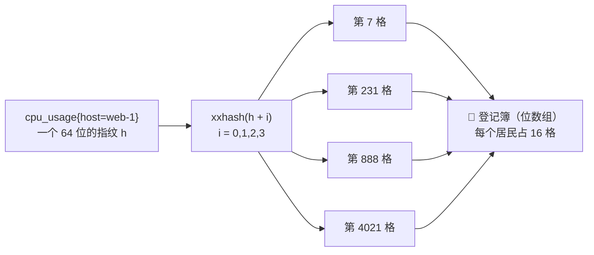
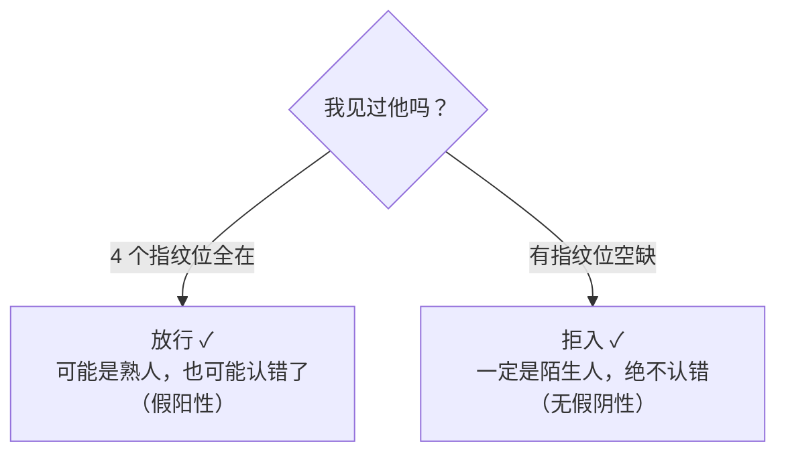
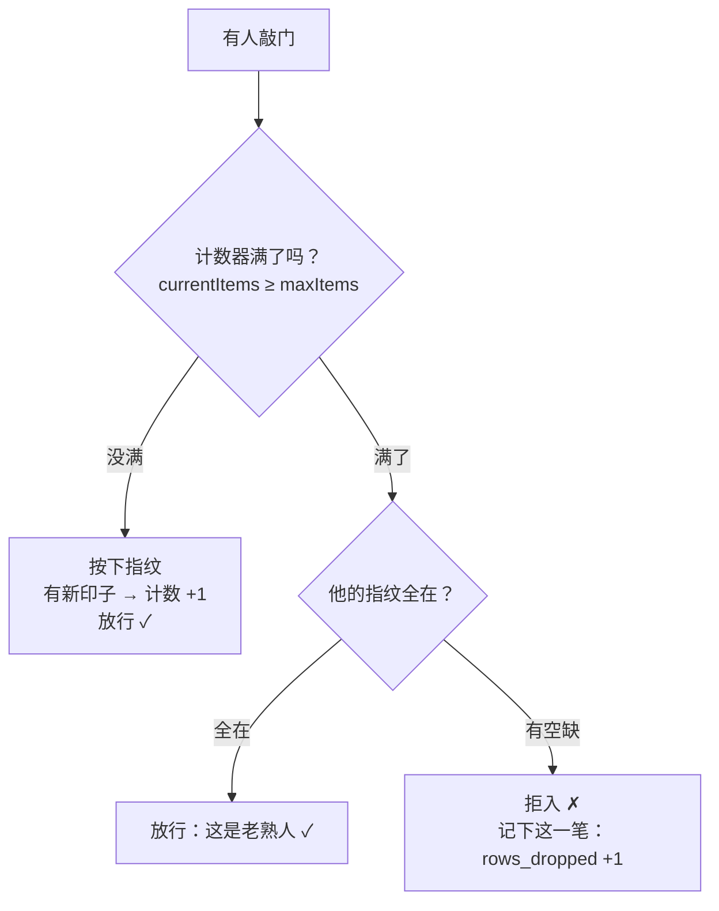
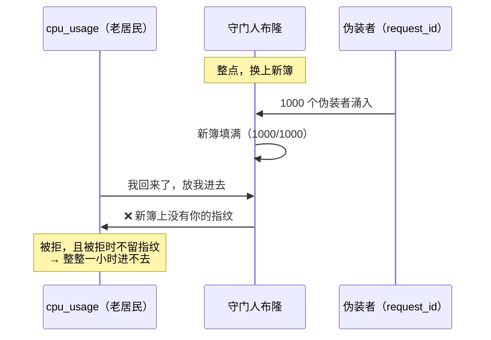
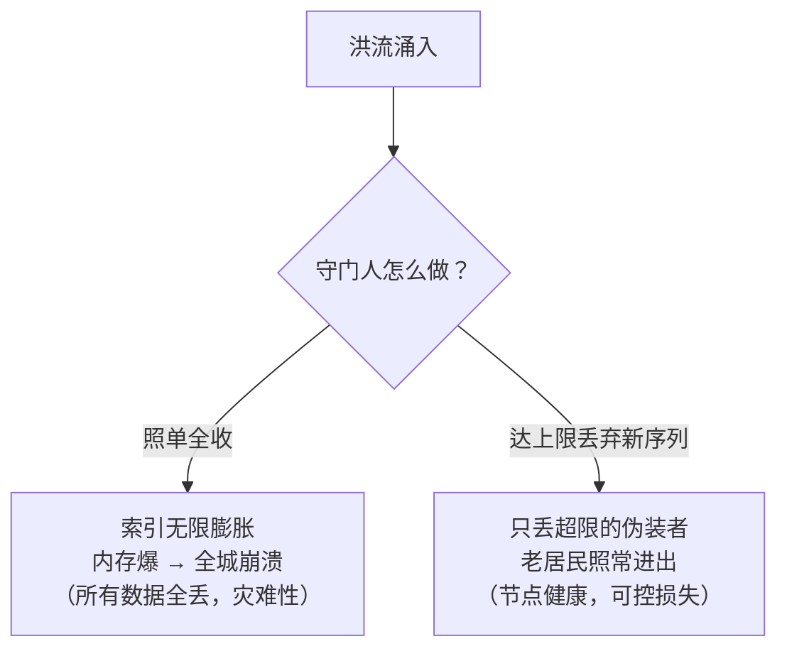

# 🏰 健忘的守门人：一个布隆过滤器关于「记住与遗忘」的独白

> 我是 VictoriaMetrics 城门口的守门人，名叫布隆（Bloom）。
> 我的工作很简单：记住每一位进城的居民。但我的记性差得惊人——每个人，我只用 **2 个字节**去记。
> 而且，每到整点，我会把整本登记簿扔掉，换一本全新的。
> 有人说我健忘，有人说我冷酷。今天，我想讲讲我的故事，也讲讲我为什么**必须**健忘。

---

## 序章：我是谁

城门口的墙上，刻着一行字：

> **"The maximum number of unique series can be added to the storage during the last hour. Excess series are logged and dropped."**
> —— 每小时最多放行 N 个新居民，超出的会被记录、然后被丢弃。

我是这行字的执行者。我用一个**布隆过滤器**（Bloom Filter）来决定谁进、谁不进。

但在我讲自己的秘密之前，先给你看一个让我困惑了很久的问题：

💭 想一想：我为什么"故意"健忘——只用 2 字节去记一个人？

**答案**：为了**内存**。精确地记住每个居民（比如一张 `map[ID]bool` 的名单），每个居民要花掉几十个字节的"档案例费用"。100 万个居民 ≈ 40 MB。而我只用 2 字节/人，100 万居民 ≈ **2 MB**。

省下来的 20 倍内存，是这座城市能容纳千万级居民还面不改色的原因。**我健忘，是为了让城市记得更多。**

---

## 第一章：我不记名字，只记指纹

我不认脸，也不记名字。每个居民进城时，我只做一件事：**让他按四次手印**。

这四次手印，在术语里叫 **k=4 个哈希函数**。它们落进一本巨大的**位数组**（bit array），每个居民只占 **16 格**（`bitsPerItem=16`）。

我的"记忆"，就是这十六格里有没有墨点。

💭 想一想：为什么是 4 次手印，而不是 1 次或 100 次？

**答案**：这是**假阳性率**和**内存**的平衡点。在 m/n=16（每居民 16 格）的前提下，4 次手印让"认错人"的概率降到：

$$P_{误判} = (1 - e^{-4/16})^4 \approx 0.24\%$$

手印太多次，格子占得多（内存涨）；太少，认错人的概率飙升。**4 次 + 16 格，是工程上反复称量后的一杆秤。**（代码里写死：`hashesCount=4, bitsPerItem=16`）

但我最得意的，不是省内存，而是我犯错的方式——**我只往一个方向犯错**：

> **我把误差，精确地指向了那个"承担得起"的方向。**
> 我可能把一个陌生人认成熟人（**假阳性**，0.24%），
> 但我**绝不可能**把一个熟人认成陌生人（**无假阴性**）。

这是我最核心的品格。记住它，后面的故事才讲得通。

---

## 第二章：城市的规矩

光会认人还不够。这座城市有个规矩——**每小时最多放行 N 个新居民**（`-storage.maxHourlySeries`）。

所以我身边还有一个**计数器**（`currentItems`）。每当一个居民留下了一枚**全新的指纹**，计数器就 +1。

💭 想一想：城市为什么要定"每小时最多 N 个新居民"这种规矩？

**答案**：防的是**高基数（high cardinality）**和**序列 churn**。城市里每住进一个新居民，索引里就要多建一份档案，内存、磁盘、查询速度都会变慢。

最怕的是有人（或某个 bug）带进来一个 `request_id` 或 `uuid` 当标签——**每次请求都是一个新居民**。不加管制，这座城市会被"一次性居民"活活挤爆，最后 **OOM，全城瘫痪**。

这条规矩，是城市的**安全阀**。

---

## 第三章：整点，我扔掉了整本登记簿

这是我的第二个秘密：**每到整点，我把登记簿整个扔掉，换一本全新的。**

术语上，这叫**固定窗口（fixed window）**——每一小时是一个独立的窗口，计数归零、重新开始。我用 `atomic.Pointer` **原子地**换上新簿，旧簿连同记忆一起被丢弃。

💭 想一想：整点换簿，遗忘是 bug 还是 feature？

**答案**：是**有意的简化**。真正的"滑动窗口"（随时看过去 60 分钟）要按时间分桶、逐条过期，成本高得多。我用"整点一次性清零"这个笨办法，换来极低的运行时开销。

但也埋下了一个隐患——请看下一章。

---

## 第四章：那场误伤

那天，出事了。

整点刚到，我换上了崭新的登记簿。就在老居民们还没来得及回来按手印的空档，**一群伪装者**涌了进来——它们带着 `request_id` 这种高基数标签，每一张都是陌生面孔。

1000 张新面孔，抢先把我的新簿填满。

就在这时，老居民 `cpu_usage{host="web-1"}` 回来了。

我把它拒之门外了。而且，**因为"被拒时我不留指纹"**，接下来的整整一小时，它每次回来，我都在新簿上找不到它——**它丢的不是一个样本，是整整一小时的数据。**

💭 想一想：这是我（守门人）的失职吗？

**答案**：这是**固定窗口的"漏"**，是设计上真实存在的代价。根因有三：

1. **整点换簿抹掉了所有记忆**——窗口边界处，"老居民"和"伪装者"被一视同仁、先到先得；
2. **被拒时不留指纹**——老居民在窗口内再也翻不了身；
3. **没有任何"长命居民保护"**——没有 warm-keep、没有优先级。

我诚实地告诉你：**好设计也会漏。** 区别只在于，我让你**知道**这个角落在哪、什么时候会被触发，而不是假装它不存在。

---

## 第五章：我为什么不肯"放行"

你可能会问：既然会误伤好人，你为什么不干脆**照单全收**？放所有人进来，不就没这些破事了吗？

让我画两条路给你看：

💭 想一想：丢数据是恶，还是善？

**答案**：丢"少量"是为了保"整体"。这叫做 **load-shedding（负载卸载）**——和 Prometheus 的 `sample_limit`、Nginx 过载返回 503、电路熔断是同一套哲学。

更关键的是，我的"丢弃"不是**暗箱**：每丢一笔，`vm_hourly_series_limit_rows_dropped_total` 就精确 +1，日志里还写明了**丢的是哪个序列**。你可以**精确对账**，而不是"大概丢了一些"。

**一个可观测、可对账的丢弃，是设计；一个连"丢了"都不可见的丢弃，才是事故。**

---

## 第六章：独白与忏悔（我的三个秘密）

夜深了。城墙上的字还亮着。我想把压在心里最久的三句话，都说给你听。

### 秘密一：我的遗忘是「定向」的

> 我从不认错熟人，只偶尔认错陌生人。
> 我把误差精确地指向了那个你承担得起的方向，并给它一个上界（0.24%）。
> **粗糙的设计，误差是对称的、无方向的；好设计，误差是定向的、有界的。**

### 秘密二：我是「约束下的最优」

> 固定窗口、静默丢弃、每序列 2 字节、无法热调整——单独看，哪一条都不是"全局最优"。
> 但在这座"性能优先、单二进制、无共享"的城市里，它们是**自洽**的。
> **约束不是枷锁，而是让交换有了方向。所谓最优，从来都是"约束下的最优"。**

### 秘密三：好设计也会漏

> 我误伤过 `cpu_usage`，丢过它整整一小时。
> 我不辩解。我只保证：这个"漏"是**显式的、可观测的、可逆的**（默认关闭、`-1` 只统计不丢弃、改 flag 可重启）。
> **好设计和坏设计的分水岭，不是"有没有取舍"，而是取舍是否显式、可观测、可逆。**

---

## 尾声：留给你的问题

故事讲完了。但有几件事，我想留给你慢慢想：

1. 如果有一天，这座城市能"自动迁移居民"来平衡负载，我还会被需要吗？—— **自动化和定向取舍，谁更本质？**
2. 我"误伤"老居民的那一小时，究竟是我失职，还是这座城市**默认"上限设得够高"**的傲慢？
3. 你说"数据准确性"很重要。那么——是"**留下来的每一笔都绝对正确**"重要，还是"**一笔都不丢**"重要？当你只能二选一时，你选哪个？

> 也许答案不在我身上。
> **记住，是为了更好地遗忘；遗忘，是为了更好地守住。**
> 没有十全十美的设计，只有知道该往哪个方向交换的人。

---

## 📖 术语速查

| 术语 | 含义 | 在故事里 |
|------|------|---------|
| 布隆过滤器 Bloom Filter | 概率型集合，`Add`/`Has` 判"是否见过" | 我的指纹登记簿 |
| 假阳性 false positive | 误判"见过"（陌生人被当熟人） | 0.24% 漏放 |
| 假阴性 false negative | 误判"没见过"（熟人被当陌生人） | 我**绝不**犯 |
| 基数 cardinality | 唯一序列数（指标名 + 标签组合） | 城市居民总数 |
| churn | 序列高速新建又废弃 | 伪装者洪水 |
| 固定窗口 fixed window | 每 1h 整点清零重计 | 整点换簿 |
| load-shedding | 过载时卸载增量、保整体 | 我拒入的理由 |
| 可观测性 observability | 用指标/日志精确对账 | `rows_dropped_total` |
