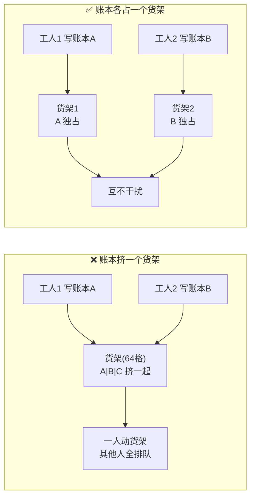
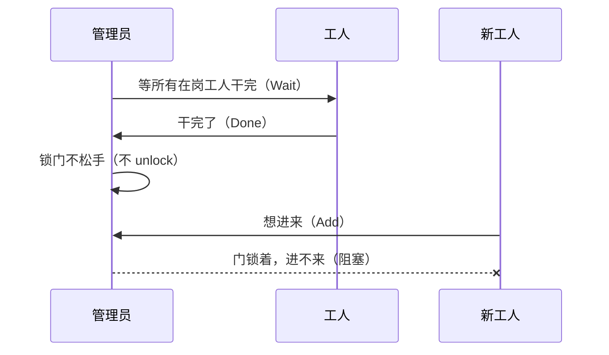
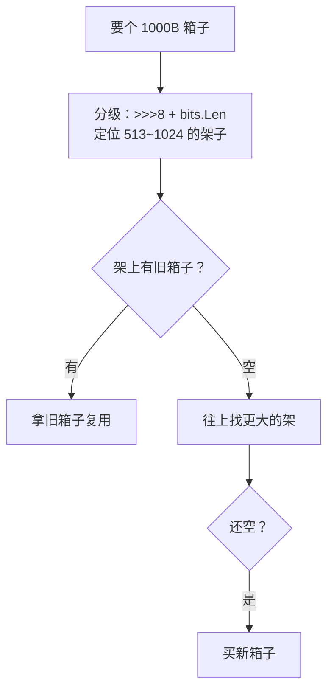
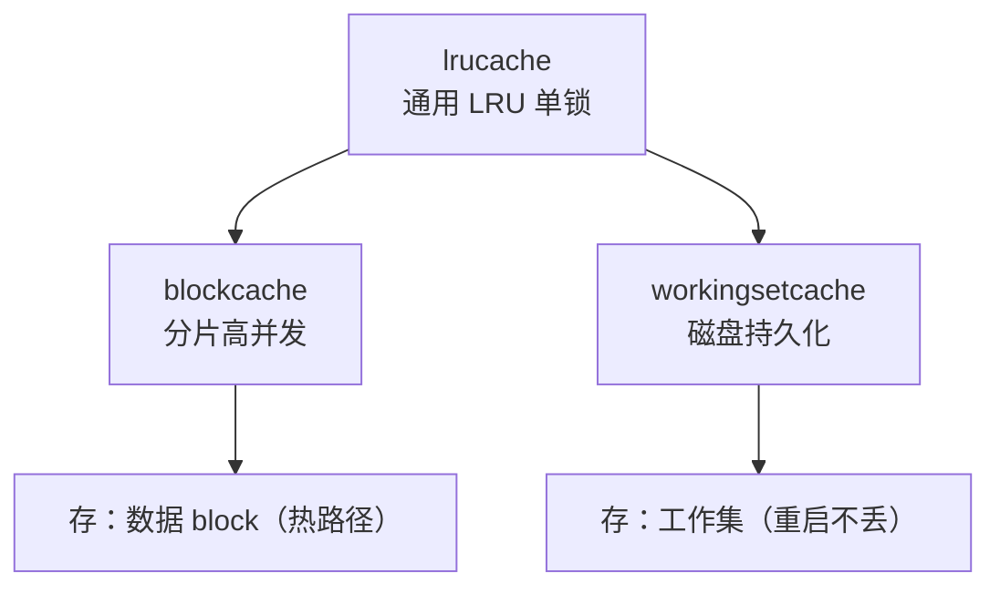

# ⚡ Go 高并发技巧：VictoriaMetrics 并发原语源码精读

> 读 VictoriaMetrics 的 `lib/` 并发原语，理解高性能 Go 的精华。每个原语回答：解决什么问题、怎么设计、精髓在哪。
> 先看故事导读建立直觉，再往下读精读正文。

---

## 📖 故事导读：多核 CPU 的货架管理

> 把 12 个并发原语串成一个仓库管理的故事。先看图建立直觉。

VictoriaMetrics 是一个大仓库，里面有 N 个「工人」（CPU 核）同时干活。仓库里有「货架」（cache line，64 格）、「令牌」（锁）、「回收站」（对象池）。问题来了：**怎么让 N 个工人互不干扰地干活？**

### 第一章：货架争夺战（伪共享）



账本（原子变量）只有 8 格，但货架（cache line）是 64 格。几个账本挤一个货架，一人记账整个货架被锁，别人读自己的账本也得等——**伪共享**。

解法：每个账本**独占一个货架**（`atomicutil.Uint64` 前后 padding 撑满 64 格）。账本小，但货架是自己的，互不干扰。`atomicutil.Slice` 更进一步：每个 worker 的账本也独占货架，读走「免锁快车道」（`atomic.Pointer.Load`），只有扩容才 CAS。

### 第二章：下班关门（优雅停机）



下班了，管理员要关门（停机）。但还有工人陆陆续续来。

`syncwg.WaitAndBlock`：管理员**等所有在岗工人干完，然后把门锁上、钥匙不松手**——新工人发现门锁着（`Add` 被阻塞）进不来，也就不会干到一半被赶走。这就是优雅停机的精髓：**先等人，再锁门，一锁到底**。

### 第三章：回收站（对象池）



工人反复用「计时器」（Timer）和「箱子」（buffer）。每次买新的、用完就扔，仓库门口堆满垃圾（GC 压力）。

解法：设「回收站」（sync.Pool）。用完放回去，下次直接拿（`timerpool` 的 `Reset`、`ByteBuffer.Reset` 的 `B[:0]`）。箱子还**按大小分架**（`leveledbytebufferpool`：256/512/1024...），避免大箱占小架。

### 第四章：仓库三层（缓存）



仓库放不下所有货，得有淘汰规则：

- **lrucache**：最久没用的货扔掉（**最小堆**，堆顶 = 最久没用）
- **blockcache**：一个仓库锁要排队，**拆成 N 个小仓库**（CPU 核数 × 倍数），各管各的
- **workingsetcache**：常客（工作集）记在账本上，**仓库重启账本还在**（磁盘持久化）

> 一句话：**伪共享靠「独占货架」，停机靠「一锁到底」，GC 靠「回收站」，缓存靠「分片 + 淘汰 + 持久化」**。

---

## 一、原子操作与无锁设计

### 1. CacheLineSize（伪共享的度量单位）

`lib/atomicutil/cacheline.go`：`const CacheLineSize = unsafe.Sizeof(cpu.CacheLinePad{})`（通常 64B）

**解决什么**：CPU 以 cache line（64B）为单位同步缓存。多个变量挤在同一 cache line 时，一个核写变量 A，其他核读相邻的 B 也会被「伪共享」拖累（cache line 在核间 ping-pong）。

### 2. atomicutil.Uint64（前后 padding 独占 cache line）

```go
type Uint64 struct {
	_ [CacheLineSize - unsafe.Sizeof(atomic.Uint64{})%CacheLineSize]byte // 前 padding
	atomic.Uint64
	_ [CacheLineSize - unsafe.Sizeof(atomic.Uint64{})%CacheLineSize]byte // 后 padding
}
```

**精髓**：`atomic.Uint64` 只有 8 字节，padding 补齐到 cache line 边界，**一个 Uint64 独占一个 cache line**，避免数组里相邻 Uint64 伪共享。

### 3. atomicutil.Slice[T]（免锁读 + CAS 扩容 + item 独占 cache line）

```go
type Slice[T any] struct { Init func(x *T); p atomic.Pointer[[]*itemPadded[T]] }
type itemPadded[T any] struct { x T; _ [CacheLineSize]byte }
```

**精髓**：

- **免锁读**：`p.Load()` 原子读，workerID 在范围直接返回（无锁 fast path）
- **CAS 扩容**：超范围才 `CompareAndSwap` 扩容，失败重试
- **每个 item 独占 cache line**：不同 worker 的 item 不伪共享

**用途**：替代 `[workersCount]*T` 数组，worker 数未知时按需增长，每个 worker 无锁独占自己的 item——**sharding 的通用实现**。

### 4. syncwg.WaitGroup（并发安全 Add/Wait + 优雅停机）

```go
func (wg *WaitGroup) WaitAndBlock() {
	wg.mu.Lock()
	wg.WaitGroup.Wait()
	// 不 unlock，后续 Add 永久阻塞
}
```

**解决什么**：标准 `sync.WaitGroup` 的 `Add` 不能和 `Wait` 并发。`syncwg` 用 mu 保护，让它们并发安全。

**WaitAndBlock 精髓**：等待完成后**不释放锁**，永久阻塞后续 `Add`——优雅停机的关键：新任务无法注册，停机安全。

## 二、对象池（降低 GC 压力）

### 5. timerpool（time.Timer 复用）

```go
func Get(d time.Duration) *time.Timer {
	if v := timerPool.Get(); v != nil { t := v.(*time.Timer); t.Reset(d); return t }
	return time.NewTimer(d)
}
```

**精髓**：`sync.Pool` 缓存 Timer，`Reset(d)` 复用避免 `time.NewTimer` 分配；`Put` 先 `Stop()` 再放回。Go 1.15+ 保证 Reset 后不收到旧值。

### 6. leveledbytebufferpool（分级池）

```go
var pools [10]sync.Pool
// pools[0]=0~256, pools[1]=257~512, ..., pools[n]=2^(n+7)+1~2^(n+8)
func getPoolIDAndCapacity(size int) (int, int) {
	size--; size >>= 8; id := bits.Len(uint(size)); return id, (1 << (id + 8))
}
```

**精髓**：

- **按容量分级**（2 的幂，256 ~ 2^18=256KB），避免「大 buffer 占小池」浪费
- **位运算定位**：`>>=8` 除 256，`bits.Len` 求对数，快速求池 id
- **容量上限 256KB**：再大没复用价值，交给 GC

### 7. ByteBuffer.Reset（复用底层数组）

```go
func (bb *ByteBuffer) Reset() { bb.B = bb.B[:0] } // 只重置长度，复用底层数组
```

## 三、零拷贝与内存优化

### 8. ToUnsafeString/ToUnsafeBytes（unsafe 零拷贝）

```go
func ToUnsafeString(b []byte) string { return unsafe.String(unsafe.SliceData(b), len(b)) }
func ToUnsafeBytes(s string) []byte { return unsafe.Slice(unsafe.StringData(s), len(s)) }
```

**精髓**：string 和 []byte 底层内存布局相同（指针+长度），unsafe 直接 reinterpret，**零拷贝**。Go 1.20 的 `unsafe.String`/`unsafe.Slice` 比旧 reflect hack 更安全。

**危险**：返回的 string 共享 b 的底层数组，b 被修改或 GC 回收就悬空（注释明确「valid only until b is reachable and unmodified」）。

### 9. memory.Allowed（自适应缓存）

```go
allowedMemory = memoryLimit * 60% // 默认
func Allowed() int { once.Do(initOnce); return allowedMemory }
```

**精髓**：

- **自适应**：缓存大小 = 系统内存 × 60%，剩 40% 给 OS page cache
- **cgroup 感知**：`sysTotalMemory()` 读 cgroup 限制（容器环境）
- **sync.Once 懒加载**：`allowedMemory` 只算一次，必须在 flag.Parse 后

## 四、缓存设计（三个层级）

### 10. lrucache（通用 LRU：最小堆 + 双淘汰 + 动态大小）

```go
type Cache struct {
	m map[string]*cacheEntry
	lah lastAccessHeap              // 最小堆，按 lastAccessTime 排序
	getMaxSizeBytes func() uint64   // 动态大小回调
}
```

**精髓**：

- **LRU 用最小堆**（非链表）：堆顶 = 最久未访问，淘汰 O(1) 看堆顶
- **双淘汰**：`cleanByTimeout`（每 53s+jitter 删 >3 分钟未访问）+ `Put` 超大小淘汰
- **动态大小**：`getMaxSizeBytes()` 回调（如 `memory.Allowed()/32`），自适应
- **访问更新**：`GetEntry` 时 `heap.Fix`（同一秒内不重复 Fix）

### 11. blockcache（sharded lrucache：高并发块缓存）

```go
shardsCount := cgroup.AvailableCPUs() * multiplier // CPU 核数 × 倍数
idx := h % uint64(len(c.shards))                    // hash 取模定位 shard
```

**精髓**：分片数 = CPU 核数 × 倍数，每个 shard 独立锁，降低锁竞争。**「独立小原语（lrucache）→ 组合成高性能系统（sharding）」的典范**。

### 12. workingsetcache（fastcache + curr/prev 旋转 + 磁盘持久化）

```go
type Cache struct { curr atomic.Pointer[fastcache.Cache]; prev *fastcache.Cache; mode ... }
```

**精髓**：

- **基于 fastcache**：mmap 持久化，**重启不丢**（工作集缓存的意义）
- **curr/prev 双缓存旋转**：split 模式定期旋转，prev 淘汰旧数据；curr 填满 >50% 切 whole
- **minCurrCacheSaveMissRate=0.8**：curr miss rate 低时不值得换（数据还热）

## 五、心法总结

1. **伪共享是高性能 Go 第一杀手**：cache line padding 贯穿所有并发结构（Uint64/Slice/itemPadded）
2. **免锁读 + CAS 写**：fast path 无锁读（`atomic.Pointer.Load`），slow path CAS 写，减少锁竞争
3. **对象池的粒度**：按容量分级（leveledbytebufferpool），不是一个大池
4. **缓存三层分工**：lrucache（通用）→ blockcache（sharded 高并发）→ workingsetcache（持久化工作集）
5. **独立小原语 → 组合成高性能系统**：这是 VM 的工程哲学，也是学 Go 的最佳教材

## 延伸阅读

- [一个指标的冒险之旅](/observability/victoriametrics/metric-journey.md) — 存储引擎的拟人故事导读
- [Lima + Docker + Minikube 环境搭建](/mac/lima-docker-minikube-setup.md) — 本地跑 VictoriaMetrics 的实验环境
