# 📊 一个指标的冒险之旅：VictoriaMetrics 从写入到查询

> 从浅入深，像读故事一样理解 VictoriaMetrics 的存储与查询机制。
> 主角：一个名叫 `cpu_usage{host="web-1"}` 的指标，值是 `0.42`。
> 每章末尾有「💭 想一想」——先自己想，再点开看答案。

---

## 序章：不速之客

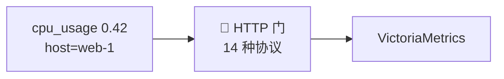

深夜，VictoriaMetrics 的 HTTP 门口响起敲门声。

门外站着一个新来的家伙，用 Prometheus 的话自我介绍：

```
cpu_usage{host="web-1"} 0.42 1788888888000
```

同一晚，门口还来过说 Influx 方言的、说 OTel 方言的、说 Graphite 方言的……**14 种不同的语言**。

但门内传来同一个声音：**「不管你说什么方言，进来后我只认一种。」**

<details>
<summary>💭 想一想：为什么 14 种协议要统一成一种内部格式？</summary>

**答案**：表面是「高内聚低耦合、可扩展」（加协议 = 加一个 parser）。但更本质是**性能**——归一到统一的 `rawRow`（int64 定点数 + uint64 ID），让存储层能在「统一的最小形态」上榨干性能。对比 OTel：它归一化求「通用」（pdata 重、有反射），VM 求「极致」。

</details>

---

## 第一章：换装

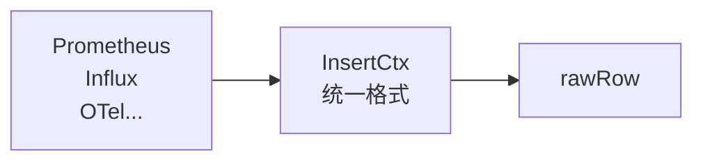

门口有个叫 **InsertCtx** 的接待员，把各种方言翻译成同一套行头：

```
{__name__="cpu_usage", host="web-1"}   值=0.42   时间=1788888888000
```

它为什么要逼所有人穿一样的衣服？

> **悬念**：不是强迫症，是为了让后面的「仓库管理员」只认一种规格，才能在**统一的最小形态**上疯狂压榨性能。换装，是为了后面的每一道工序都更快。

<details>
<summary>💭 想一想：归一化主要是「工程整洁」还是「性能需要」？</summary>

**答案**：两者都有，但 VM 更看重**性能**。工程整洁是「加协议只加 parser」，性能是「存储层只在一种紧凑格式上优化」。真正的分野在于：归一化到 rawRow 不只是统一接口，更是统一**数据形态**（float64→定点数、字符串→uint64）——为后面的编码/压缩铺路。

</details>

---

## 第二章：改名

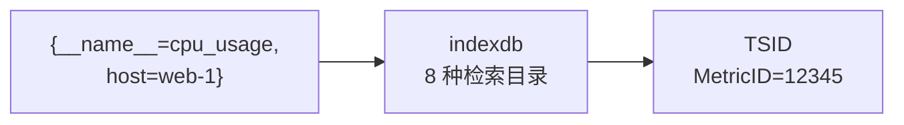

换好衣服，接待员看了一眼那串标签——`{__name__="cpu_usage", host="web-1"}`，有点长，有点啰嗦。

它转身对「索引官」indexdb 说：**「给它起个短名吧。」**

于是这一长串标签，被登记成：

```
{__name__="cpu_usage", host="web-1"}  →  MetricID = 12345
```

**这短名（MetricID）是「递增分配」的**——每来一个新面孔，编号就 +1，绝不重号、绝不回收。所以 12345 之后，一定是 12346。

但故事没完。短名只是「身份证号」，为了方便按片区分组，索引官还发了一张**完整身份证 TSID**：

```
TSID{
  MetricGroupID = xxhash("cpu_usage")   ← 户籍组（hash 指标名）
  JobID         = xxhash("web-1")       ← 街道
  InstanceID    = 0                     ← 门牌
  MetricID      = 12345                 ← 身份证号（递增）
}
```

更厉害的是，索引官的**登记簿不止一本，而是 8 种「检索目录」**：

| 目录 | key 前缀 | 查什么 |
|------|---------|--------|
| 正向目录 | `MetricNameToTSID` | 名字 → 身份证 |
| 倒排目录 | `TagToMetricIDs` | 标签 → 身份证列表 |
| 定位目录 | `MetricIDToTSID` | 身份证 → TSID |
| 展示目录 | `MetricIDToMetricName` | 身份证 → 名字 |
| 删除目录 | `DeletedMetricID` | 注销标记 |
| 日期目录 | `DateToMetricID` | 日期 → 身份证 |
| 按天倒排 | `DateTagToMetricIDs` | 日期+标签 → 身份证（时间局部性） |
| 按天正向 | `DateMetricNameToTSID` | 日期+名字 → 身份证 |

> **悬念**：为什么？因为字符串又长又慢，uint64 排序、检索、压缩都快得飞起。**「名字」只登记一次，「身体」以后只用短名**。

<details>
<summary>💭 环环相扣的问题链（跟着想一遍）</summary>

**Q1：为什么用 uint64 的 MetricID 替代字符串标签？**
字符串又长又慢，uint64 排序、检索、压缩都快得飞起。

**Q2：MetricID 为什么「递增分配」而不是「hash」？**
递增**天然唯一、无碰撞**；hash 可能碰撞。且「数据聚在一起」靠的是**落盘时按 TSID 排序**，不是 hash——hash 真正的用武之地是**集群分片**。

**Q3：TSID 和 MetricID 是什么关系？**
TSID 是「完整身份证」= 分组 hash（MetricGroupID/JobID/InstanceID）+ MetricID（递增）。分组字段用 hash，唯一 ID 用递增。

**Q4：为什么登记簿分「8 种检索目录」，而不是一本大杂烩？**
8 种是「用 1 字节前缀在同一个索引里做逻辑分区」（不是 8 个独立存储），同类 key 字节序相邻（顺序读）。

**Q5：最关键的一对「带 Date vs 不带 Date」是什么？**
`DateTagToMetricIDs` 按日分片，让范围查询只碰相关日，避免全局 tag 列表无限膨胀（时间局部性）。

</details>

---

## 第三章：安家

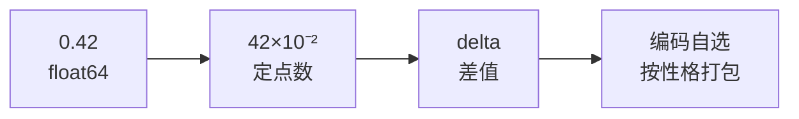

有了短名，它被带到了**仓库**。

第一步，先在**内存**里排队（`inmemoryPart`），满了才批量往磁盘搬——因为**顺序搬运比随机搬运快一个量级**。

第二步，要「压缩打包」了。打包师傅看着那个 `0.42`，做了两步：

```
0.42 (float64)  →  42 × 10⁻²  (定点数)  →  和前一个值的差  (delta)
```

但打包师傅真正的本事，是**「看货物的性格，选打包方式」**——这叫「编码自选」：

| 货物的性格 | 打包方式 | 说明 |
|-----------|---------|------|
| 全一样（flag=1） | `Const` | 只记「这批都相同」 |
| 等差（每秒+1） | `DeltaConst` | 只记「首项 + 公差」 |
| 单调上涨的计数（counter） | 二阶差分 | 一阶差分恒定，二阶差分全零 |
| 上下波动的仪表（gauge） | 一阶差分 | 差值小 |

它怎么判断是 counter 还是 gauge？**看「下降的幅度」**——小幅下降是 gauge 正常波动，骤降 7/8 以上是 counter 重启归零。这个 `7/8` 的阈值，是作者对真实规律的总结。

最后，打包好的字节，被写进三个文件：`timestamps`（时间）、`values`（值）、`index`（说明书）。

<details>
<summary>💭 环环相扣的问题链（跟着想一遍）</summary>

**Q1：为什么值要存「int64 定点数」而不是「float64」？**
两个理由：① **round-trip 精确**——float64 存 `0.1` 会变成 `0.10000000000000001`；② **delta 压缩友好**——int64 做差值编码比 float64 高效。

**Q2：定点数的 `scale` 怎么定？**
整个 block 共用**一个 scale**（相邻值量级相近），合并时用 `CalibrateScale` 对齐不同 block 的 scale。

**Q3：delta 编码为什么有效？**
相邻值差很小，存「差」比存「值」字节少；差值趋近 0 时编码极省。

**Q4：counter 为什么「二阶差分」，gauge 为什么「一阶差分」？**
counter 单调增长（0,5,10,15,20），一阶差分恒定，**二阶差分全零（最省）**；gauge 上下波动，一阶就够。

**Q5：编码自选怎么判断 counter 还是 gauge？**
看「下降幅度」——小幅下降是 gauge 波动，骤降 7/8 以上是 counter 重启归零（`vPrev >> 3` 阈值）。

</details>

---

## 第四章：归档

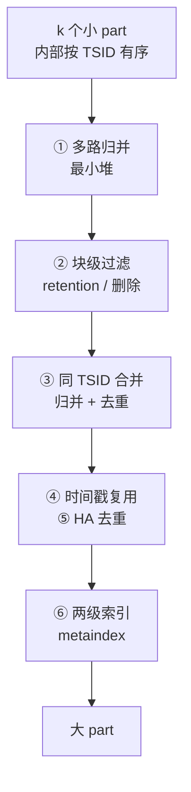

日子一天天过去，仓库里的「小包裹」越来越多。

管理员有条规矩：**「包裹堆到 15 个，就合并成一个大包裹。」**（小 part → 大 part）

但合并可不是简单地把包裹摞在一起，管理员有一套**「合并流水线」**：

**① 多路归并（最小堆）**：每个包裹里的货物早就按「身份证号」排好序了。管理员每次从所有包裹里挑「身份证号最小」的那件，像归并排序一样归成一条有序的流。

**② 块级过滤（顺手丢）**：合并时顺手做两件事——
> **「过期了？整包别搬。」**（retention，块级粗筛）
> **「身份证注销了？跳过。」**（删除标记）

这就是 retention 的秘密——**从不专门打扫，只在「打包」时顺手丢**，零额外成本。

**③ 同身份证合并**：如果两个包裹里都有同一身份证（同 TSID）的货物，而且时间范围重叠，就按时间戳归并、去重。

**④ 时间戳复用**：如果相邻货物的时间戳**完全一样**（同一时刻采集的），就只存一份时间戳——省磁盘。

**⑤ 去重（HA）**：如果同一时间戳有多个样本（两个采集器重复采集），**选最大的值**——因为 counter 单调递增，最大值才是真相。

**⑥ 两级索引**：最后，打包好的大包裹附上一张**「目录」（metaindex）**，记录每个区块的身份证范围和时间范围，以后查货先翻目录、不用挨个拆包。

<details>
<summary>💭 环环相扣的问题链（跟着想一遍）</summary>

**Q1：merge 为什么用「最小堆」？**
k 个 part 内部都按 TSID 有序，要归成一条全局有序的流。最小堆每次弹出「TSID 最小」的 block，复杂度 O(n log k)。

**Q2：多路归并的「前提」是什么？**
「part 内 block 已按 TSID 有序」——这正是写入时按 TSID 排序的原因。**排序不是为了让数据好看，是为了让 merge 能归并**。

**Q3：同 TSID 的 block 为什么可能「时间重叠」？**
同一个序列的数据，可能散在多个 part（不同时间写入的）。merge 时这些重叠的 block 要归并成一条连续的时间线。

**Q4：时间重叠了怎么办？**
按时间戳归并 + 去重（`<=` 保留一份，跳过重复时间戳）。

**Q5：这个「归并去重」和「HA 去重」是一回事吗？**
不是。**归并去重** = 同序列跨 part 的重叠（去掉跨 part 的重复）；**HA 去重** = 同时间戳的重复采集（`-dedup.minScrapeInterval` 窗口内，选最大值）。

**Q6：retention 为什么也搭 merge 顺风车？**
merge 本来就要读全部数据重写，顺手丢过期行是零额外 I/O——单独扫描删除成本极高。

</details>

---

## 第五章：寻访

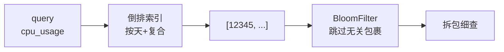

某天，来了一位查询者，要找 `cpu_usage`。

**第一步，查登记簿（倒排索引）**：

```
"cpu_usage" → [12345, 67890, ...]
```

这本登记簿有两个设计得很讲究的地方：

> **① 按天分片(Date)**：日期不是写「2026-09-08」这种长字符串，而是**自 1970 年起的天数**，一个 8 字节整数，比较起来飞快。所以查「最近 5 分钟」，只翻最近 5 分钟的分片，不碰历史。

> **但按天分片也不是万能的**。查「最近一年」，按天分片就得连翻 365 个分片——一个个 seek 过去，慢死了。所以户籍官立了条经验规矩：**「查 40 天以内翻按天分片，超过 40 天直接翻『全册』（全局索引）一次顺序读完。」**

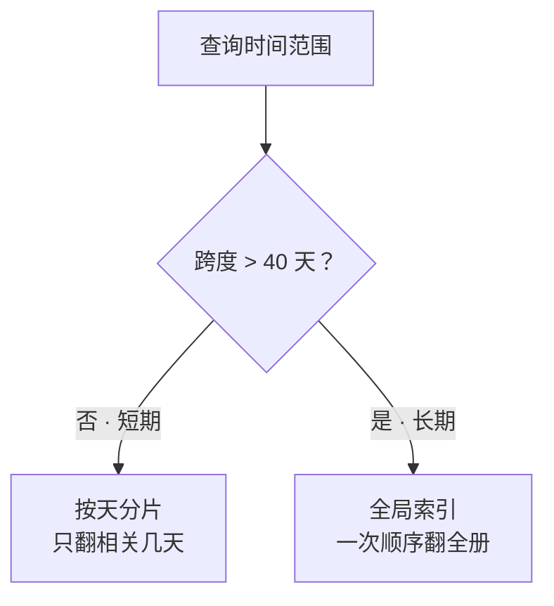

> 这 40 天是**时间局部性的分水岭**：范围越短按天越占优，超过临界点全局索引的一次顺序读更划算。

> **② 复合索引**：`metric 名 + 标签` 组成复合键，**先按大分类（指标名）缩小范围，再按小类（标签）精确找**——因为指标名的区分度最高（一个指标名几十个序列，一个标签值可能几十万）。

**第二步，去仓库找数据**。拿到 `MetricID=12345` 后，仓库里有成百上千个包裹，总不能每个都拆开看吧？

好在每个包裹外面都贴着**一张「快速索引贴纸」（BloomFilter）**，写着「这个包裹里大概有哪些身份证号」：

- 查询者先看贴纸 → 贴纸说「没有 12345」→ **跳过这个包裹**（快！）
- 贴纸说「可能有 12345」→ 才拆开细查（慢，但只是少数）

贴纸有个关键性质：**可能「误报」（说有其实没有，约 0.24%），但绝不「漏报」（说没有就一定没有）**。所以「跳过」永远安全。

> **悬念**：挑最有区分度的维度打头（复合索引）缩小「查哪些」，贴纸帮你跳过无关包裹（BloomFilter）缩小「翻哪些」——一个管索引，一个管磁盘。

<details>
<summary>💭 环环相扣的问题链（跟着想一遍）</summary>

**Q1：标签过滤为什么用「倒排索引」而不是「B+ 树」？**
B+ 树擅长「一维有序键的范围扫描」，倒排索引擅长「多维标签的集合交集」——时序查询是后者。

**Q2：多维标签的交集怎么算？**
`label=value → 有序 ID 列表`，交集 = k-way 归并（两个有序列表合并）。

**Q3：按天分片（Date）解决什么？**
全局 tag 列表会无限膨胀；按日分片让范围查询只碰相关日（时间局部性）。

**Q4：复合索引为什么用 metric 名打头？**
metric 名选择性最高（几十个序列 vs 标签值几十万），先缩小范围再精确找。

**Q5：BloomFilter 的「可能误报、绝不漏报」是什么意思？**
**无假阴性**（说不在就一定不在，跳过安全）+ **有假阳性**（0.24%，说可能在要真查）。用 0.24% 误报换跳过 99.7% 无关包裹。

</details>

---

## 第六章：归途

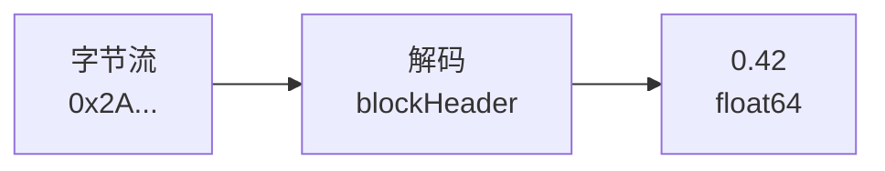

找到了 `MetricID=12345`，查询者打开对应包裹。

包裹里的 `index` 文件是一张**说明书**（blockHeader），写着：

```
我是怎么被编码的？→ 定点数 + delta
我的第一个值是多少？→ 42
```

照着说明书逆向操作：

```
字节 → delta 解码 → [42, 43, 41] → ×10⁻² → 0.42
```

**读回的值，和当初写进来的一模一样。**

```
cpu_usage{host="web-1"} 0.42
```

一个指标的冒险，画上了闭环。

<details>
<summary>💭 环环相扣的问题链（跟着想一遍）</summary>

**Q1：blockHeader 为什么叫「自描述」？**
它存了 MarshalType、FirstValue、Scale、RowsCount 等元数据——解码时读它就知道「怎么解」。

**Q2：解码和编码怎么「对称」？**
编码时 `MarshalValues` 返回 MarshalType，解码时 `UnmarshalValues` 按 MarshalType 分派——数据文件自带说明书。

**Q3：有损压缩（PrecisionBits&lt;64）会破坏什么？怎么修复？**
破坏「**时间戳单调递增**」这个不变量（截断低位后时间戳可能不单调）。解码后跑 `EnsureNonDecreasingSequence` 把「下降的点」拉回前一个值。默认 `PrecisionBits=64`（无损）就是省得付这个修复成本。

</details>

---

## 第七章：人潮（高基数）

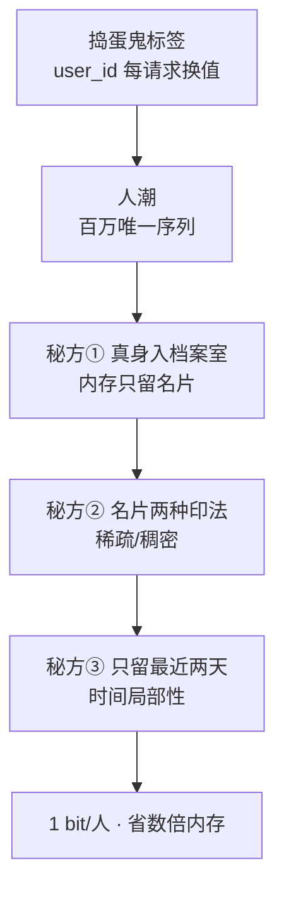

某天，户籍科（indexdb）门口突然挤满了人。

原来来了个**捣蛋鬼标签** `user_id`——它每来一个请求就换一个名字：`10001`、`10002`……很快，户籍科涌进**几百万个新面孔**。

户籍官慌了：「每个新面孔都要登记，登记簿要写爆了！」

老管理员却掏出**三张省纸秘方**：

### 秘方①：真身放档案室，内存只放名片

每个新面孔的「全名」（`{__name__=..., user_id=..., url=...}` 一长串标签）太重，全塞内存会撑爆。

> **「全名」写进档案室（磁盘），内存里只放一张「名片」——一个 8 字节短号（MetricID）。**

档案室堆多少都不压内存——因为内存里没有长字符串，只有轻飘飘的短号。

### 秘方②：名片的两种印法（稀疏 / 稠密）

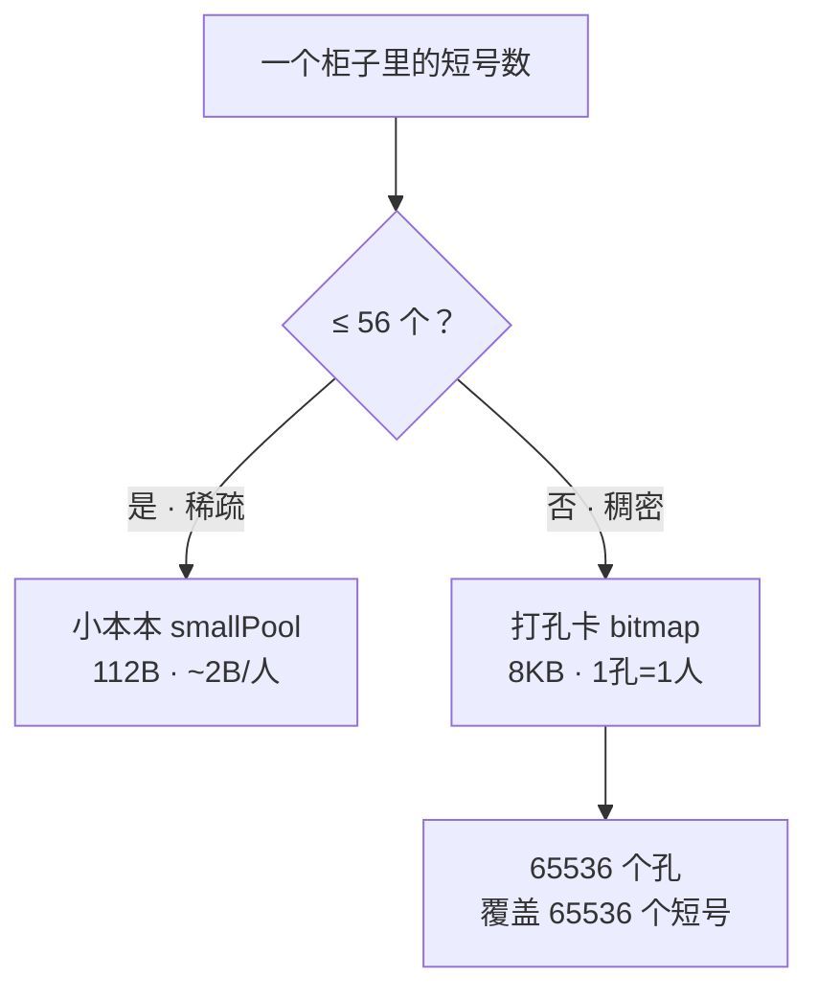

名片怎么印最省？看一个柜子（bucket）里的人多人少：

- **人少**（≤56 个）→ 用**小本本**逐个记（`smallPool`，112B，~2B/人）
- **人山人海**（>56 个）→ 换一张**打孔卡**（`bitmap`），**1 个孔 = 1 个人**，65536 个孔只要 8KB

**关键**：短号是**顺号发的**（递增分配），人天生「抱团」——大多数柜子人山人海，走打孔卡 → **平均 1 人 1 bit**。

> 一句话：**稀疏用小本本，稠密用打孔卡——两种极端都省纸**。

### 秘方③：过期的名片自动碎（时间局部性）

规矩：**「只留最近两天的名片」**。昨天的「谁来过」，今天已没用，自动进碎纸机。

所以不管档案室堆多少年，内存里的名片永远**薄薄一叠**——只覆盖最近两天的活跃面孔。

### 名片盒满了的灾难（slow insert）

万一名片盒（RAM 缓存）装不下所有人呢？

那每来一个新人，户籍官都得**亲自跑一趟档案室**翻原始档案，确认「登记过没」。跑腿一趟趟慢得要死——**这就是 slow insert**：写入雪崩、磁盘 IO 和 CPU 飙升的元凶。

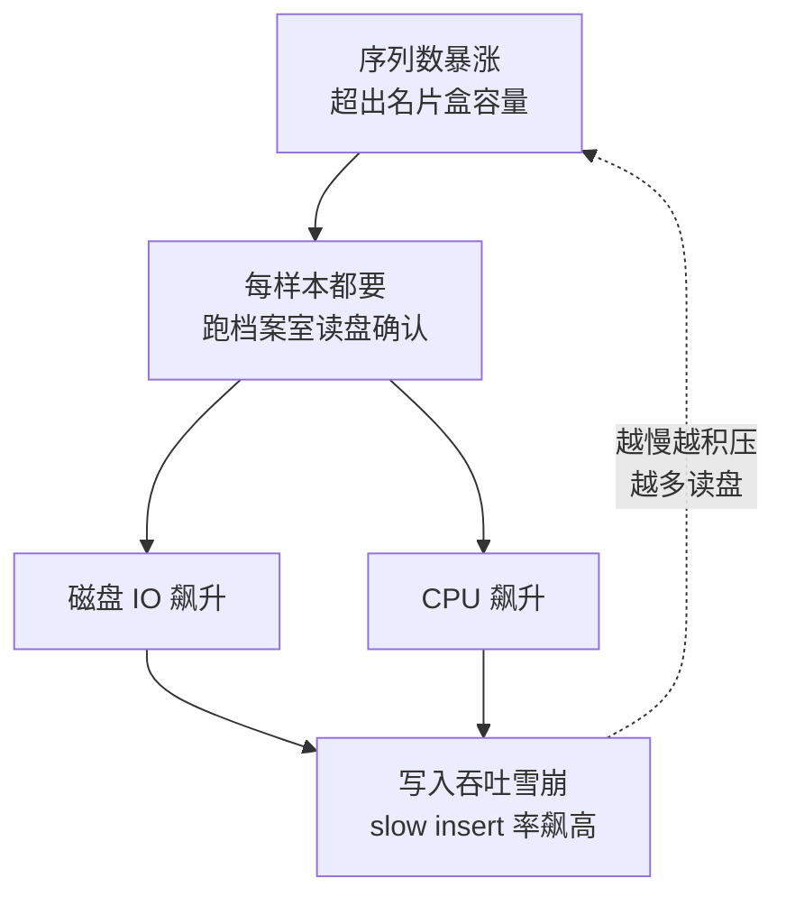

> **悬念**：内存够不够，不看档案室多大，看名片盒能不能装下最近两天的活跃面孔。

### 治本：别让捣蛋鬼当标签

老管理员最后劝告：

> `user_id`、`url`、`ip` 这种「每来一个就变」的字段，**根本不该当分类标签**。它该写进「备注」（exemplar / log / trace），或干脆「匿名化」（relabel 哈希化）。否则每条数据都在制造新面孔，人潮永不会退。

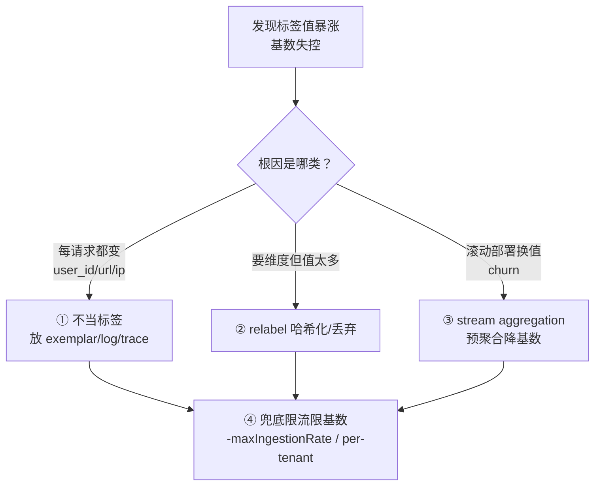

<details>
<summary>💭 环环相扣的问题链（跟着想一遍）</summary>

**Q1：高基数为什么让内存爆？**
每个唯一序列都要：登记身份证（倒排索引）+ 放名片（缓存）+ 缓冲样本 → 成本随序列数**线性**增长。

**Q2：VM 怎么做到「内存省数倍」？**
把「重」的全名（label 字符串）放磁盘，内存只放「轻」的短号位图（`uint64set`）。

**Q3：为什么平均 1 bit/序列？**
短号**递增分配** → 连续 → 抱团在同一个柜子 → 走「打孔卡」稠密位图，1 孔 = 1 人。

**Q4：slow insert 是什么？**
名片盒装不下活跃序列 → 每个样本都得读盘确认 → 写入雪崩、CPU/IO 飙升。

**Q5：怎么治理高基数？**
高基数字段（`user_id`/`url`/`ip`）别当标签，放 exemplar/log/trace；或 relabel 哈希化/丢弃；控制 churn。

</details>

---

## 尾声：更大的世界


如果故事只到这里，VM 只是个「单机好手」。但它还能走向更大：

- **多节点（一致性哈希）**：把指标分散到多个节点，用的是一场**「选房间」的游戏**——每个指标和每个节点算一次「缘分值」（hash），选缘分最高的。这就是 **Rendezvous**，简单又均匀，不用哈希环那套复杂。
- **多租户**：`vmauth` 按 token 路由到不同集群——大客户单独一套，小客户共享一套。而「共享一套」里的每个租户，靠一个 **8 字节的「门牌号」（tenantID = accountID + projectID）** 区分：数据存进去时，门牌号**钉在名字最前面**（`[accountID][projectID][指标名]`），查的时候对不上门牌号就返回空——哪怕挤在同一个集群，谁也看不见谁的数据。
- **高基数**：百万序列也不怕——「短名 + 列式」让内存省数倍。更妙的是那张「紧凑身份证登记册」（`uint64set`）：**稀疏时用个小数组，稠密时切成一张位图（1 bit/身份）**，两种极端都省；而登记册的字符串「真身」躺在磁盘上，内存里只留这张轻巧的位图。

<details>
<summary>💭 环环相扣的问题链（跟着想一遍）</summary>

**Q1：一致性哈希解决什么？**
把 key 稳定路由到节点，扩容只扰动一小部分 key（不像取模哈希几乎全换）。

**Q2：为什么扩容只扰动约 1/4？**
Rendezvous 里，扩容后只有「落在新节点负责环段」的 key（约 1/4）重新映射。不过 VM 有个前提：它**不自动迁移数据**，靠 vmselect fan-out 查询掩盖分裂。

**Q3：Rendezvous 和哈希环的区别？**
Rendezvous 对每节点算权重取最大（O(n) 遍历）；哈希环二分查环（O(log n)），但节点少时需要虚拟节点补均匀性。

**Q4：为什么 O(n) 还选 Rendezvous？**
**评估复杂度要看实际规模上限**——n 被「查询 fan-out」锁死在几十，O(n) 的 200 纳秒淹没在毫秒级写入里。换「天然均匀 + 实现几十行」。

**Q5：多租户怎么隔离？**
逻辑隔离（accountID/projectID 前缀）+ 物理隔离（集群）+ 路由（vmauth 按 token → url_prefix）。

</details>

---

## 三条贯穿全程的主线（读完回味）

1. **分层正交**：接待员、索引官、打包师傅、管理员……各管各的，靠「紧凑 ID + 统一格式」衔接。
2. **处处适配数据形状**：按天分片、编码自选、复合索引——都是「看数据真实长什么样，用最省的方式表达」。
3. **用架构手段回避难题**：Rendezvous 选 O(n) 因为 n 本来就被 fan-out 锁死；大 n 用分层而不是优化哈希。

> 一句话：**VM 的厉害，不是某一个算法，而是「每一道工序都为『时序数据长这样』量身定做」。**

---

## 📖 专业名词速查表

> 故事里的每个专业名词，从「一句话」到「公式与参数」。

### 身份与索引
| 名词 | 专业介绍 |
|------|-----------|
| **MetricID** | 时间序列紧凑标识，`uint64` 递增分配（无碰撞），替代标签字符串 |
| **TSID** | 24 字节 = MetricGroupID(8B) + JobID(4B) + InstanceID(4B) + MetricID(8B) |
| **倒排索引** | `label=value → 有序 ID 列表`，多标签过滤 = k-way 归并交集 |
| **复合索引** | `(metric名, tag)` 复合键，用最高选择性的 metric 名做前缀 |
| **按天分片** | `date = uint64 天数`（自 1970），范围查询只碰相关日 |

#### BloomFilter（重点：公式 + 变量 + 举例）

**假阳性率公式**（标准 BloomFilter）：

```
p ≈ (1 - e^(-k·n/m))^k
```

- `k` = 哈希函数个数（VM 固定 `hashesCount = 4`）
- `m` = 位数组总位数，`n` = 元素个数
- **`m/n` = bitsPerItem**（每个元素的位数）——这是**控制假阳性率的关键变量**

**VM 默认**：`k=4, bitsPerItem=16` → **p = (1 - e^(-4/16))^4 = (1 - e^-0.25)^4 ≈ 0.24%**

**举例**（固定 k=4，调 bitsPerItem，看「精度换空间」的权衡）：

| bitsPerItem (m/n) | 假阳性率 p | 1 亿序列内存占用 |
|-------------------|-----------|-----------------|
| 8   | `(1-e^-0.5)^4` ≈ **2.40%** | 100 MB |
| 12  | `(1-e^-0.33)^4` ≈ 0.65%  | 150 MB |
| 16  | `(1-e^-0.25)^4` ≈ **0.24%** | 200 MB |
| 32  | `(1-e^-0.125)^4` ≈ 0.019% | 400 MB |

> **结论**：bitsPerItem 每翻倍，假阳性率大约下降一个数量级，但内存也翻倍——「精度换空间」。VM 选 16，是「0.24% 误报」和「200MB 内存」的平衡点。

### 编码与存储
| 名词 | 专业介绍 |
|------|-----------|
| **定点数** | `值 = mantissa(int64) × 10^scale(int16)`，整个 block 共用 scale |
| **delta 编码** | 一阶 `delta[i]=v[i]-v[i-1]`；二阶（delta-of-delta）适合规则间隔 |
| **编码自选** | 4 种：`Const`（全同）/`DeltaConst`（等差）/`NearestDelta2`（counter 二阶）/`NearestDelta`（gauge 一阶） |
| **inmemoryPart** | 内存数据缓冲，`maxInmemoryParts=60`，满则批量刷盘 |
| **part** | 磁盘块，三文件 timestamps/values/index；`index` 存 blockHeader |
| **merge** | `defaultPartsToMerge=15`，小 part 并大 part，顺带 retention |
| **blockHeader** | 自描述元数据：MarshalType、FirstValue、Scale、RowsCount、Min/MaxTimestamp |

### 分布式与扩展
| 名词 | 专业介绍 |
|------|-----------|
| **一致性哈希** | 扩容只扰动 `~1/n` 的 key；Rendezvous 公式 `argmax_i hash(key, node_i)` |
| **Rendezvous** | 对每节点算权重取最大，O(n) 遍历但 n 小（fan-out 锁死） |
| **vmauth** | 认证+路由网关，`token → url_prefix` 映射 |
| **高基数** | 唯一序列数；每 100 万 active series ≈ 1GB RAM（索引驻留磁盘，RAM 只留紧凑位图），成本随序列数线性 |

### uint64set（重点：稀疏/稠密自适应位图）

**活跃序列**（active series）= 最近 1 小时收到过样本的序列；**churn** = 旧序列被新序列高速替换。

VM 把「重」的 label 字符串索引放**磁盘**（mergeset.Table），RAM 里只放「轻」的**紧凑位图** `metricIDCache`。它的底层 `uint64set` 是三级层级：

```
uint64
 ├─ 高 32 位 → bucket32（hi 排序）
 ├─ 中 16 位 → bucket16（b16his 排序）
 └─ 低 16 位 → bitmap / smallPool
```

| 状态 | 结构 | 大小 |
|------|------|------|
| 稀疏（≤56 项） | `smallPool [56]uint16` | 112B 内联（~2B/项）|
| 稠密（>56 项） | `bits` 位图（`bitsPerBucket=1<<16`）| 8KB（1 bit/可能值，覆盖 65536 值）|

**为什么 1 bit/序列**：MetricID **递增分配** → ID 连续 → 落在同一 bucket → 走稠密位图路径。1M 序列 ≈ 128KB（纯位图）。

**slow insert 真相**：位图装不下活跃序列 → 每个样本读盘解包 → CPU/IO 雪崩。缓存预算 `memory.allowedPercent` 默认 60%。

> 一句话：**稀疏用小数组、稠密用位图——两种极端都省内存**。

## 延伸阅读

- [Lima + Docker + Minikube 环境搭建](/mac/lima-docker-minikube-setup.md) — 本地跑 VictoriaMetrics 的实验环境
- [MySQL 联合索引优化实战](/database/mysql-index-optimization-case.md) — 另一个「索引」视角的实战
