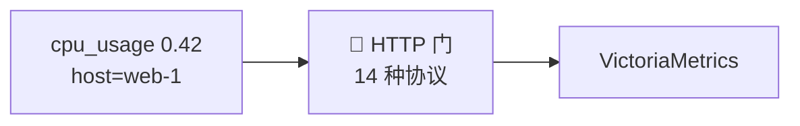
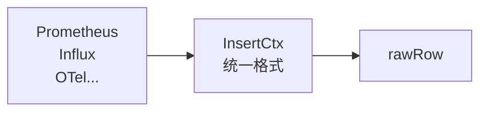
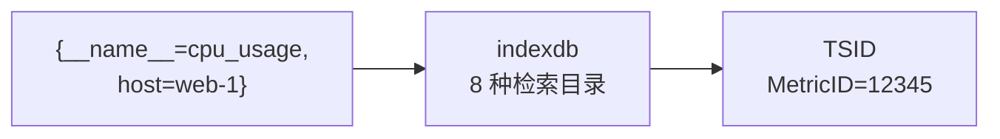
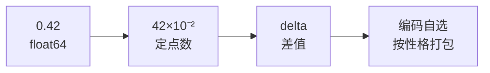
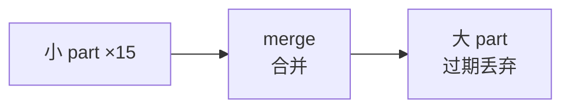
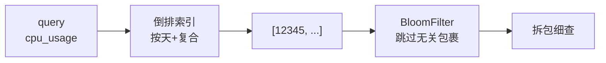
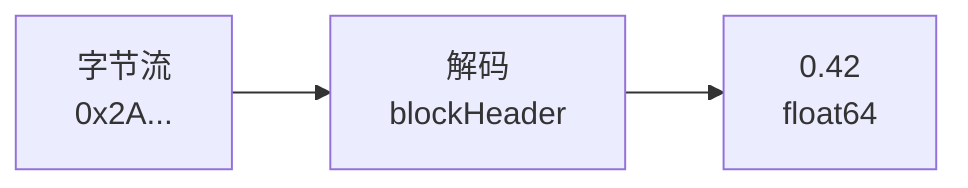

# 📊 一个指标的冒险之旅：VictoriaMetrics 从写入到查询

> 从浅入深，像读故事一样理解 VictoriaMetrics 的存储与查询机制。
> 主角：一个名叫 `cpu_usage{host="web-1"}` 的指标，值是 `0.42`。
> 每章末尾有「💭 想一想」——先自己想，再点开看答案。

---

## 序章：不速之客



深夜，VictoriaMetrics 的 HTTP 门口响起敲门声。

门外站着一个新来的家伙，用 Prometheus 的话自我介绍：

```
cpu_usage{host="web-1"} 0.42 1788888888000
```

同一晚，门口还来过说 Influx 方言的、说 OTel 方言的、说 Graphite 方言的……**14 种不同的语言**。

但门内传来同一个声音：**「不管你说什么方言，进来后我只认一种。」**

<details>
<summary>💭 想一想：为什么 14 种协议要统一成一种内部格式？</summary>

**答案**：表面是「高内聚低耦合、可扩展」（加协议 = 加一个 parser）。但更本质是**性能**——归一到统一的 `rawRow`（int64 定点数 + uint64 ID），让存储层能在「统一的最小形态」上榨干性能。对比 OTel：它归一化求「通用」（pdata 重、有反射），VM 求「极致」。

</details>

---

## 第一章：换装



门口有个叫 **InsertCtx** 的接待员，把各种方言翻译成同一套行头：

```
{__name__="cpu_usage", host="web-1"}   值=0.42   时间=1788888888000
```

它为什么要逼所有人穿一样的衣服？

> **悬念**：不是强迫症，是为了让后面的「仓库管理员」只认一种规格，才能在**统一的最小形态**上疯狂压榨性能。换装，是为了后面的每一道工序都更快。

<details>
<summary>💭 想一想：归一化主要是「工程整洁」还是「性能需要」？</summary>

**答案**：两者都有，但 VM 更看重**性能**。工程整洁是「加协议只加 parser」，性能是「存储层只在一种紧凑格式上优化」。真正的分野在于：归一化到 rawRow 不只是统一接口，更是统一**数据形态**（float64→定点数、字符串→uint64）——为后面的编码/压缩铺路。

</details>

---

## 第二章：改名



换好衣服，接待员看了一眼那串标签——`{__name__="cpu_usage", host="web-1"}`，有点长，有点啰嗦。

它转身对「索引官」indexdb 说：**「给它起个短名吧。」**

于是这一长串标签，被登记成：

```
{__name__="cpu_usage", host="web-1"}  →  MetricID = 12345
```

**这短名（MetricID）是「递增分配」的**——每来一个新面孔，编号就 +1，绝不重号、绝不回收。所以 12345 之后，一定是 12346。

但故事没完。短名只是「身份证号」，为了方便按片区分组，索引官还发了一张**完整身份证 TSID**：

```
TSID{
  MetricGroupID = xxhash("cpu_usage")   ← 户籍组（hash 指标名）
  JobID         = xxhash("web-1")       ← 街道
  InstanceID    = 0                     ← 门牌
  MetricID      = 12345                 ← 身份证号（递增）
}
```

更厉害的是，索引官的**登记簿不止一本，而是 8 种「检索目录」**：

| 目录 | 查什么 | 类比 |
|------|--------|------|
| 正向目录 | 名字 → 身份证（MetricName→TSID） | 按姓名查 |
| 倒排目录 | 标签 → 身份证号列表（Tag→MetricID） | 按标签查 |
| 按天目录 | 日期+标签 → 身份证（DateTag→MetricID） | 按日期查 |
| 删除目录 | 已注销的身份证（DeletedMetricID） | 死亡登记 |

> **悬念**：为什么？因为字符串又长又慢，uint64 排序、检索、压缩都快得飞起。**「名字」只登记一次，「身体」以后只用短名**。

<details>
<summary>💭 想一想：MetricID 为什么用「递增分配」而不是「标签的 hash」？</summary>

**答案**：递增分配**天然唯一、无碰撞**；hash 则可能碰撞（需要处理冲突）。而且「数据聚在一起」靠的是**落盘时按 TSID 排序**，不是 hash。hash 真正的用武之地是**集群分片**（一致性哈希），和单机的 MetricID 是两码事——这是最容易混淆的点。

</details>

<details>
<summary>💭 想一想：为什么登记簿要分「8 种检索目录」，而不是一本大杂烩？</summary>

**答案**：8 种是「用 1 字节前缀在同一个索引里做逻辑分区」，不是 8 个独立存储。好处是**同类 key 字节序相邻**（顺序读）+ 一套 mergeSet 逻辑复用。最关键的一对是「带 Date vs 不带 Date」——`DateTagToMetricIDs` 按日分片，让范围查询只碰相关日，避免全局 tag 列表无限膨胀（时间局部性）。

</details>

---

## 第三章：安家



有了短名，它被带到了**仓库**。

第一步，先在**内存**里排队（`inmemoryPart`），满了才批量往磁盘搬——因为**顺序搬运比随机搬运快一个量级**。

第二步，要「压缩打包」了。打包师傅看着那个 `0.42`，做了两步：

```
0.42 (float64)  →  42 × 10⁻²  (定点数)  →  和前一个值的差  (delta)
```

但打包师傅真正的本事，是**「看货物的性格，选打包方式」**——这叫「编码自选」：

| 货物的性格 | 打包方式 | 说明 |
|-----------|---------|------|
| 全一样（flag=1） | `Const` | 只记「这批都相同」 |
| 等差（每秒+1） | `DeltaConst` | 只记「首项 + 公差」 |
| 单调上涨的计数（counter） | 二阶差分 | 一阶差分恒定，二阶差分全零 |
| 上下波动的仪表（gauge） | 一阶差分 | 差值小 |

它怎么判断是 counter 还是 gauge？**看「下降的幅度」**——小幅下降是 gauge 正常波动，骤降 7/8 以上是 counter 重启归零。这个 `7/8` 的阈值，是作者对真实规律的总结。

最后，打包好的字节，被写进三个文件：`timestamps`（时间）、`values`（值）、`index`（说明书）。

<details>
<summary>💭 想一想：为什么值要存「int64 定点数」而不是「float64」？</summary>

**答案**：两个理由。① **round-trip 精确**——float64 存 `0.1` 会变成 `0.10000000000000001`，定点数（尾数 42 + 指数 -2）能逐位还原。② **delta 压缩友好**——相邻值差很小，int64 做差值编码比 float64 高效得多。代价是要维护一个 `scale`（整个 block 共用）。

</details>

<details>
<summary>💭 想一想：为什么 counter 用「二阶差分」，gauge 用「一阶差分」？</summary>

**答案**：counter 单调增长（0,5,10,15,20），一阶差分是 5,5,5,5（恒定），**二阶差分是 0,0,0（全零，最省）**；gauge 上下波动（20.1,20.3,19.8），一阶差分就够，二阶意义不大。这背后是「看数据的真实形状，用最省的编码」——编码自选的核心。

</details>

---

## 第四章：归档



日子一天天过去，仓库里的「小包裹」越来越多。

管理员有条规矩：**「包裹堆到 15 个，就合并成一个大包裹。」**（小 part → 大 part）

更有意思的是，合并的时候，管理员顺手做了一件事：

> **「过期了？那就别搬进新包裹了。」**

这就是 retention（数据保留）的秘密——**它从不专门打扫，只在「打包」的时候顺手丢掉过期货**。零额外成本。

<details>
<summary>💭 想一想：retention 为什么不单独扫描，而是搭 merge 的顺风车？</summary>

**答案**：merge 本来就要**读全部数据、重新写一遍**，顺手把过期行丢掉是**零额外 I/O**；如果单独扫描删除，等于多一轮全量 I/O，成本极高。这就是「把昂贵操作藏进本来就要做的事里」的工程心法。

</details>

---

## 第五章：寻访



某天，来了一位查询者，要找 `cpu_usage`。

**第一步，查登记簿（倒排索引）**：

```
"cpu_usage" → [12345, 67890, ...]
```

这本登记簿有两个设计得很讲究的地方：

**① 按天分片(Date)**：日期不是写「2026-09-08」这种长字符串，而是**自 1970 年起的天数**，一个 8 字节整数，比较起来飞快。所以查「最近 5 分钟」，只翻最近 5 分钟的分片，不碰历史。

**② 复合索引**：`metric 名 + 标签` 组成复合键，**先按大分类（指标名）缩小范围，再按小类（标签）精确找**——因为指标名的区分度最高（一个指标名几十个序列，一个标签值可能几十万）。

**第二步，去仓库找数据**。拿到 `MetricID=12345` 后，仓库里有成百上千个包裹，总不能每个都拆开看吧？

好在每个包裹外面都贴着**一张「快速索引贴纸」（BloomFilter）**，写着「这个包裹里大概有哪些身份证号」：

- 查询者先看贴纸 → 贴纸说「没有 12345」→ **跳过这个包裹**（快！）
- 贴纸说「可能有 12345」→ 才拆开细查（慢，但只是少数）

贴纸有个关键性质：**可能「误报」（说有其实没有，约 0.24%），但绝不「漏报」（说没有就一定没有）**。所以「跳过」永远安全。

> **悬念**：挑最有区分度的维度打头（复合索引）缩小「查哪些」，贴纸帮你跳过无关包裹（BloomFilter）缩小「翻哪些」——一个管索引，一个管磁盘。

<details>
<summary>💭 想一想：标签过滤为什么用「倒排索引」而不是「B+ 树」？</summary>

**答案**：这是两种不同的计算形态。B+ 树擅长「**一维有序键的范围扫描**」（`WHERE id BETWEEN 1 AND 100`）；而标签过滤是「**多维标签的集合交集**」（`{job=a, instance=b}` = 两个 ID 列表求交）。倒排索引天然维护 `label=value → 有序 ID 列表`，交集 = 归并。B+ 树要在多维组合下建复合索引，但标签组合运行时才知，无法预建。

</details>

<details>
<summary>💭 想一想：BloomFilter 的「可能误报、绝不漏报」是什么意思？为什么能加速查询？</summary>

**答案**：**无假阴性**（说不在就一定不在，所以跳过安全）+ **有假阳性**（说可能在可能不在，所以要真查）。用 `bitsPerItem=16` + 4 哈希换来约 **0.24% 假阳性**——即 1000 个无关包裹里只有 ~2.4 个会误报，其余 997 个都被贴纸直接跳过，省掉了磁盘 I/O。高基数场景 part 越多，这个加速越关键。

</details>

---

## 第六章：归途



找到了 `MetricID=12345`，查询者打开对应包裹。

包裹里的 `index` 文件是一张**说明书**（blockHeader），写着：

```
我是怎么被编码的？→ 定点数 + delta
我的第一个值是多少？→ 42
```

照着说明书逆向操作：

```
字节 → delta 解码 → [42, 43, 41] → ×10⁻² → 0.42
```

**读回的值，和当初写进来的一模一样。**

```
cpu_usage{host="web-1"} 0.42
```

一个指标的冒险，画上了闭环。

<details>
<summary>💭 想一想：有损压缩（PrecisionBits&lt;64）会破坏什么「不变量」？怎么修复？</summary>

**答案**：破坏「**时间戳单调递增**」这个不变量——有损编码截断低位后，解码出的时间戳可能不单调（如 1,2,1,3）。修复方式是解码后跑一遍 `EnsureNonDecreasingSequence`，把「下降的点」拉回到前一个值。这也是为什么默认 `PrecisionBits=64`（无损），省得付这个修复成本。

</details>

---

## 尾声：更大的世界


如果故事只到这里，VM 只是个「单机好手」。但它还能走向更大：

- **多节点（一致性哈希）**：把指标分散到多个节点，用的是一场**「选房间」的游戏**——每个指标和每个节点算一次「缘分值」（hash），选缘分最高的。这就是 **Rendezvous**，简单又均匀，不用哈希环那套复杂。
- **多租户**：`vmauth` 按 token 路由到不同集群——大客户单独一套，小客户共享一套。
- **高基数**：百万序列也不怕，因为「短名 + 列式」让内存省数倍。

<details>
<summary>💭 想一想：一致性哈希从 3 节点扩到 4 节点，为什么只有约 1/4 的指标重新映射？</summary>

**答案**：这是「一致性哈希」相对「普通取模哈希」的核心优势。取模 `id % 3 → id % 4` 会让几乎所有 key 换节点；而一致性哈希（Rendezvous）里，扩容后**只有「落在新节点负责环段」的 key**（约 1/4）重新映射。不过 VM 有个前提：它**不自动迁移数据**，新节点只接新写入，靠 vmselect fan-out 查询掩盖「旧数据在旧节点、新数据在新节点」的分裂。

</details>

<details>
<summary>💭 想一想：为什么 Rendezvous 是 O(n) 遍历，VM 还选它而不是 O(log n) 的哈希环？</summary>

**答案**：**评估复杂度要看「实际规模上限」**。n 被「查询 fan-out」锁死在几十（节点多了每次查询要广播到所有节点），此时 O(n) 的 200 纳秒淹没在毫秒级写入里。Rendezvous 换来「天然均匀（免虚拟节点）+ 实现几十行」——当 n 小时，复杂度理论不重要，实现简单度和均匀性才是决定因素。

</details>

---

## 三条贯穿全程的主线（读完回味）

1. **分层正交**：接待员、索引官、打包师傅、管理员……各管各的，靠「紧凑 ID + 统一格式」衔接。
2. **处处适配数据形状**：按天分片、编码自选、复合索引——都是「看数据真实长什么样，用最省的方式表达」。
3. **用架构手段回避难题**：Rendezvous 选 O(n) 因为 n 本来就被 fan-out 锁死；大 n 用分层而不是优化哈希。

> 一句话：**VM 的厉害，不是某一个算法，而是「每一道工序都为『时序数据长这样』量身定做」。**

---

---

---

## 📖 专业名词速查表

> 故事里的每个专业名词，从「一句话」到「公式与参数」。

### 身份与索引
| 名词 | 专业介绍 |
|------|-----------|
| **MetricID** | 时间序列紧凑标识，`uint64` 递增分配（无碰撞），替代标签字符串 |
| **TSID** | 24 字节 = MetricGroupID(8B) + JobID(4B) + InstanceID(4B) + MetricID(8B) |
| **倒排索引** | `label=value → 有序 ID 列表`，多标签过滤 = k-way 归并交集 |
| **复合索引** | `(metric名, tag)` 复合键，用最高选择性的 metric 名做前缀 |
| **按天分片** | `date = uint64 天数`（自 1970），范围查询只碰相关日 |

#### BloomFilter（重点：公式 + 变量 + 举例）

**假阳性率公式**（标准 BloomFilter）：

```
p ≈ (1 - e^(-k·n/m))^k
```

- `k` = 哈希函数个数（VM 固定 `hashesCount = 4`）
- `m` = 位数组总位数，`n` = 元素个数
- **`m/n` = bitsPerItem**（每个元素的位数）——这是**控制假阳性率的关键变量**

**VM 默认**：`k=4, bitsPerItem=16` → **p = (1 - e^(-4/16))^4 = (1 - e^-0.25)^4 ≈ 0.24%**

**举例**（固定 k=4，调 bitsPerItem，看「精度换空间」的权衡）：

| bitsPerItem (m/n) | 假阳性率 p | 1 亿序列内存占用 |
|-------------------|-----------|-----------------|
| 8   | `(1-e^-0.5)^4` ≈ **2.40%** | 100 MB |
| 12  | `(1-e^-0.33)^4` ≈ 0.65%  | 150 MB |
| 16  | `(1-e^-0.25)^4` ≈ **0.24%** | 200 MB |
| 32  | `(1-e^-0.125)^4` ≈ 0.019% | 400 MB |

> **结论**：bitsPerItem 每翻倍，假阳性率大约下降一个数量级，但内存也翻倍——「精度换空间」。VM 选 16，是「0.24% 误报」和「200MB 内存」的平衡点。

### 编码与存储
| 名词 | 专业介绍 |
|------|-----------|
| **定点数** | `值 = mantissa(int64) × 10^scale(int16)`，整个 block 共用 scale |
| **delta 编码** | 一阶 `delta[i]=v[i]-v[i-1]`；二阶（delta-of-delta）适合规则间隔 |
| **编码自选** | 4 种：`Const`（全同）/`DeltaConst`（等差）/`NearestDelta2`（counter 二阶）/`NearestDelta`（gauge 一阶） |
| **inmemoryPart** | 内存数据缓冲，`maxInmemoryParts=60`，满则批量刷盘 |
| **part** | 磁盘块，三文件 timestamps/values/index；`index` 存 blockHeader |
| **merge** | `defaultPartsToMerge=15`，小 part 并大 part，顺带 retention |
| **blockHeader** | 自描述元数据：MarshalType、FirstValue、Scale、RowsCount、Min/MaxTimestamp |

### 分布式与扩展
| 名词 | 专业介绍 |
|------|-----------|
| **一致性哈希** | 扩容只扰动 `~1/n` 的 key；Rendezvous 公式 `argmax_i hash(key, node_i)` |
| **Rendezvous** | 对每节点算权重取最大，O(n) 遍历但 n 小（fan-out 锁死） |
| **vmauth** | 认证+路由网关，`token → url_prefix` 映射 |
| **高基数** | 每 100 万序列 ≈ 850MB RAM，成本随序列数线性 |

## 延伸阅读

- [Lima + Docker + Minikube 环境搭建](/mac/lima-docker-minikube-setup.md) — 本地跑 VictoriaMetrics 的实验环境
- [MySQL 联合索引优化实战](/database/mysql-index-optimization-case.md) — 另一个「索引」视角的实战
